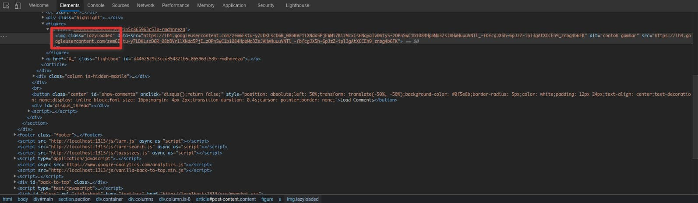

Apa sih *lazyload* ? Lazy Load adalah sebuah teknik untuk membuat pemuatan gambar di website menjadi tidak sinkron, Dengan artian setelah konten bagian atas sepenuhnya dimuat, Maka gambar tidak akan dimuat [Sumber: [Jagoan Hosting](https://www.jagoanhosting.com/blog/apa-itu-lazy-load/)]

Sebelumnya disini saya tidak menggunakan atribute default HTML5 `load="lazy"`, tetapi menggunakan javascript tambahan yaitu `lazysizes` yang bisa kalian lihat *source code* nya di [github](https://github.com/aFarkas/lazysizes)

1. Kalian download dulu [lazysizes.min.js](https://afarkas.github.io/lazysizes/lazysizes.min.js) dan kalian simpan di `static/js` dengan nama `lazysizes.min.js`
2. Lalu kalian tambahkan script nya ke `header.html` atau `footer.html`
```html
<script src={{ "js/lazysizes.js" | absURL }} async as="script"></script>
```
3. Atau kalian bisa menggunakan cdn, tambahkan *snippet* berikut di `header.html` atau `footer.html`
```html
<script src="https://cdnjs.cloudflare.com/ajax/libs/lazysizes/5.3.0/lazysizes.min.js" integrity="sha512-JrL1wXR0TeToerkl6TPDUa9132S3PB1UeNpZRHmCe6TxS43PFJUcEYUhjJb/i63rSd+uRvpzlcGOtvC/rDQcDg==" crossorigin="anonymous"></script>
```
4. Buat `render-image.html` di folder `layouts/_default/_markup/`
```go
layouts
└── _default
    └── _markup
        └── render-image.html
```
5. Tambahkan *snippet* HTML berikut ini di `render-image.html`
```html

```
6. Jika sudah kalian save, setelah itu kalian bisa coba tambahkan gambar di post kalian menggunakan format default markdown
```markdown

```
7. Jika berhasil, maka gambar akan muncul dengan sempurna dan terdapat `class="lazyload"`, jika gambar tidak muncul pastikan tidak ada error yang berhubungan dengan `lazysizes.min.js`, atau kalian bisa lihat di ***Inspect Element*** bagian ***Console*** disana akan terdapat error yang akan memudahkan kalian untuk memecahkan masalahnya.

