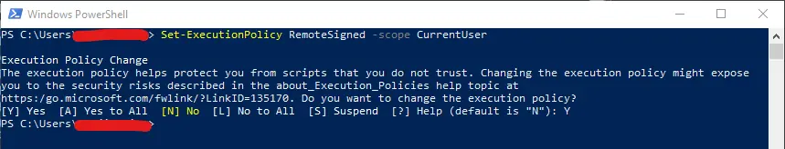
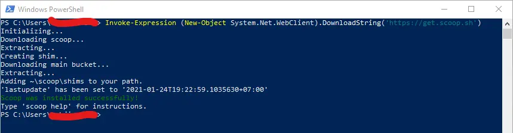
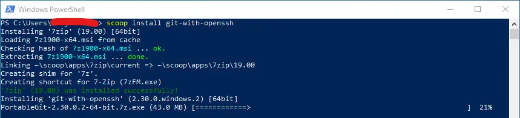
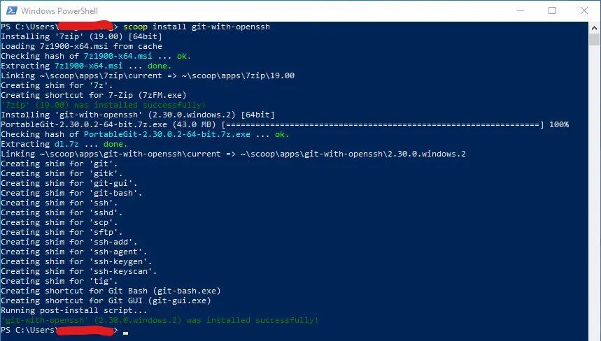
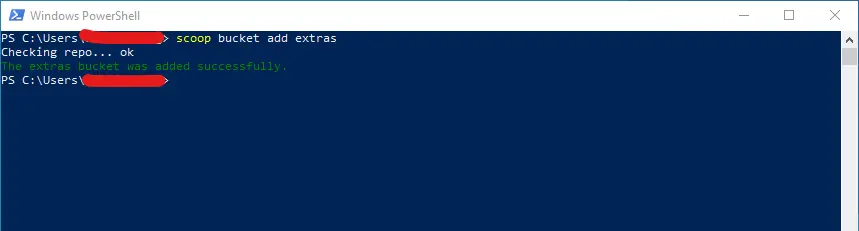
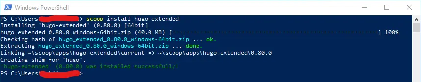

Apa itu scoop ? Scoop adalah *command-line package manager* untuk memudahkan kalian menginstall aplikasi. Scoop menginstal program ke home direktori (C:/Users/Username) secara default. Jadi, kalian tidak memerlukan izin admin untuk menginstal program, dan kalian tidak akan melihat pop-up UAC setiap kali kalian menginstall atau menghapus program.

#### Menginstall Scoop
Cara menginstall scoop, pastikan di windows kalian
1. Powershell versi 5 atau lebih baru (di windows 10 sudah terinstall secara default) 
2. .NET Framework 5 atau lebih baru (di windows 10 sudah terinstall secara default)

Jika sudah memenuhi syarat diatas, kalian bisa jalankan perintah ini terlebih dahulu untuk menginstall scoop

```powershell
Set-ExecutionPolicy RemoteSigned -scope CurrentUser
```



Setelah itu kalian ketik `Y` dan `Enter`, lalu copy & paste perintah dibawah ini untuk menginstall scoop

```powershell
Invoke-Expression (New-Object System.Net.WebClient).DownloadString('https://get.scoop.sh')
```

Atau yang lebih pendek

```powershell
iwr -useb get.scoop.sh | iex
```


#### Menginstall Aplikasi
Sebelum menginstall aplikasi, kalian wajib menginstall `git` terlebih dahulu, dengan perintah
```powershell
scoop install git
```
Note: Jika kalian butuh `openSSH` kalian bisa install
```powershell
scoop install git-with-openssh
```





Setelah git nya terinstall kalian **add extras bucket**, agar banyak aplikasi yang bisa di kalian install via scoop, caranya

```powershell
scoop bucket add extras
```



Untuk menginstall aplikasi dengan scoop sangat mudah caranya
1. Kalian buka powershell kalian
2. Jalankan perintah

```powershell
scoop install nama-aplikasi
```
Contohnya, disini saya akan menginstall **FFMPEG** & **HUGO-EXTENDED**, kalian tinggal jalankan perintah
```powershell
scoop install ffmpeg
```
```powershell
scoop install hugo-extended
```
Atau bisa juga disatukan perintahnya
```powershell
scoop install ffmpeg hugo-extended
```

#### Update Aplikasi
Untuk update aplikasi perintahnya
```powershell
scoop update nama-aplikasi
```
Atau jika kalian ingin mengupdate semua aplikasi bisa dengan perintah
```powershell
scoop update *
```
Setelah kalian mengupdate aplikasi via scoop, pastikan kalian menjalankan perintah dibawah ini untuk menghapus aplikasi versi sebelumnya
```powershell
scoop cleanup *
```

Untuk lebih lengkapnya tentang scoop ini kalian bisa langsung kunjungi [documentation nya di github](https://github.com/lukesampson/(wiki))