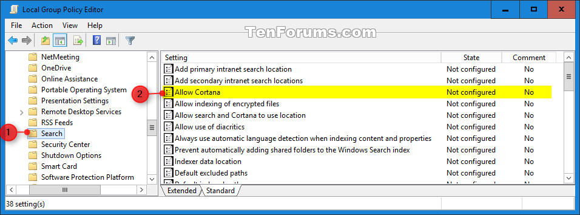
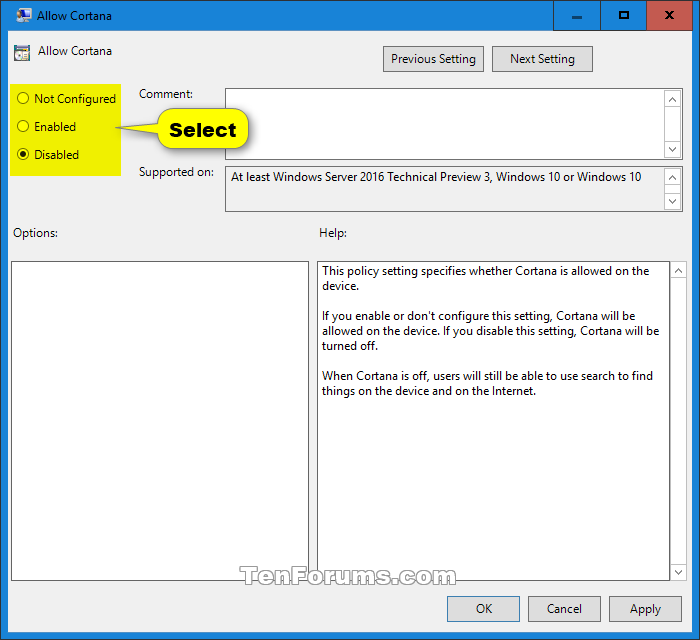

Cortana adalah asisten pribadi berbasis cloud yang bekerja di seluruh perangkat Windows dan layanan Microsoft lainnya. Cortana dapat menyediakan berbagai fitur. Cortana di Windows tersedia di negara dan bahasa tertentu. Cortana juga tersedia di platform lain, seperti Android dan iOS.

Cortana bekerja paling baik saat kalian masuk (*sign in*) dan mengizinkannya menggunakan data dari perangkat kalian, layanan Microsoft lainnya, dan layanan pihak ketiga yang kalian pilih untuk disambungkan. Cortana belajar dari data tertentu tentang kalian, seperti pencarian, kalender, kontak, dan lokasi kalian. Kalian dapat mengontrol seberapa banyak data yang Anda bagikan. Jika kalian memilih untuk tidak masuk (*sign in*) ke Cortana di Windows, kalian masih dapat mengobrol dengan Cortana dan menggunakannya untuk membantu kalian mencari di web, dokumen yang disimpan di layanan Microsoft seperti OneDrive, dan perangkat Windows Kalian. Di perangkat iOS dan Android, Cortana hanya berfungsi saat kalian masuk (*sign in*).

Kalian harus log in sebagai **administrator** untuk enable atau disable Cortana

#### Enable atau Disable Cortana menggunakan Group Policy
1. Buka **Local Group Policy Editor**, caranya kalian tekan shorcurt pada keyboard **Win + R**, setelah itu masukan `gpedit.msc` atau Kalian juga bisa menggunakan fitur **Search**
2. Di panel sebelah kiri **Local Group Policy Editor**, Kalian masuk ke

Computer Configuration/Administrative Templates/Windows Components/Search

3. Di Panel sebelah kanan **Search**, double click/tap di **Allow Cortana** Untuk mengedit policy nya

4. Langkah selanjutnya kalian tinggal lihat **langkah 5 untuk enable cortana** atau **langkah 6 untuk disable cortana**
5. Untuk Enable Cortana kalian pilih **Not Configured** atau **Enabled**
6. Untuk Disable Cortana kalian pilih **Disabled**

7. Jika sudah, Close **Local Group Policy Editor**
8. Restart Explorer atau Sign Out & Sign In atau Kalian Restart PC kalian. Untuk menerapkan konfigurasi yang sudah di setting di **Local Group Policy Editor**

#### Enable atau Disable Cortana menggunakan Regedit

File .reg dibawah ini mengubah value DWORD registry key berikut
HKEY_LOCAL_MACHINE\SOFTWARE\Policies\Microsoft\Windows\Windows Search
AllowCortana DWORD
0 = Disable
1 atau delete = Enable

1. Download file **langkah 2** untuk Enable Cortana & **langkah 3** untuk Disable Cortana
2. Enable Cortana (Default Settings)
   * [Download Reg File](https://www.tenforums.com/attachments/tutorials/41034d1443973120-cortana-enable-disable-windows-10-a-enable_cortana.reg)
3. Disable Cortana
   * [Download Reg File](https://www.tenforums.com/attachments/tutorials/41033d1443973120-cortana-enable-disable-windows-10-a-disable_cortana.reg)
4. Save file di Desktop atau dimana saja
5. Double click/tap di file .reg yang kalian download.
6. Ketika muncul UAC kalian klik Yes, dan klik OK lagi untuk menerapkan konfigurasi regedit nya.
7. Restart Explorer atau Sign Out & Sign In atau Kalian Restart PC kalian. Untuk menerapkan konfigurasi yang sudah di setting di **Regedit**

**Note:** Cara pertama (gpedit), biasanya tidak bisa diterapkan di **Windows versi Home**, untuk itu kalian bisa menggunakan cara kedua (regedit)

Source Tutorial: [tenforums](https://www.tenforums.com/tutorials/25118-enable-disable-cortana-windows-10-a.html)