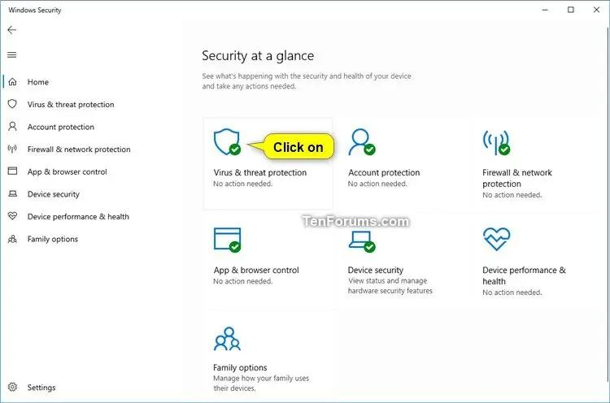
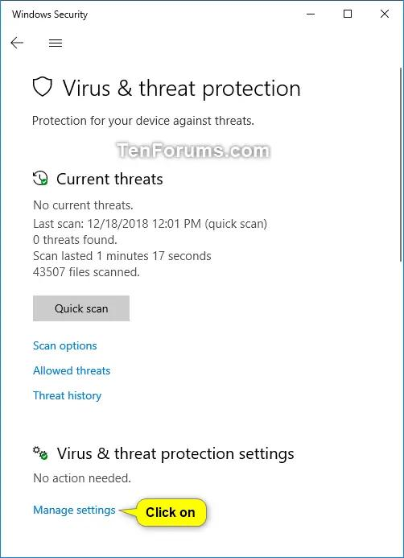
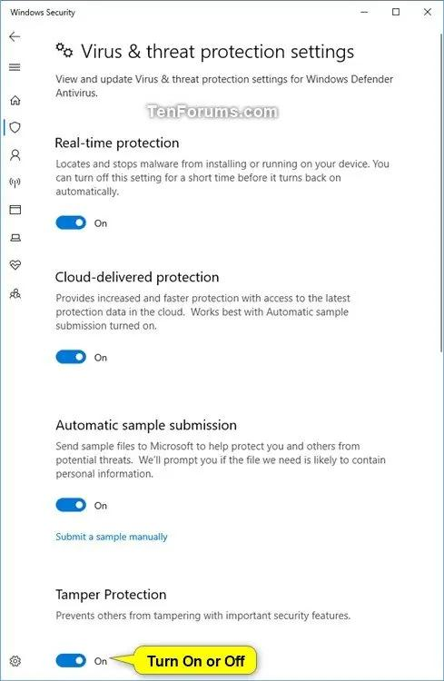
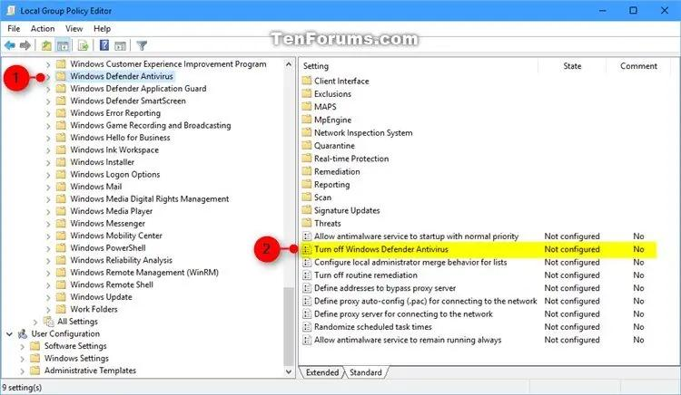
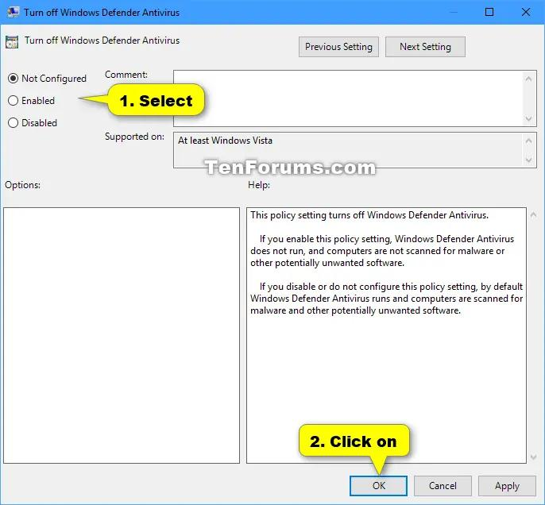

Mulai Windows 10 versi 2004 Windows Defender diganti namanya menjadi Microsoft Defender Antivirus, Sebetulnya Microsoft Defender Antivirus akan nonaktif sendiri jika kalian menginstall Antivirus pihak ketiga, seperti: ESET, Norton, dll.

__Note:__ Jika kalian menggunakan Windows 10 Home, kalian gunakan cara ke dua yang menggunakan regedit (registry editor).

Sebelum menonaktifkan Defender Antivirus, pastikan kalian Off kan terlebih dahulu __Microsoft Defender Antivirus Tamper Protection__

Caranya:
1. Buka __Windows Security__, dan click/tap di __Virus & threat protection__ icon.

2. Click/tap on the __Manage settings__ link dibawah __Virus & threat protection settings__

3. Scroll sampai bawah dan Off kan __Tamper Protection__

Jika sudah, ikuti langkah selanjutnya.

#### Cara 1: Menggunakan Local Group Policy Editor
1. Buka __Local Group Policy Editor__, caranya kalian tekan shorcurt pada keyboard __Win + R__, setelah itu masukan `gpedit.msc` atau Kalian juga bisa menggunakan fitur __Search__
2. Di panel sebelah kiri __Local Group Policy Editor__, Kalian masuk ke

Untuk Windows 10 version 1909 dan sebelumnya
Computer Configuration\Administrative Templates\Windows Components\Windows\Defender Antivirus

Untuk Windows 10 version 2004 dan selanjutnya
Computer Configuration\Administrative Templates\Windows Components\Microsoft Defender Antivirus

3. Di Panel sebelah kanan __Windows Defender Antivirus__ atau __Microsoft Defender Antivirus__, double click/tap di __Turn off Windows Defender Antivirus__ atau __Turn off Microsoft Defender Antivirus__ Untuk mengedit policy nya
4. Untuk Disable Defender Antivirus kalian pilih __Enabled__ 
5. Sedangkan untuk Enable Defender Antivirus kalian pilih __Not Configured__ atau __Disabled__

#### Cara 2: Menggunakan Registry Editor (Regedit)

File .reg dibawah ini mengubah value DWORD registry key berikut\
HKEY_LOCAL_MACHINE\SOFTWARE\Policies\Microsoft\Windows Defender\
DisableAntiSpyware DWORD\
0 = Disable\
1 atau delete = Enable

1. Enable Defender Antivirus (Default Settings)
2. Disable Defender Antivirus
   * [Download Reg File](https://www.tenforums.com/attachments/tutorials/130449d1492353257-turn-off-windows-defender-windows-10-a-turn_on_windows_defender_antivirus.reg)
3. Save file di Desktop atau dimana saja
   * [Download Reg File](https://www.tenforums.com/attachments/tutorials/130448d1492353257-turn-off-windows-defender-windows-10-a-turn_off_windows_defender_antivirus.reg)
4. Double click/tap di file .reg yang kalian download.
5. Ketika muncul UAC kalian klik Yes, dan klik OK lagi untuk menerapkan konfigurasi regedit nya.
6. Restart Explorer atau Sign Out & Sign In atau Kalian Restart PC kalian. Untuk menerapkan konfigurasi yang sudah di setting di **Regedit**

Source Tutorial: [tenforums](https://www.tenforums.com/tutorials/5918-how-turn-off-microsoft-defender-antivirus-windows-10-a.html)