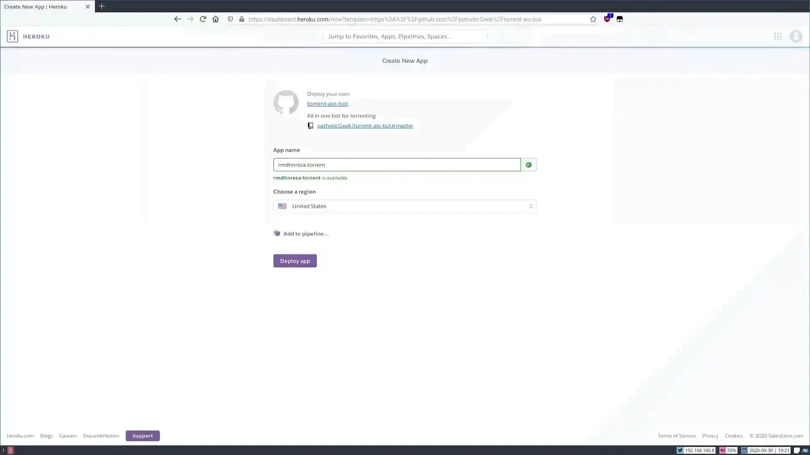

Pada tutorial kali ini saya akan membagikan cara mengunduh atau leech file torrent dari Heroku langsung ke akun Google Drive atau Team Drive kita. Jadi kita bisa mengunduhnya via download manager seperti EagleGet, Free Download Manager, Internet Download Manager, dll.

Tutorial kali ini mirip-mirip dengan tutorial [Setup Google Drive Indexer di Heroku](https://rmdhnreza.my.id/setup-google-drive-indexer-di-heroku/) yang ada di blog ini, jika kalian sudah pernah mencoba [Setup Google Drive Indexer di Heroku](https://rmdhnreza.my.id/setup-google-drive-indexer-di-heroku/) langkah-langkahnya tidak terlalu rumit seperti membuat **Client_ID**, **Client_Secret**, dll.

Pertama-tama kalian yang tidak punya akun heroku harus buat dulu di akunnya di [heroku.com](https://heroku.com), jika kalian sudah membuat akunnya langsung saja kita mulai pemasangannya. Oke, langsung saja kita masuk ke Tutorialnya

## Setup Heroku

1. Klik link berikut ini [Heroku Deploy](https://github.com/patheticGeek/torrent-aio-bot)
      * **App name** kalian bebas apa saja asal masih tersedia di heroku nya, app name ini yang akan menjadi subdomain link kalian
      * **Region** kalian bebas mau di US atau EU

2. Setelah semuanya selesai kalian klik **Deploy app** & tunggu beberapa menit sampai prosesnya selesai

3. Jika proses build nya sudah selesai kalian klik **Manage app** masuk ke bagian **Settings** dan klik **Reveal Config Vars**

4. Isi bagian 
      * **KEY** dengan **SITE** 
      * **VALUE** dengan https://appname.herokuapp.com/ (**appname** kalian ganti dengan name yang kalian buat di langkah 1)
      * Lalu klik **Add**

Sampai sini sebetulnya kalian sudah bisa mengunduh/leech torrent, tapi pasti akan error karena tempat penyimpanannya (dalam hal ini Google Drive) belum kita setting.

## Membuat Client & Secret ID

5. Buka [developers.google.com/drive/api/v3/quickstart/nodejs](https://developers.google.com/drive/api/v3/quickstart/nodejs) Klik **Enable Drive API** masuk dengan akun Google kalian. Jika kalian sudah masuk tinggal isi project name bebas setelah itu Next maka akan muncul **Configure your OAuth client** kalian pilih **Desktop App** jika sudah langsung klik **Create** maka kalian akan mendapatkan **Client ID** & **Client Secret**

6. Buka link: https://appname.herokuapp.com/drivehelp
      * Copy & Paste **Client ID** & **Client Secret** yang kalian buat dilangkah 5 
7. Setelah semuanya selesai kalian klik Generate token

8. Kalian masuk dengan akun Google kalian, akun Google ini yang akan menjadi tempat penyimpanan unduhan torrent, jadi pastikan kalian masuk dengan akun Google yang memiliki Shared Drive atau akun Universitas (edu).
9. Setelah mendapatkan **Auth Code** paste code nya dikolom app kalian, lalu **Get auth code** maka kalian akan mendapatkan **token** 

10. Setting config aplikasi kalian (Langkah Nomor 4) seperti berikut (KEY -> Value)
      * **CLIENT_ID** -> yang kalian dapatkan pada langkah 5
      * **CLIENT_SECRET** -> yang kalian dapatkan pada langkah 5
      * **AUTH_CODE** -> yang kalian dapatkan pada langkah 7
      * **TOKEN** -> yang kalian dapatkan 9
11. Jika kalian ingin menyimpan unduhan torrent nya di satu folder maka buat config
      * **GDRIVE_PARENT_FOLDER** -> Isi dengan ID Folder kalian

12.  Maka hasil akhirnya seperti ini

13. Setelah itu kalian bisa tes download torrent jika berhasil maka hasil undukan akan langsung muncul dibagian Drive

Jika kalian bingung dengan langkah-langkah nya kalian bisa tanyakan di kolom komentar bingung di langkah berapa

