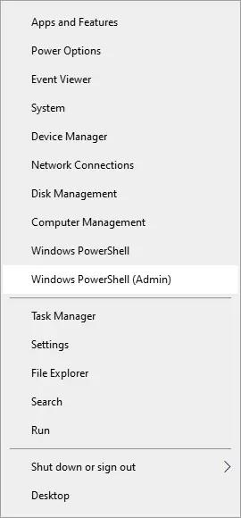
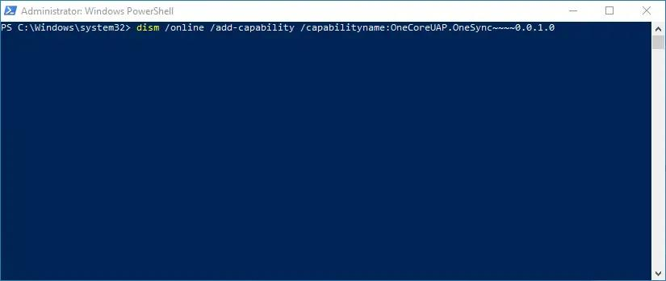
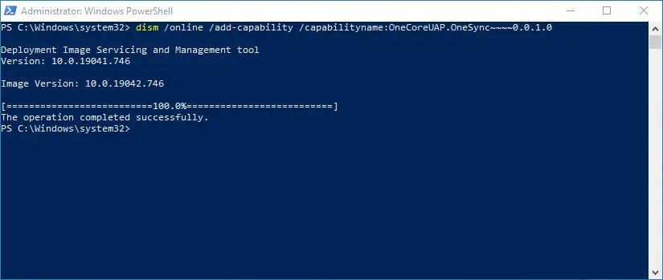

Biasanya ini terjadi ketika kalian sudah menghapus `bloatware` di windows 10 kalian, Jadinya ada software core yang terhapus.

Untuk mengatasi tidak bisa menambahkan akun di aplikasi Mail Windows 10 caranya cukup mudah

1. Kalian buka `Windows Powershell (Admin)`



2. Masukan perintah berikut
```powershell
dism /online /add-capability /capabilityname:OneCoreUAP.OneSync~~~~0.0.1.0
```



3. Tunggu sampai selesai (_This operation completed successfully_), biasanya tidak sampai 5 menit



4. Setelah selesai kalian coba add akun di Windows Mail tanpa perlu restart windows kalian