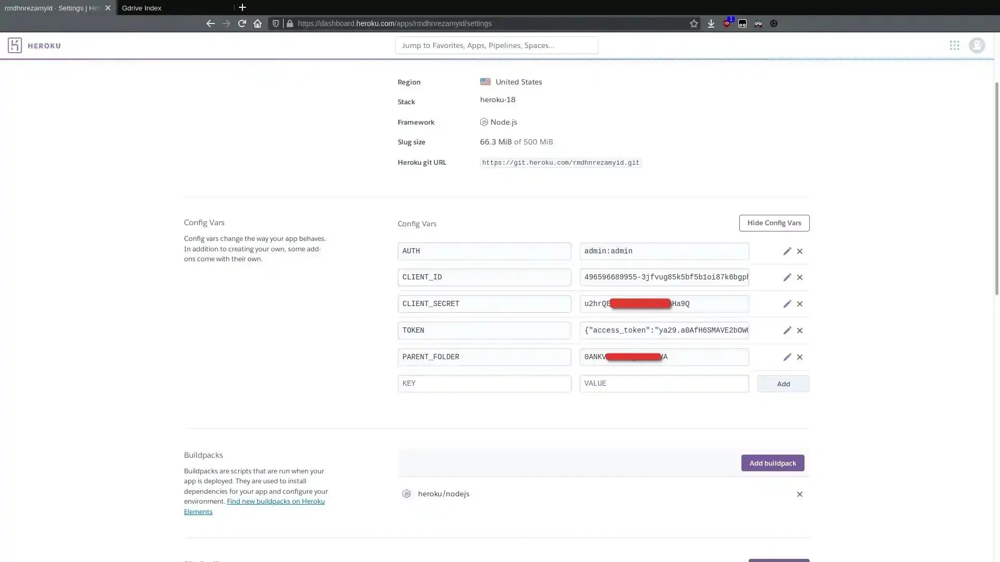

Google Drive Indexer memudahkan kalian untuk share file dari akun Team Drive untuk di unduh oleh orang lain, karena Team Drive sendiri tidak support share folder maka Gdrive Indexer ini solusinya. Perlu diketahui Gdrive Indexer ini support drive dan juga Team Drive.

Pada tutorial kali ini Gdrive Indexer akan kita pasang di Heroku, jadi buat kalian yang tidak punya akun heroku harus buat dulu di heroku.com, jika kalian sudah membuat akunnya langsung saja kita mulai pemasangannya.

## Setup Heroku

1. Klik link berikut ini [Deploy to Heroku](https://heroku.com/deploy?template=https://github.com/patheticGeek/gdrive-index)
      * **App name** kalian bebas apa saja asal masih tersedia di heroku nya, app name ini yang akan menjadi subdomain link kalian
      * **Region** kalian bebas mau di US atau EU

2. Setelah semuanya selesai kalian klik Deploy app & tunggu beberapa menit sampai prosesnya selesai

3. Jika proses build nya sudah selesai kalian klik Manage app masuk ke bagian **Settings** dan klik **Reveal Config Vars**

4. Isi bagian **KEY** dengan **AUTH** sedangkan **VALUE** nya kosongkan saja klik **Add**
5. Buka project kalian https://appname.herokuapp.com/setup ganti **appname** dengan **appname** yang kalian buat dilangkah pertama
6. Jika sukses maka tampilan app kalian akan seperti ini

## Membuat Client & Secret ID

7. Buka [developers.google.com/drive/api/v3/quickstart/nodejs](https://developers.google.com/drive/api/v3/quickstart/nodejs) Klik **Enable Drive API** Login dengan akun Google kalian. Jika kalian sudah masuk tinggal isi **Project Name** bebas setelah itu Next maka akan muncul **Configure your OAuth** client kalian pilih **Desktop App** jika sudah langsung klik **Create** maka kalian akan mendapatkan **Client ID** & **Client Secret**

8. Copy **Client ID & Client Secret** ke app kalian (langkah nomer 6) setelah itu **Get Auth Code**, akan otomatis membuka tab baru dan kalian masuk dengan akun Google kalian sampai mendapatkan code nya

9.  Paste Code pada kolom Paste auth code here lalu klik Generate token maka akan muncul akses token-nya
10. Untuk **Parent Folder ID** ini opsional tapi saya sangat sarankan untuk diisi, disini saya akan menggunakan **Shared Drive** jadi saya isi ID nya dengan ID folder shared drive saya
      * contoh: https://drive.google.com/drive/folders/**0ANKV19DAKsAKdsRUk9PVA**
      * Kalian hanya copy bagian **0ANKV19DAKsAKdsRUk9PVA** saja dan paste di Parent Folder ID
11. Untuk bagian Auth kalian boleh isi atau tidak, tapi untuk keamanan saya sarankan kalian isi.
12. Langkah selanjutnya kalian tinggal copy paste pada tabel Enviroment variables ke config app kalian (langkah nomor 4)

13. Jadinya seperti ini

14. jika sudah kalian tinggal buka https://appname.herokuapp.com

15. Itulah langkah-langkah setup Google Drive Indexer di Heroku, jika kalian kesulitan dalam pemasangannya kalian bisa tanyakan di kolom komentar
