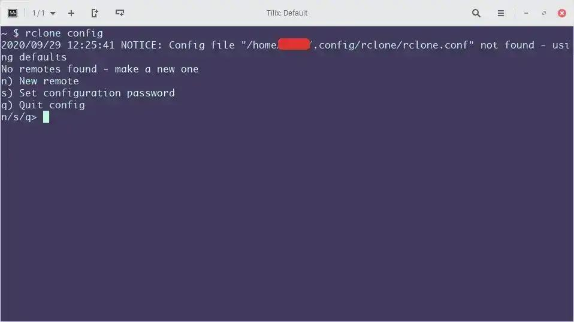
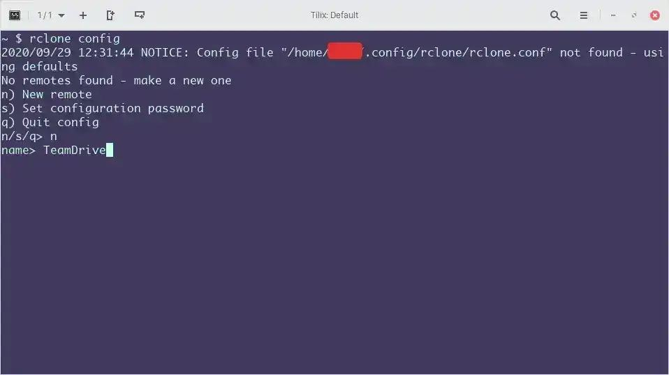
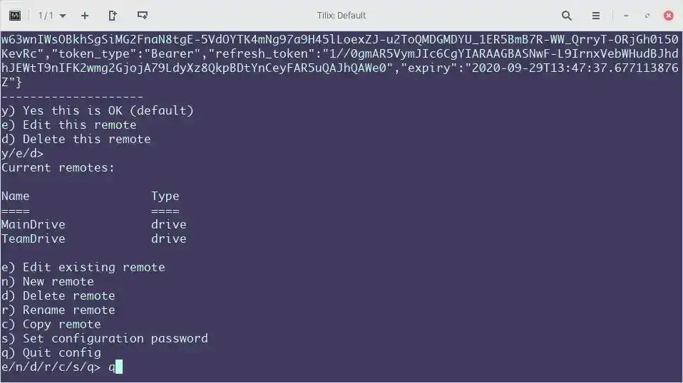
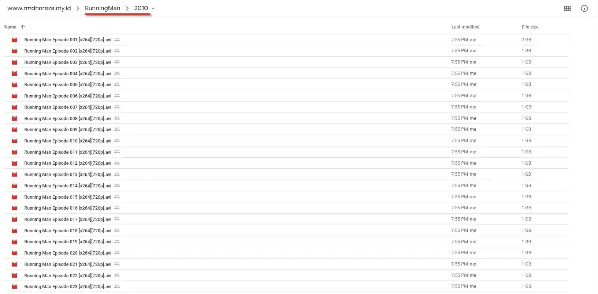
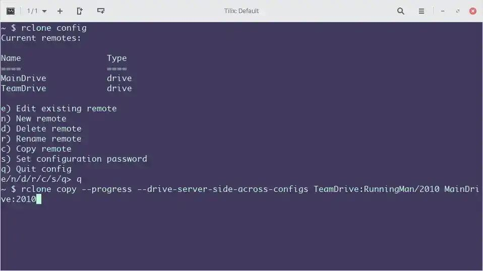
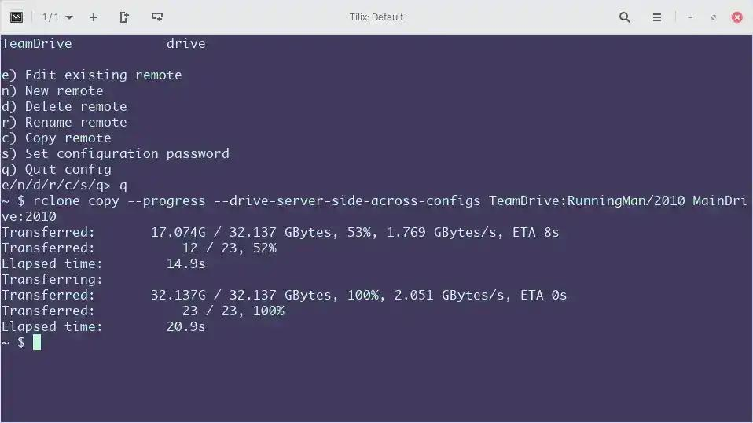

Pada tutorial kali ini saya akan membagikan cara copy file dari Team Drive ke Akun Google Drive, seperti yang kita ketahui sekarang Google Drive tidak bisa melakukan copy file secara langsung ke akun Google Drive kita sebagai gantinya hanya dijadikan shorcut saja alih-alih filenya dicopy ke akun Google Drive.

Disini saya akan menggunakan aplikasi bernama rclone untuk melakukan copy dari Team Drive ke Google Drive, perlu diketahui rclone ini bisa dijalankan pada Linux, Mac OS & Windows. Perlu diketahui disini saya menggunakan Sistem Operasi Linux. Oke langsung saja.

1. Download aplikasi rclone terlebih dahulu di official website nya [rclone.org](https://rclone.org)
2. Untuk pengguna Linux, Mac OS saya sarankan menggunakan perintah
```bash
curl https://rclone.org/install.sh | sudo bash
```
3. Untuk Pengguna Windows Saya sarankan kalian menginstall scoop terlebih dahulu yang bisa kalian lihat di [Cara Menginstall Package Manager Scoop Di Windows 10](/cara-menginstall-package-manager-scoop-di-windows-10/)
   * Gunakan perintah ini untuk menginstall rclone

```powershell
scoop install rclone
```

4. Jika proses installasi rclone berjalan lancar kalian bisa ketikan
```bash
rclone config
```
5. Jika tidak muncul error maka bisa langsung lanjut ke langkah selanjutnya



## Konfigurasi TeamDrive
1. Ketikan perintah Lalu Enter
```bash
rclone config
```
2. **No remotes found - make a new one** > kalian pilih **n** untuk membuat remote
3. **name** > kalian buat nama remote kalian bebas, tapi saya sarankan jangan memakai spasi, disini nama remote yang akan saya gunakan **TeamDrive**



4. **Storage** > kalian ketik "**drive**" (tanpa tanda "")
5. **client_id**, **client_secret**, kalian kosongkan saja
6. **Scope** > Kalian pilih nomor **1** (Full Access) 
7. **root_folder_id**, **service_account_file** kalian kosongkan saja
8. Edit advanced config? pilih **N** atau bisa Enter langsung
9.  Use auto config?
    * Jika kalian pilih Y maka rclone akan otomatis membuka URL dan kalian tinggal masuk saja dengan akun Google yang memiliki Shared Drive
    * Jika kalian pilih N maka akan muncul URL di terminal dan kalian harus copy paste manual ke browser lalu masuk dengan akun Google yang memiliki Shared Drive setelah itu kalian copy code yang muncul di browser lalu paste di Terminal
    * Kesimpulan: Kalian bebas pilih yang mana saja yang menurut kalian paling mudah.
10. Configure this as a team drive? kalian pilih **Y**, ini adalah hal yang paling penting dalam konfigurasi akun Team Drive di rclone. jika kalian pilih N, Shared Drive kalian tidak akan muncul di rclone
11. Pilih Akun TeamDrive yang akan di copy filenya
12. Setelah itu kalian tinggal Enter dan Enter lagi, maka rclone akan kembali ke perintah 1

## Konfigurasi Google Drive
1. Sama seperti langkah Konfigurasi Team Drive, yang harus dibedakan adalah nama pada langkah nomor 3 disini saya menggunakan nama MainDrive dan Langkah nomor 10 kalian harus pilih **N**
2. Jika konfigurasi telah selesai kalian ketik q lalu Enter untuk Quit



## Melakukan copy dari remote TeamDrive ke MainDrive
1. Yang harus kalian lakukan pertama kali adalah share file (karena Team Drive untuk sekarang tidak bisa share folder) dari akun Team Drive kalian ke akun Google Drive yang akan meng-copy jika kalian tidak melakukan ini maka dipastikan akan error pada saat melakukan copy dengan rclone
2. Saya akan melakukan copy Video Running Man tahun 2010 di Folder (Perhatikan **PATH** nya) **RunningMan/2010**  ke Folder **2010** di Akun Google Drive



3. Jika sudah di Share langsung buka cmd, PowerShell atau terminal nya lalu ketikan perintah
```bash
rclone copy --progress --drive-server-side-across-configs NamaRemoteTeamDriveKalian:Folder/Yang/Akan/Di/Share NamaRemoteGoogleDriveKalian:NamaFolder
```
4. Dalam kasus saya perintahnya
```bash
rclone copy --progress --drive-server-side-across-configs TeamDrive:RunningMan/2010 MainDrive:2010
```



5. Jika berhasil maka tidak ada error yang muncul dan kalian akan melihat progress copy filenya



Jika kalian masih kebingungan kalian bisa tanyakan di kolom komentar, bingungnya dibagian mana, sebisa mungkin nanti saya akan bantu


