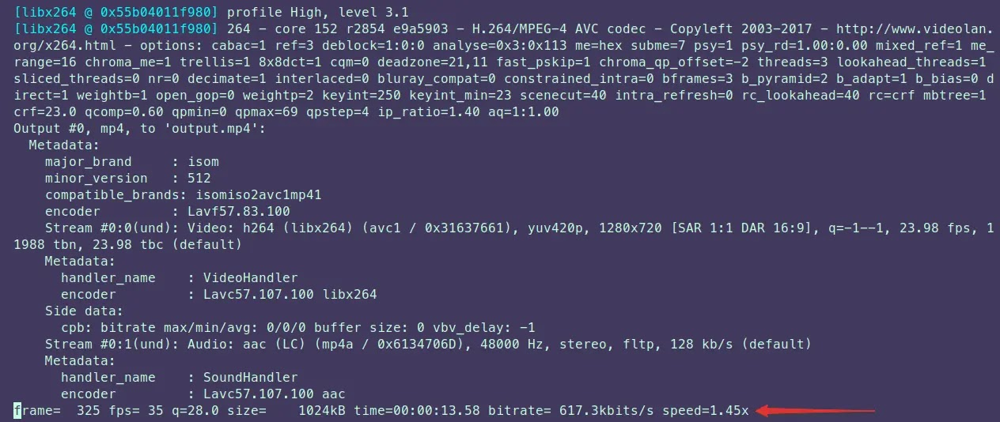
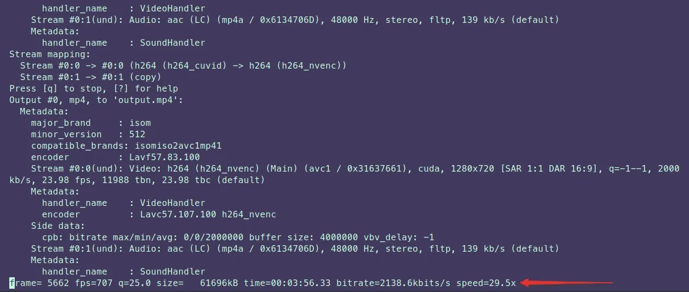
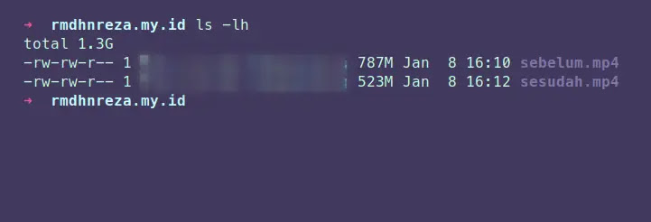
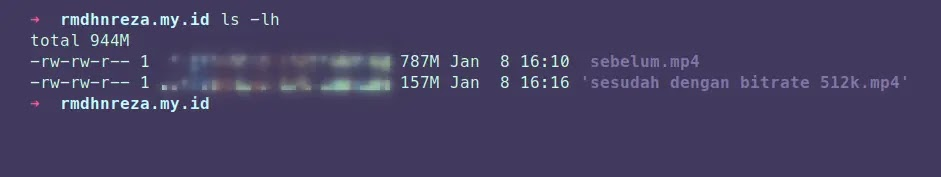

Pada kesempatan kali ini saya akan memberikan tutorial compress video menggunakan ffmpeg, ffmpeg ini biasanya program yang digunakan aplikasi untuk compress video, salah satunya handbrake.
Tutorial ini bisa dipakai di sistem operasi Linux dan Windows (disini saya menggunakan Linux, tetapi perintah nya sama saja mau Linux ataupun Windows)
1. Kalian install ffmpeg terlebih dahulu
   * Untuk Windows kalian bisa download di [gyan.dev](https://www.gyan.dev/ffmpeg/builds/)
   * untuk sistem operasi Linux saya sarankan menginstall ffmpeg dari snap, karena sudah support *Hardware Accelerated*, tetapi jika GPU kalian belum support NVENC kalian bisa menggunakan perintah
```bash
 sudo pacman -S ffmpeg (Arc based)
 sudo apt install ffmpeg (Debian based)
```
Jika kalian menggunakan snap bisa menggunakan perintah
```bash
 snap install ffmpeg
``` 
2. Jika ffmpeg nya sudah terinstall kalian bisa cek menggunakan powershell atau terminal dengan perintah ` ffmpeg` jika tidak muncul error berarti installasi selesai, jika muncul `command not found` berarti kalian belum setting **PATH** untuk ffmpeg nya,
   * Untuk setting **PATH** di Windows bisa kalian kunjungi [sulhi.id](https://sulhi.id/setting-path-environment-variable-di-windows-10/)
   * Untuk setting **PATH** di Linux kalian bisa kunjungi thread di [stackoverflow](https://stackoverflow.com/questions/14637979/how-to-permanently-set-path-on-linux-unix)
3. Sekarang kita mulai compress video nya dengan perintah
```bash
 ffmpeg -i input.mp4 -vcodec h264 -acodec aac output.mp4
```
4. Jika kalian ingin menggunakan *Hardware Accelerated*, kalian bisa gunakan perintah
```bash
 ffmpeg -hwaccel cuvid -c:v h264_cuvid -i input.mp4 -c:v h264_nvenc -cq 19 -c:a copy output.mp4
```

**input.mp4** ini adalah nama dan extensi video yang akan di compress sedangkan **output.mp4** adalah video yang sudah selesai di compress\
`-cq 19` **0** itu auto **19** rekomendasi **51** lossless, kalian bisa pilih 1-51.

5. Perbedaan kecepatan compress menggunakan CPU dan GPU (*Hardware Accelerated*)

AMD Phenom X4 955 BE @ 3.20GHz (4 Cores)  |  GPU NVIDIA GTX 750Ti

 

6. Jika kalian ingin setting bitrate video nya kalian bisa menggunakan perintah
```bash
 ffmpeg -hwaccel cuvid -c:v h264_cuvid -i input.mp4 -c:v h264_nvenc -cq 19 -b:v 512k -minrate 512k -maxrate 512k -bufsize 512k -c:a copy output.mp4
```
`512k` bisa kalian ganti misalnya dengan `1024k` atau `1M`

Menggunakan perintah langkah 4  | Menggunakan perintah langkah 6

 