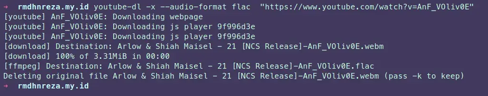
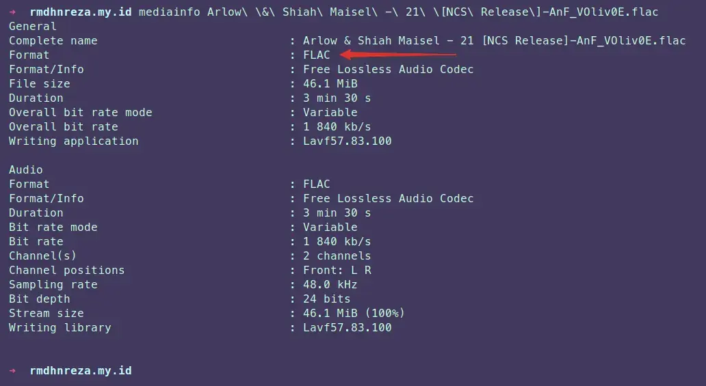

Tutorial kali ini saya akan share cara convert video atau music dari youtube ke format FLAC menggunakan **youtube-dl**.
Pastikan di sistem operasi kalian sudah terinstall ffmpeg, jika belum terinstall, silahkan install terlebih dahulu agar tidak error.

#### Tutorial Installasi di Sistem Operasi Linux
1. Download terlebih dahulu youtube-dl nya, untuk sistem operasi Linux kalian bisa menggunakan **curl**
```bash
 sudo curl -L https://yt-dl.org/downloads/latest/youtube-dl -o /usr/local/bin/youtube-dl
 sudo chmod a+rx /usr/local/bin/youtube-dl
```
Atau menggunakan **wget**
```bash
 sudo wget https://yt-dl.org/downloads/latest/youtube-dl -O /usr/local/bin/youtube-dl
 sudo chmod a+rx /usr/local/bin/youtube-dl
```
2. Jika di sistem operasi kalian sudah terinstall **python3** kalian bisa menggunakan perintah
```bash
 sudo pip3 install --upgrade youtube_dl
```

#### Tutorial Installasi di Sistem Operasi Windows
1. Download [youtube-dl.exe](https://yt-dl.org/downloads/2021.01.08/youtube-dl.exe) dan copy ke `C:\Windows`, Jika kalian mendapati error kalian install [Microsoft Visual C++ 2010 Redistributable Package (x86)](https://www.microsoft.com/en-US/download/details.aspx?id=5555) terlebih dahulu.
2. Jika di sistem operasi kalian sudah terinstall **python3** kalian bisa menggunakan perintah
```bash
 pip3 install --upgrade youtube_dl
```

#### Convert Video ke Audio Format FLAC
1. Kalian cari Video atau Music yang akan kalian convert, disini saya akan convert music dari channel NCS `https://www.youtube.com/watch?v=AnF_VOliv0E`
2. Jika kalian sudah siap, kalian buka `CMD` / `Powershell` untuk Windows, dan `Terminal` untuk Linux
3. Masukan perintah berikut
```bash
 youtube-dl -x --audio-format flac  "https://www.youtube.com/watch?v=AnF_VOliv0E"
```
`-x` adalah kependekan dari `--extract-audio`

