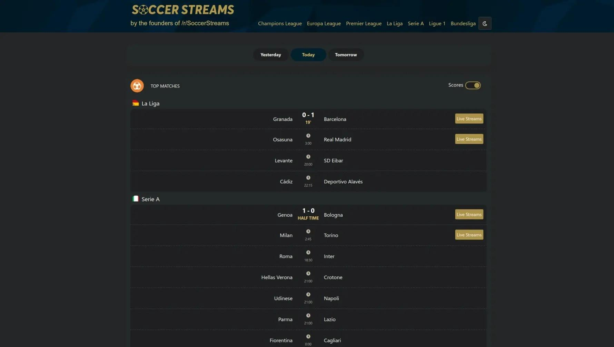
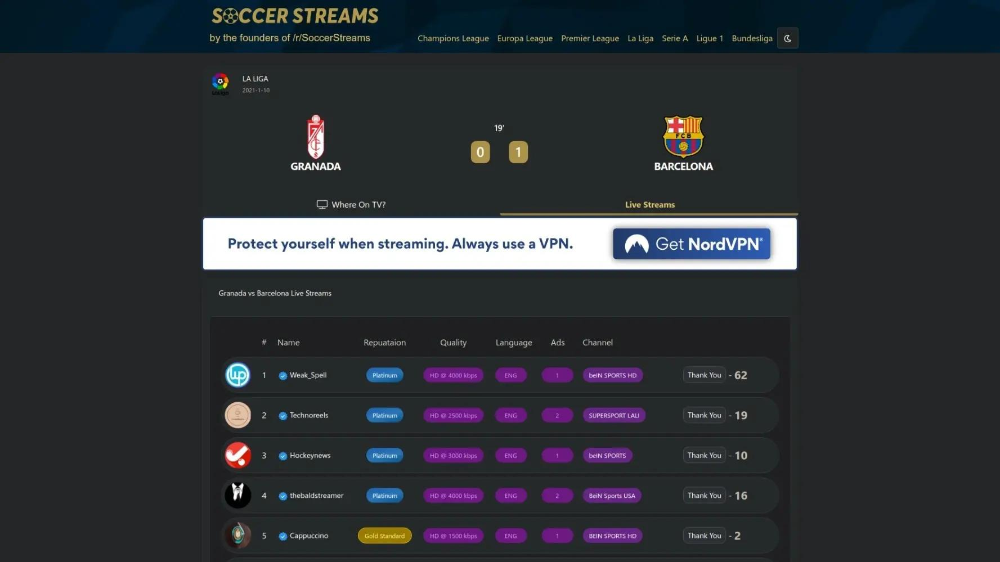
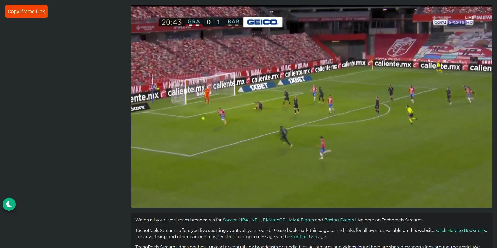
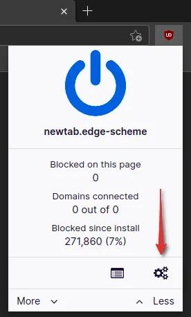
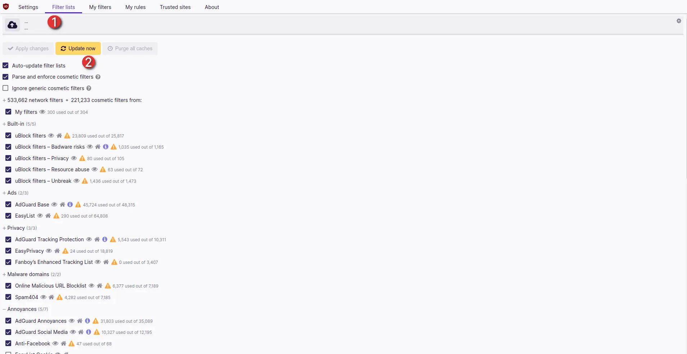

Tutorial kali ini akan membahas cara menonton live stream sepakbola secara ilegal tentunya, sebelum memulai tutorial ini pastikan kalian sudah setting `DNS-over-HTTPS` agar website streaming nya tidak terblokir, karena sudah banyak website-website streaming yang sudah diblokir oleh pihak ISP di Indonesia. Dengan menggunakan `DNS-over-HTTPS` kalian tidak perlu menggunakan VPN. Cara setting `Dns-over-HTTPS` sudah ada di website ini.
#### [Membuka Situs Terblokir Menggunakan DNS Over HTTPS](https://rmdhnreza.my.id/membuka-situs-terblokir-menggunakan-dns-over-https/) {class="centertext"}
Jika sudah setting `DNS-over-HTTPS` nya, langsung saja ke tutorialnya
1. Kalian kunjungi web [Soccer Stream](https://reedit.soccerstreams.net/home)
2. Klik di bagian `Live Streams` pada pertandingan yang akan kalian tonton, disini saya contohkan pertandingan **Granada Vs Barcelona**

3. Setelah itu kalian pilih salah satu website stream nya, jika live stream nya tidak bisa diputar, kalian pilih website stream yang lain, disini saya menggunakan web **Technoreels** (Nomor 2) untuk stream nya

4. Selamat Menonton

## Tambahan agar lebih enak streaming nya {class="centertext"}
1. Gunakan ekstensi adblocker agar tidak ada iklan yang mengganggu, saya sarankan menggunakan **uBlock Origin** yang kalian bisa install di browser kalian
   * [uBlock untuk Google Chrome atau Chromium Based Browser](https://chrome.google.com/webstore/detail/ublock-origin/cjpalhdlnbpafiamejdnhcphjbkeiagm)
   * [uBlock untuk Microsoft Edge (Chromium)](https://microsoftedge.microsoft.com/addons/detail/ublock-origin/odfafepnkmbhccpbejgmiehpchacaeak)
   * [uBlock untuk Mozilla Firefox atau Gecko Based Browser](https://addons.mozilla.org/en-US/firefox/addon/ublock-origin/)
2. Setelah terinstall kalian masuk ke **Dashboard uBlock Origin** nya, caranya klik icon uBlock Origin nya, lalu Klik di icon Gear

3. Masuk ke bagian **Filter Lists** lalu **Update Now**

4. Tunggu sampai semua Filter nya ter-update
## Tambahan {class="centertext"}
Di Indonesia sendiri **Mola TV** adalah tempat streaming legal untuk siaran sepak bola, oleh karena itu jika kalian ingin menonton siaran sepakbola secara legal kalian bisa berlangganan **Mola TV** Untuk harganya bisa kalian lihat di bagian [Beli Akses halaman Mola TV](https://mola.tv/accounts/profile?tab=subscriptionPackage)
