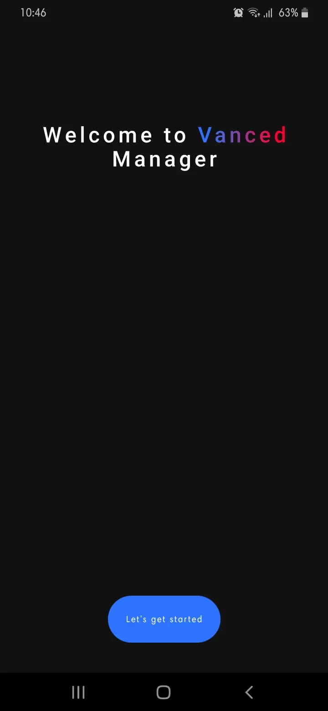
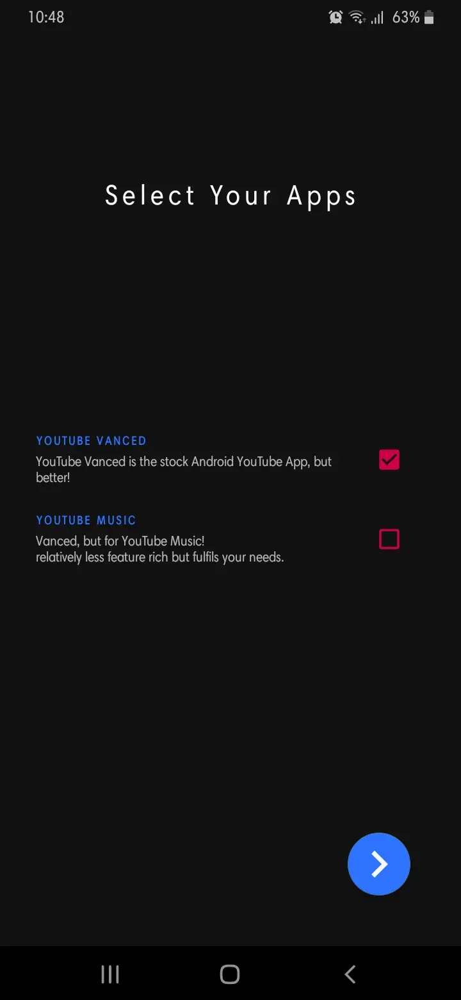
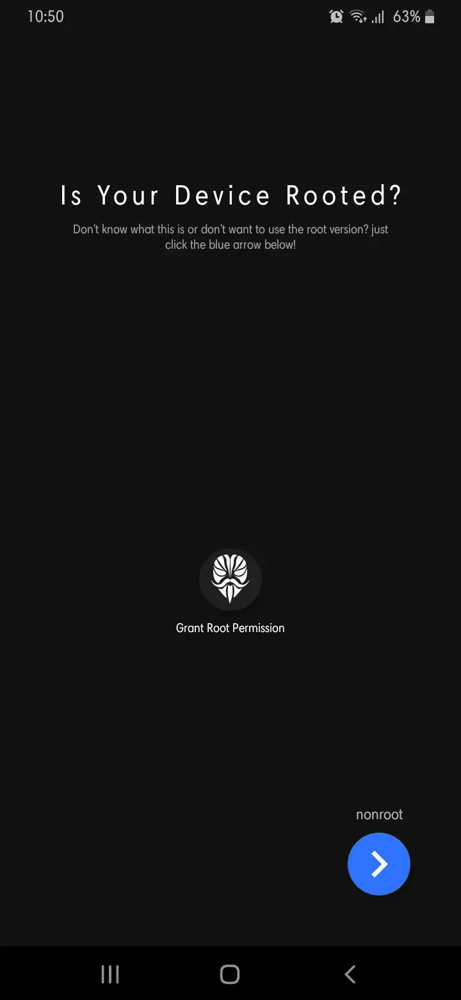
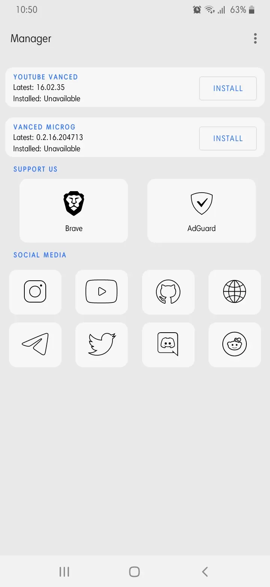
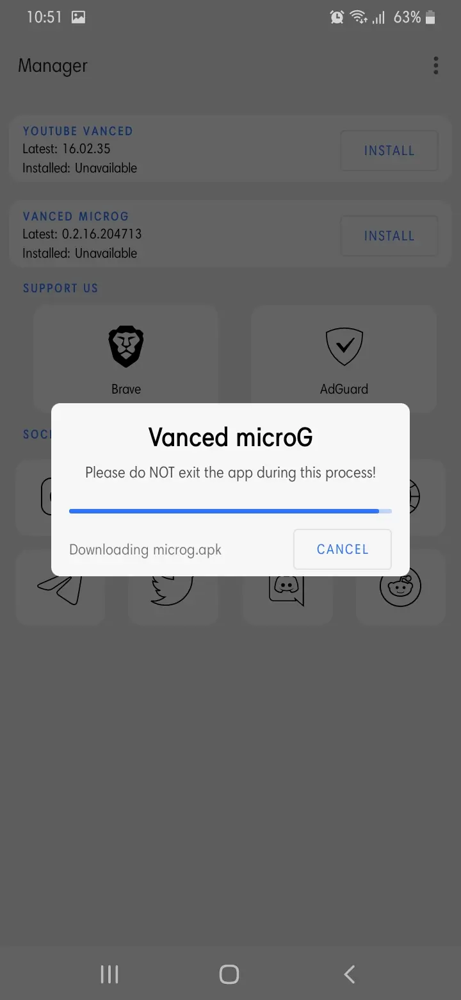
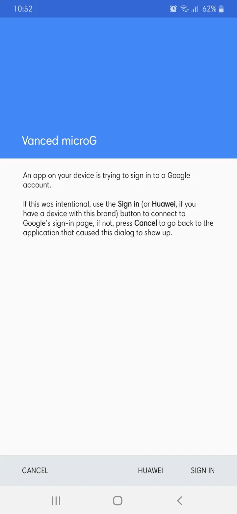
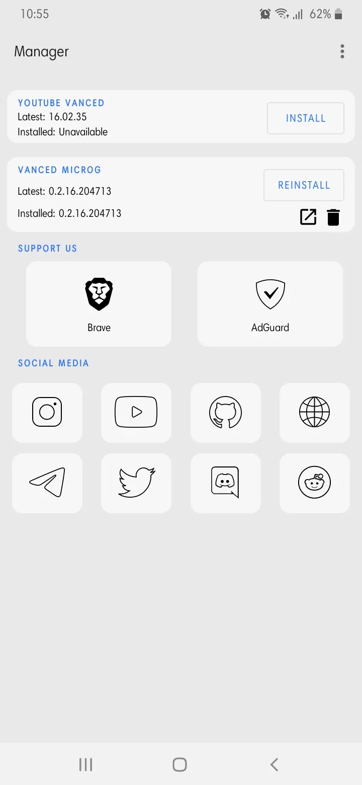
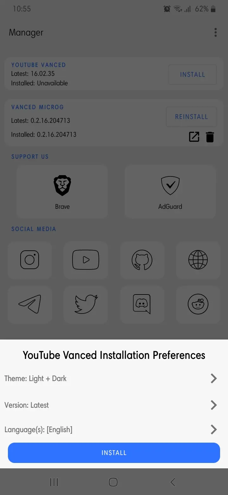
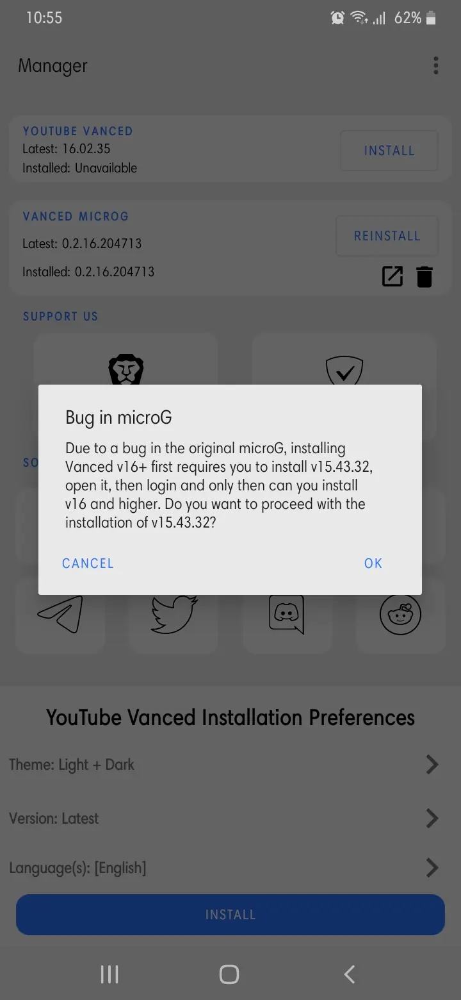

Adanya iklan ketika menonton video YouTube di hp Android menjadi gangguan tersendiri bagi pengguna. Iklan-iklan ini muncul mulai dari game ataupun aplikasi yang kamu instal di perangkat kamu. Selain itu, hal paling menjengkelkan ketika sedang asyik menonton tiba-tiba muncul iklan. Untuk itu disini saya akan share Cara Block Iklan di Aplikasi YouTube Android 2021 (root dan tanpa root). Oke, langsung saja ke tutorial nya

1. Download [Vanced Manager](https://github.com/YTVanced/VancedManager/releases/latest/download/manager.apk)
2. Install Vanced Manager, setelah terinstall buka Vanced Manager nya
3. Tap "Let's get started" pilih aplikasi yang mau kalian install, apakah mau **YouTube Vanced** saja atau mau install **YouTube Music** juga, Jika Android kalian sudah root, kalian beri permission Vanced Manager nya, jika belum root tinggal Next saja.
   * Setau saya perbedaan root dan tidak root, hanya di penginstallan MICROG nya saja, Android yang sudah root tidak butuh MICROG.  

    

4. Kalian install **VANCED MICROG** terlebih dahulu dengan tap **INSTALL**, lalu buka **VANCED MICROG** nya dan **Add Account**, **Login** dengan akun Google kalian. Jika device kalian HUAWEI, kalian tap dibagian HUAWEI

   

5. Kembali ke Vanced Manager, sekarang kita install **YOUTUBE VANCED** langsung saja tap **INSTALL**. Disini ada pilihan tema kalian bisa pilih, jika ada pop up kalian klik OK saja

   

6. **PENTING**, setelah terinstall **YouTube Vanced** nya, **kalian buka aplikasinya terlebih dahulu sebelum UPDATE ke versi terbaru**, jika kalian langsung update, YouTube Vanced nya akan Blank atau Loading terus-menerus.
7. Setelah kalian buka YouTube Vanced nya, kembali ke Vanced Manager dan tap **UPDATE**, setelah Update sekarang kalian bisa buka YouTube Vanced nya
8.  Selaman menonton video YouTube bebas iklan :D

## Untuk Xiaomi atau yang menggunakan ROM MIUI
Kalian disable dulu **MIUI OPTIMIZATION** nya di **Developer Option**
1. Masuk ke **Settings** (Setelan)
2. Cari dan klik **About phone** (Tentang Telepon)
3. Di bagian **MIUI Version** (Versi MIUI) tap 7x sampai muncul notifikasi “You are now a developer! (Sekarang Anda adalah seorang Pengembang)” di sisi bawah layar.
4. Kembali ke halaman Settings (Setelan)
5. Klik **Additional Settings** (Setelan Tambahan)
6. Cari dan klik **Developer Options** (Opsi Pengembang)
7. Scroll ke paling bawah sampai bawah sampai bagian **MIUI OPTIMIZATION** (OPTIMASI MIUI)
8. **OFF** kan, dan restart Android kalian (biasanya tampilan nya menjadi acak-acakan)
9. Kalian ikuti cara install YouTube Vanced diatas
10. **ON** kan lagi **MIUI OPTIMIZATION** (OPTIMASI MIUI), agar tampilan MIUI nya tidak acak-acakan.