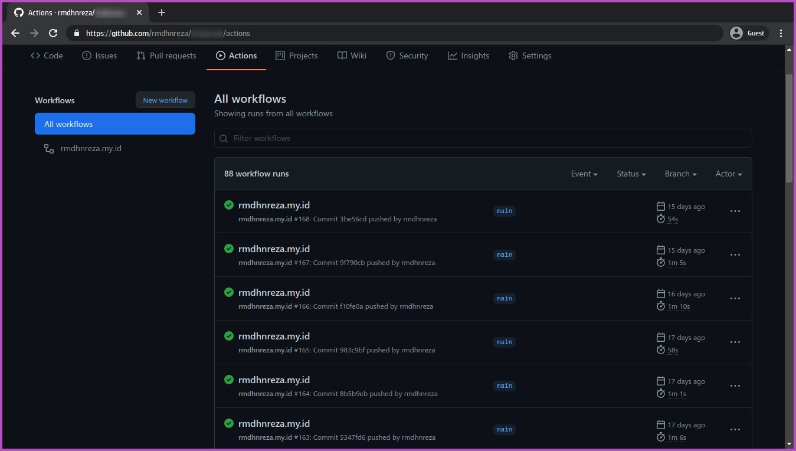
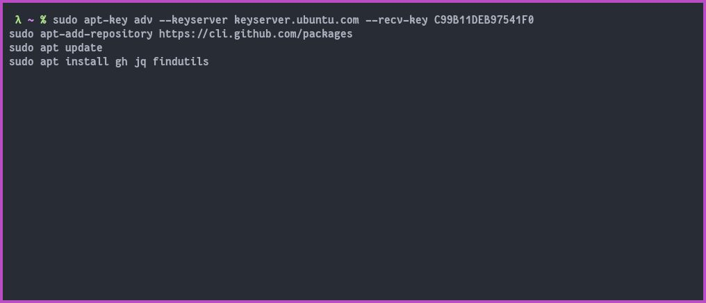
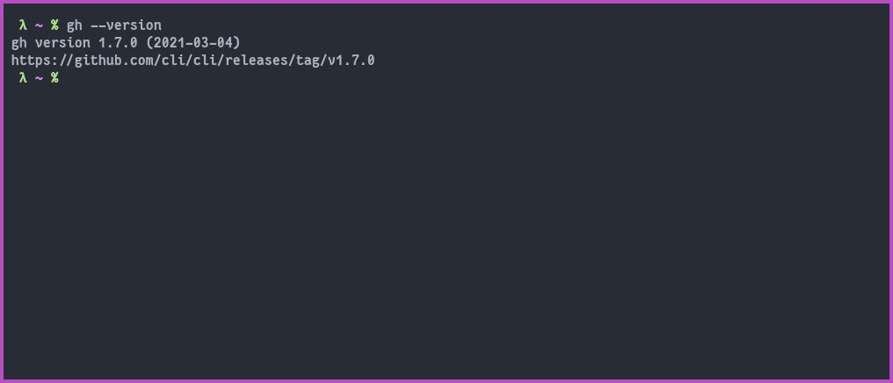
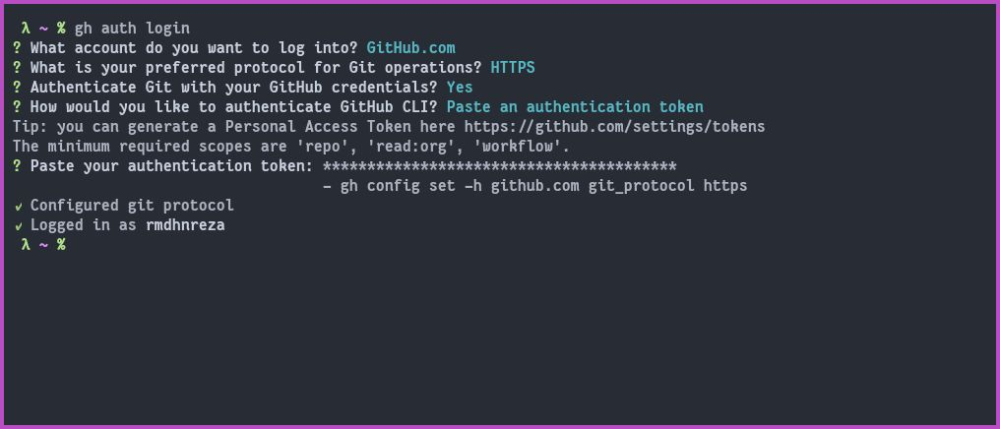
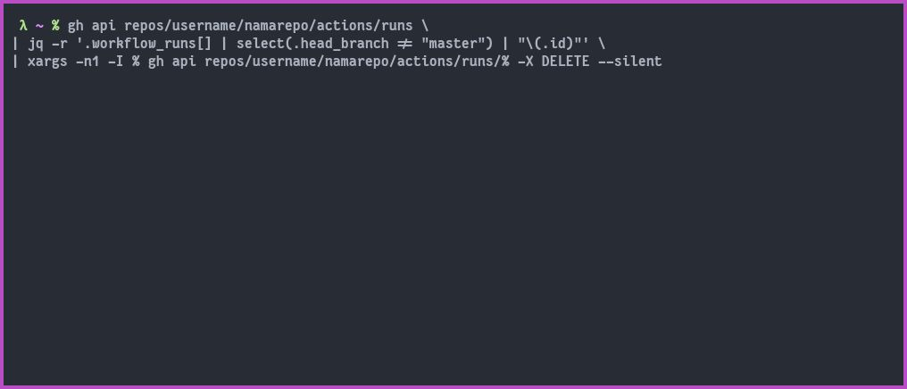
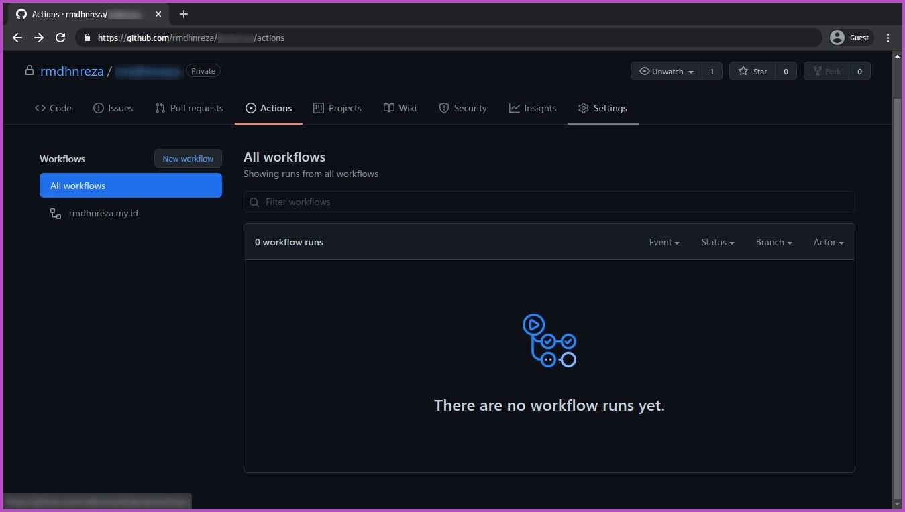

Pada kesempatan kali ini saya akan share Cara Hapus Semua Log Workflows Hasil Github Actions, seperti ini


Disini saya menggunakan Linux Ubuntu, tapi untuk sistem operasi lain sama saja perintahnya, yang berbeda hanya penginstallan gh-cli nya saja, Oke langsung ke tutorialnya.
1. Install **gh-cli jq** dan **findutils** untuk Sistem Operasi 
   * Ubuntu gunakan perintah
```bash
sudo apt-key adv --keyserver keyserver.ubuntu.com --recv-key C99B11DEB97541F0
sudo apt-add-repository https://cli.github.com/packages
sudo apt update
sudo apt install gh jq findutils
```
   * Arch Linux gunakan perintah
```bash
sudo pacman -S github-cli jq findutils
```
   * Windows, Untuk sistem operasi Windows gunakan scoop, jika sistem operasi kalian belum terinstall scoop, kalian bisa lihat tutorial nya di [Cara Menginstall Package Manager Scoop Di Windows 10](/cara-menginstall-package-manager-scoop-di-windows-10/). Setelah terinstall scoop gunakan perintah
```powershell
scoop install gh jq findutils
```


2. Cek github cli nya apakah sudah sukses terintall dengan perintah
```bash
gh --version
```


3. Masukan perintah berikut ini untuk login ke akun github kalian yang akan dihapus log workflows nya
```bash
gh auth login
```
```
   ? What account do you want to log into? -> GitHub.com
   ? What is your preferred protocol for Git operations? -> HTTPS
   ? How would you like to authenticate GitHub CLI? -> Login with a web browser (sangat mudah)
   ? Masukan one-time code nya
   ? Authorize Github
   ? Tekan Enter di terminal
```


4. Setelah kalian sukses login, kalian gunakan perintah ini untuk menghapus semua log workflows hasil github actions
```bash
gh api repos/username/namarepo/actions/runs \
| jq -r '.workflow_runs[] | select(.head_branch != "master") | "\(.id)"' \
| xargs -n1 -I % gh api repos/username/namarepo/actions/runs/% -X DELETE --silent
```
**Note:** 
   - **username** ganti dengan **username** github kalian !
   - **namarepo** ganti dengan **nama repository** yang akan di hapus log workflows nya !
   - Jika kalian tidak ingin menghapus log workflows di branch `main` ganti `master` dengan `main`, begitupun sebaliknya! Perintah diatas **tidak menghapus** log workflows di branch `master`


5. Setelah kalian menjalankan perintahnya cek log workflows nya apakah sudah terhapus atau belum. jika belum kalian jalankan lagi saja perintahnya sampai semuanya terhapus

