Pertama-tama jika kalian ingin hosting atau deploy blog hugo ke Firebase kalian bisa lihat di [Tutorial Membuat Static Website Dengan Hugo](/tutorial-membuat-static-website-dengan-hugo/) \
Jika kalian ingin hosting atau deploy ke Github kalian bisa lihat tutorial [Tutorial Build Hugo Website Ke Github Pages Menggunakan Github Actions](/tutorial-build-hugo-website-ke-github-pages-menggunakan-github-actions/)

Pada kesempatan kali ini saya akan share tutorial hosting atau deploy website Hugo kalian ke [Gitlab](https://gitlab.com/), Saya asumsikan kalian sudah mempunyai akun Gitlab dan sudah login.

1. Buat project baru dengan klik **Create a project** Pilih **Create blank project**
  - **Project name** kalian bisa isi bebas
  - **Project slug** kalian buat **username**.gitlab.io (Wajib jika tidak menggunakan ***3rd-party*** domain)
  - **Visibility Level** pilih **Public**
  - **Initialize repository with a README** kalian **ceklis**

 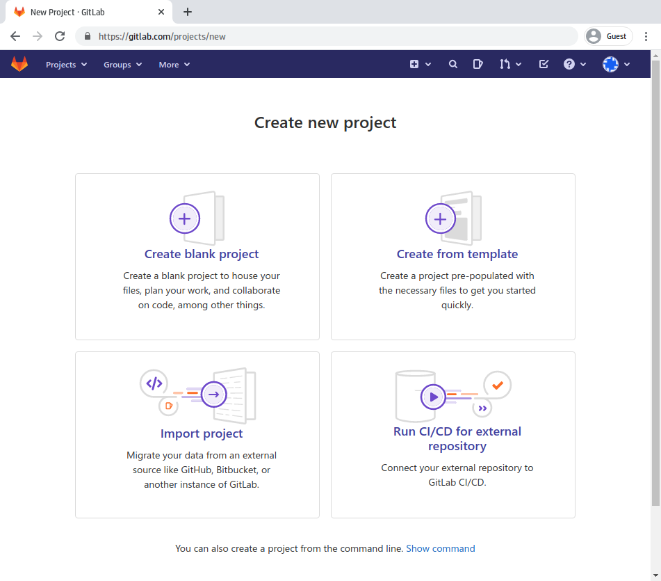 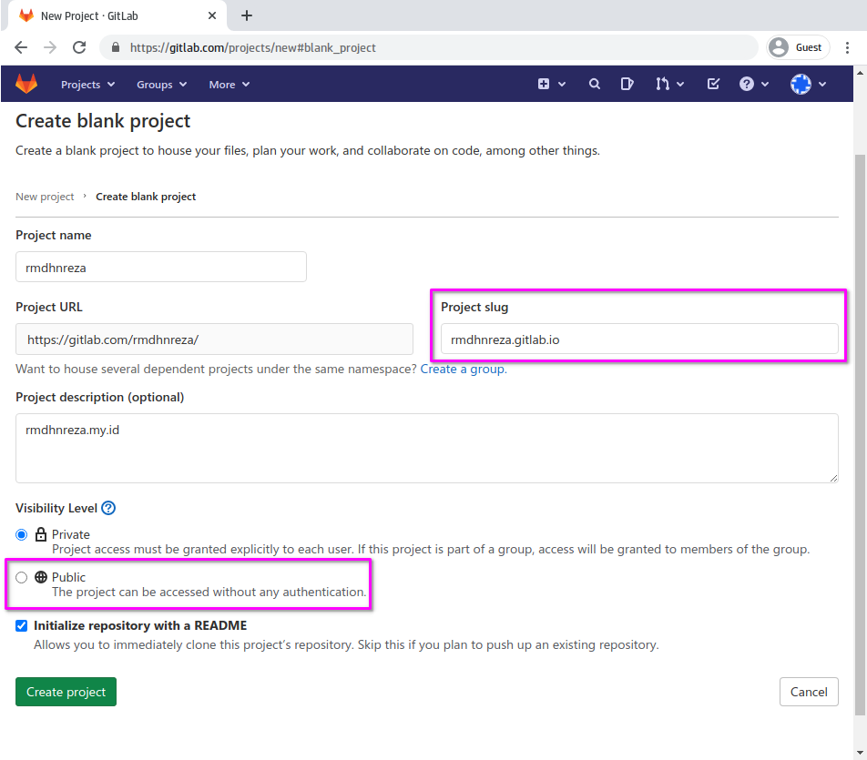 

2. Clone repository atau project kalian, Karena disini saya menggunakan HTTPS, jadi gitlab meminta username dan password, jika kalian sudah setting **sshKeys** di Gitlab saya sarankan clone menggunakan SSH
```bash
git clone https://gitlab.com/rmdhnreza/rmdhnreza.gitlab.io.git
```
3. Buat website hugo dengan perintah `hugo new site --force username.gitlab.io`. Note: Perintah `--force` disini untuk memberitahu hugo jika folder nya tidak kosong
```bash
hugo new site --force rmdhnreza.gitlab.io
```

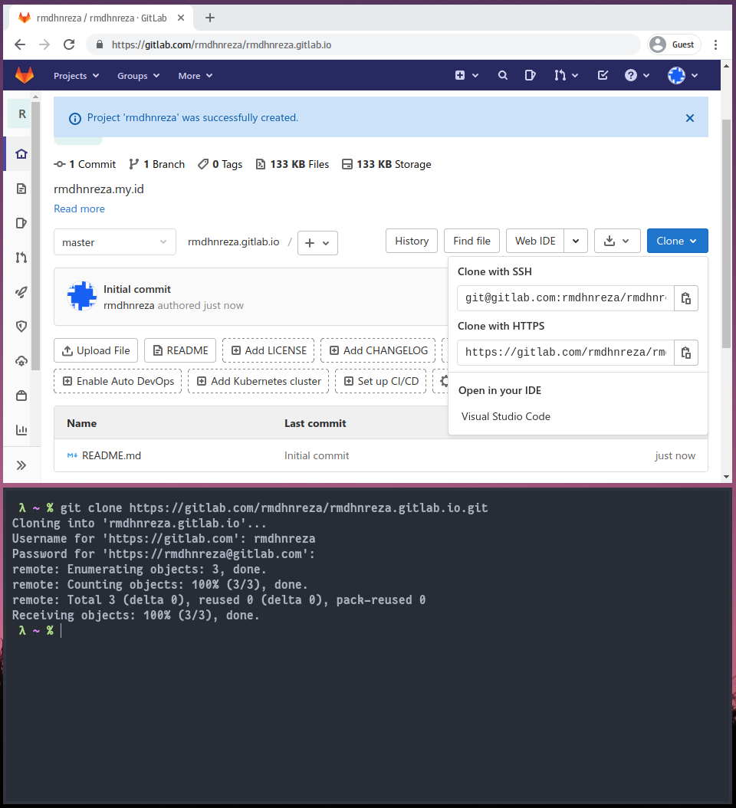  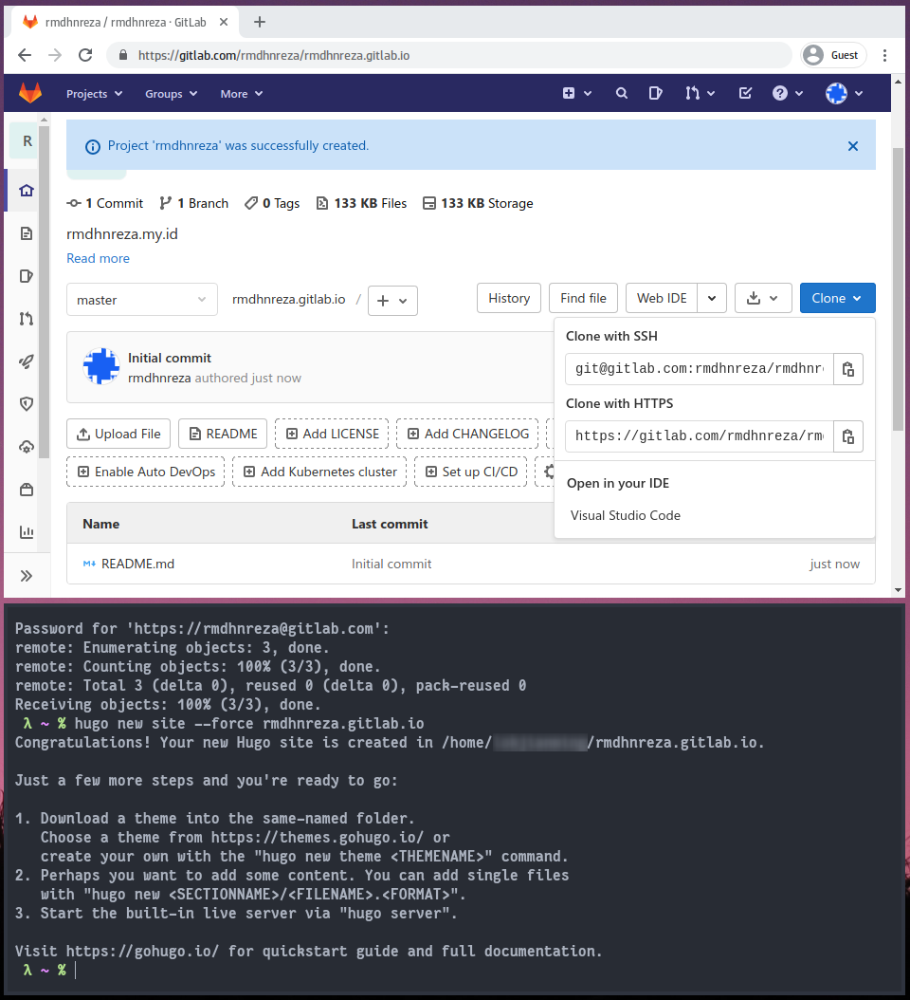

4. Masuk ke folder **root direktori** hugo kalian (rmdhnreza.gitlab.io) dan tambahkan tema yang akan kalian gunakan, disini saya menggunakan tema **Notepadium**, untuk setting-setting temanya kalian bisa lihat di dokumentasi tema nya.
```bash
git submodule add https://github.com/cntrump/hugo-notepadium.git themes/hugo-notepadium
```
5. Copy isi folder dari **tema/exampleSite** ke **root direktori** hugo website kalian, jangan lupa jika di **exampleSite** terdapat **config.yaml** maka kalian harus **hapus config.toml** di **root direktori** hugo website kalian, begitupun sebaliknya. Karena jika ada 2 config, kemungkinan besar akan error.

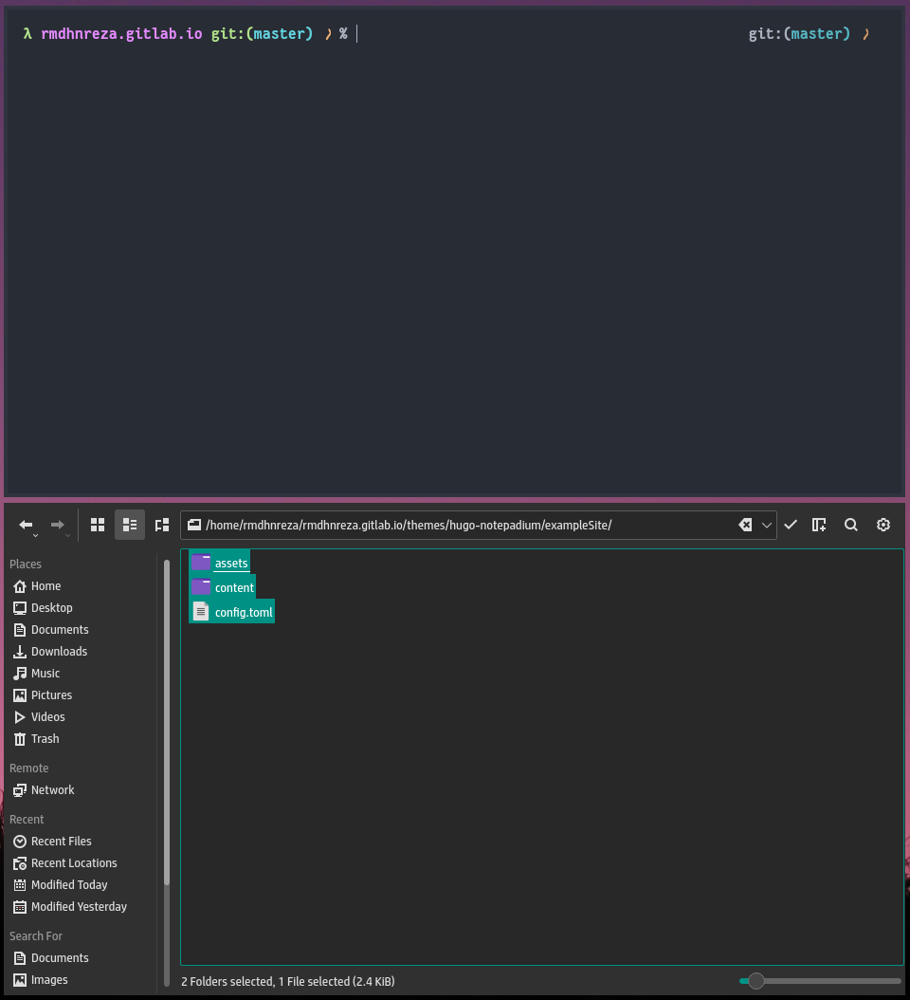 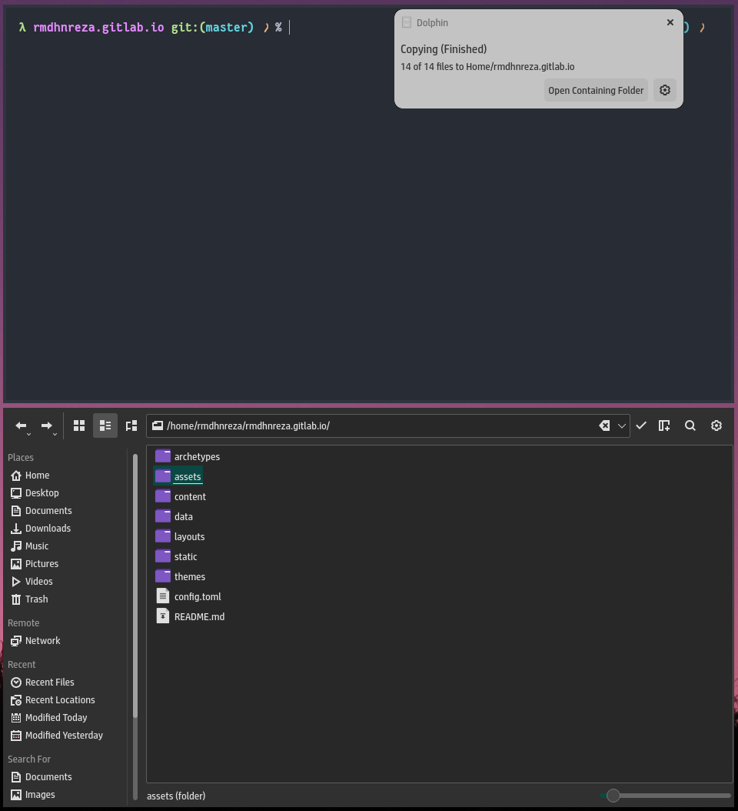

6. Jika sudah gunakan perintah `hugo server` untuk menjalankannya secara local, saya asumsikan disini kalian tidak mendapati error.


7. Edit **config.toml**, ganti **baseURL** nya menjadi **https://username.gitlab.io**


8. Buat file baru dengan nama **.gitlab-ci.yml**, isikan konten berikut lalu Save
```yml
# All available Hugo versions are listed here: https://gitlab.com/pages/hugo/container_registry
image: registry.gitlab.com/pages/hugo:latest

variables:
  GIT_SUBMODULE_STRATEGY: recursive

test:
  script:
  - hugo
  except:
  - master

pages:
  script:
  - hugo
  artifacts:
    paths:
    - public
  only:
  - master
```

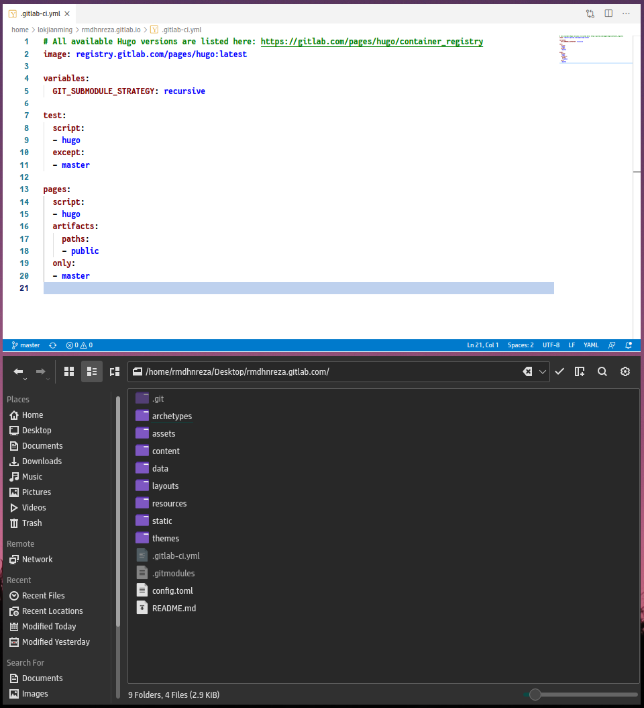

8. Sekarang kita push ke Gitlab
```bash
git config user.name "Nama Kalian" ->> Jika kalian sudah setting ini secara global, bisa lewati langkah ini
git config user.email "Email Kalian" ->> Jika kalian sudah setting ini secara global, bisa lewati langkah ini
git add .
git commit -m "Deploy Hugo ke Gitlab"
git push origin master
```

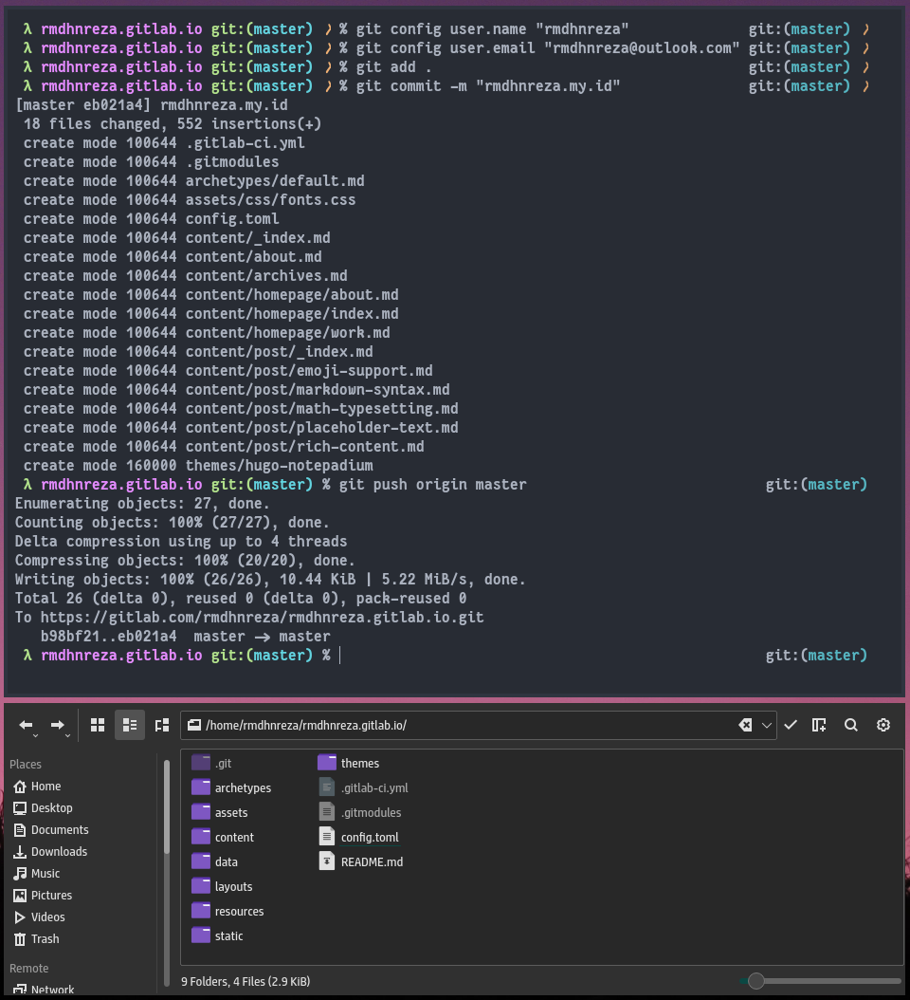

9. Tunggu beberapa saat sampai **https://username.gitlab.io** bisa diakses, pada saat tutorial ini dibuat dibawah 2 menit website yang saya hosting di Gitlab langsung bisa diakses

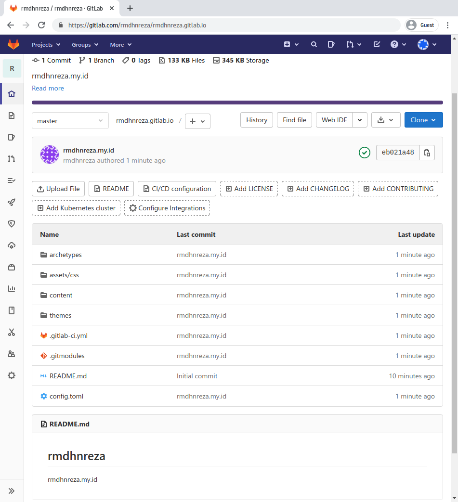 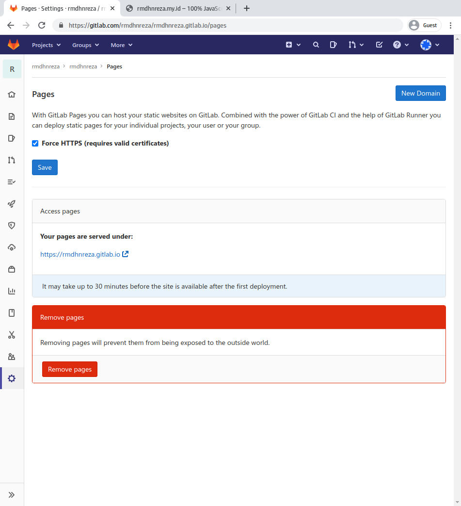 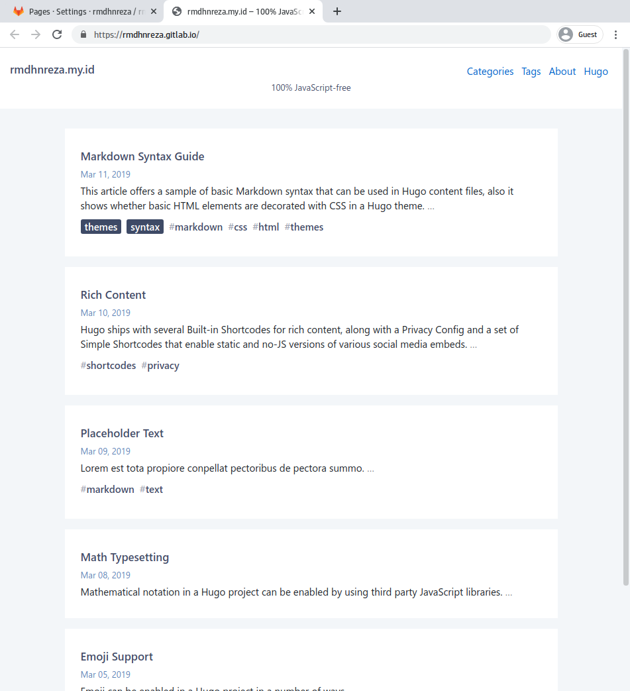