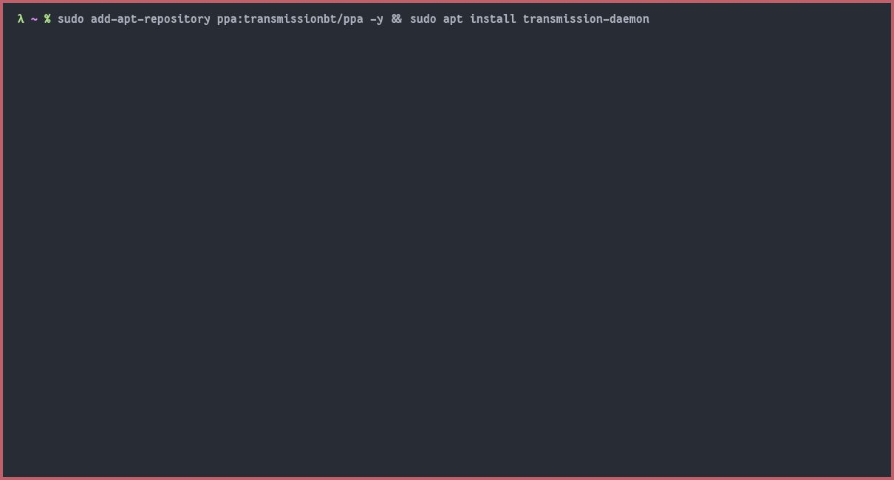
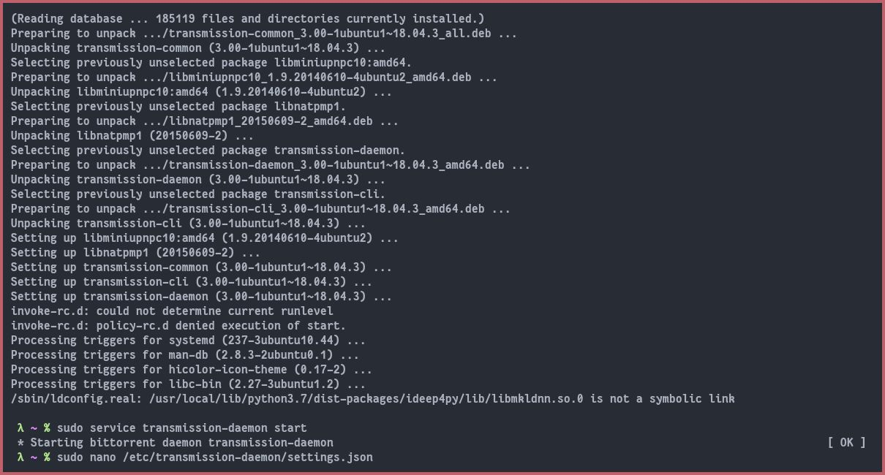
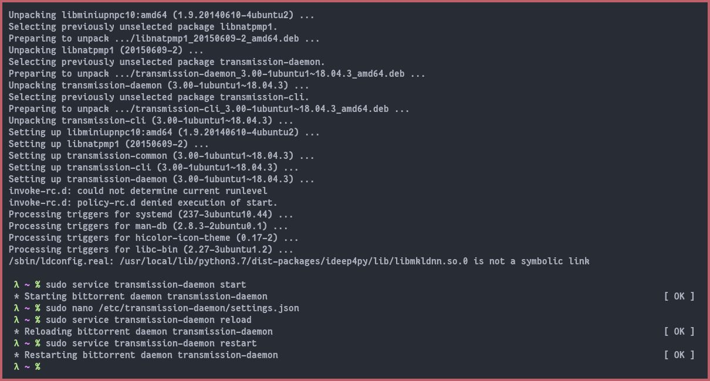
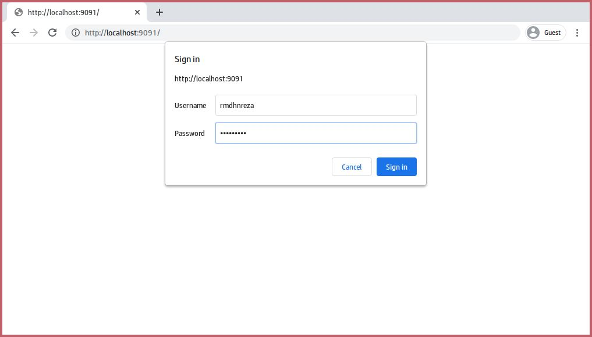
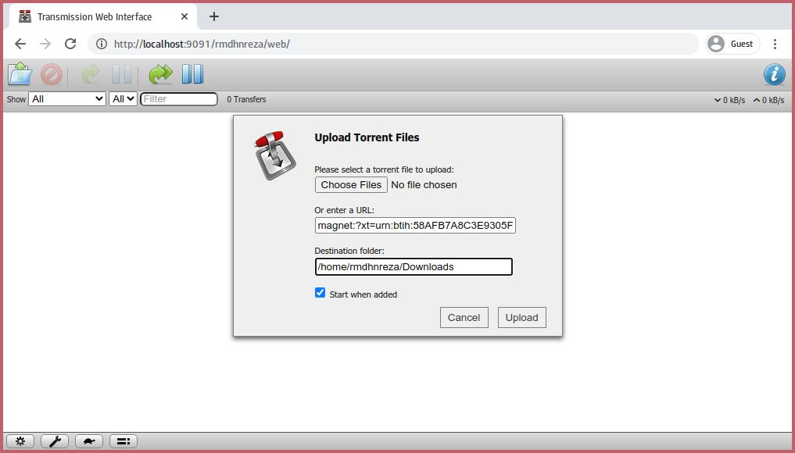
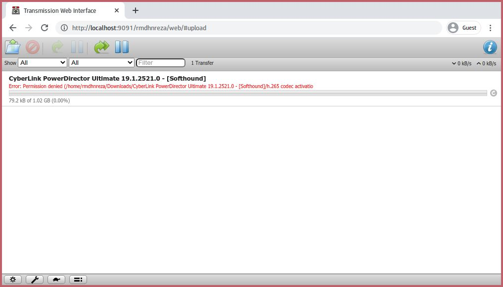
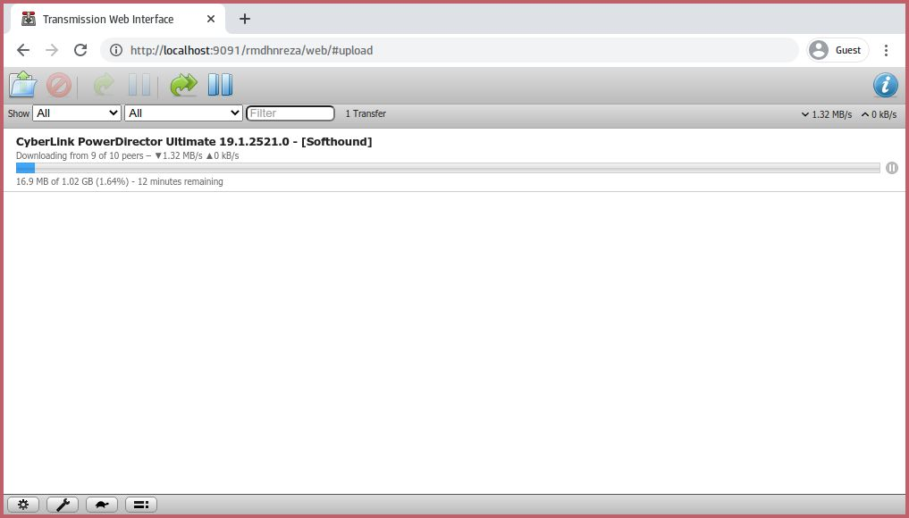
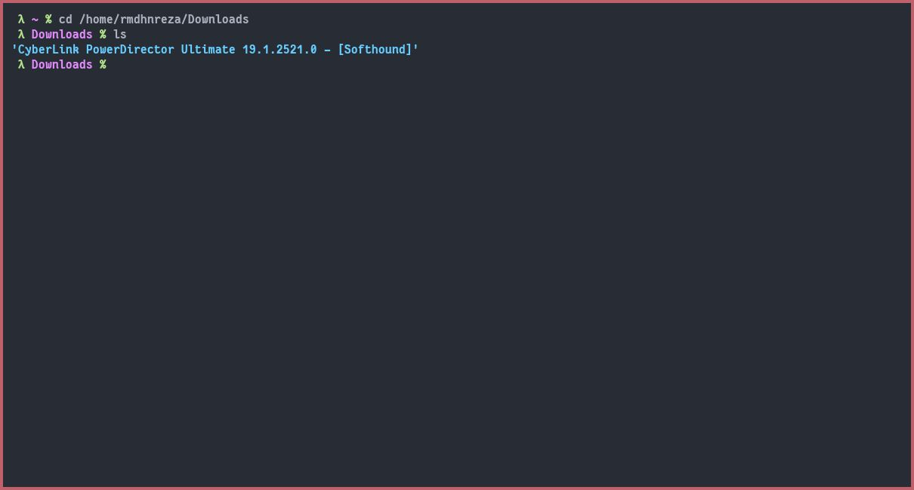
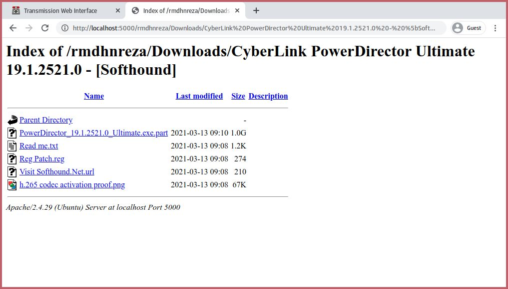

Pada kesempatan kali ini saya akan share tutorial Cara Install Transmission BT 3.0 di Linux Ubuntu. Transmission adalah klien BitTorrent gratis yang tersedia untuk Linux. Transmission ini menggunakan sumber daya yang sangat sedikit dibandingkan dengan klien BitTorrent lainnya. Aplikasi klien Transmission tidak tersedia di repositori Ubuntu 20.04. Namun, kalian dapat menginstallnya melalui repositori PPA eksternal. Pada saat tutorial ini ditulis, versi Transmission terbaru adalah 3.00.

## Install Transmission 3.0 Ubuntu 18.04 & 20.04
1. Tambahkan ppa berikut ini dan jalankan perintah untuk menginstall transmission nya
```bash
sudo add-apt-repository ppa:transmissionbt/ppa -y && sudo apt install transmission-daemon
```



2. Setelah terinstall jalankan perintah berikut ini untuk menjalankan trasnmission nya dan agar kita bisa setting config nya
```bash
sudo service transmission-daemon start
```
3. Edit config **settings.json** yang terdapat di `/etc/transmission-daemon/settings.json`
```bash
sudo nano /etc/transmission-daemon/settings.json
```



4. Ubah bagian yang kalian perlukan, disini saya hanya mengubah bagian ini saja, setelah selesai edit kalian bisa simpan dengan cara `CTRL + O` `Enter` `CTRL + X` untuk editor `nano`
```json
{
    "download-dir": "/home/rmdhnreza/Downloads", // <-- Ubah direktori download torrent nya sesuai keinginan kalian
    "rpc-authentication-required": true, // <-- Ubah ke false jika kalian tidak ingin menggunakan username/password untuk Login
    "rpc-password": "rmdhnreza", // <- Password untuk login, jika  "rpc-authentication-required": true
    "rpc-port": 9091, // <-- Port bisa kalian ubah sesuai keigininan kalian, asal port nya belum terpakai oleh aplikasi lain
    "rpc-url": "/rmdhnreza/", // <- Ubah sesuai keinginan kalian, URL nya jadi seperti ini http://localhost:9091/rmdhnreza/web
    "rpc-username": "rmdhnreza", // <- Username untuk login, jika  "rpc-authentication-required": true
    "rpc-whitelist": "*", // <- Ubah dari 127.0.0.1 ke * 
}
```
5. Reload config dan restart transmission-daemon
```bash
sudo service transmission-daemon reload && sudo service transmission-daemon restart
```



6. Buka web address, disini saja menggunakan local computer jadi ip nya 127.0.0.1 atau localhost, jika kalian menggunakan VPS kalian masukan IP nya
```
http://127.0.0.1:9091
http://localhost:9091
http://ip.v.p.s:9091
```
7. Jika berhasil maka akan ada prompt untuk memasukan username & password, dengan catatan di config nya kalian set `"rpc-authentication-required": true`, jika `"rpc-authentication-required": false` maka tidak akan muncul prompt ini



8. Sekarang kalian bisa langsung add torrent file atau magnet link



9.  Jika pada saat download kalian mendapati error `Permission Denied`, kalian bisa ubah permission `"download-dir": "/home/rmdhnreza/Downloads"` nya dengan cara
```bash
chmod 777 /home/rmdhnreza/Downloads
```

 

10. Add lagi torrent yang kalian download, sudah pasti sekarang tidak akan mendapati error `Permission Denied`



11. Jika torrent sudah selesai cek folder download nya



## Untuk pengguna VPS
1. Kalian install terlebih dahulu apache2
```bash
sudo apt install apache2
```
2. Jalankan apache2 nya dengan perintah
```bash
sudo service apache2 start
```
3. Buat symlink directory download ke `/var/www/html`
```bash
sudo ln -s /home/rmdhnreza/Downloads /var/www/html
```
4. Buka di browser `http://ip.v.p.s/Downloads` jika kalian edit port apache2 nya menjadi 5000 (misalnya), maka `http://ip.v.p.s:5000/Downloads`

