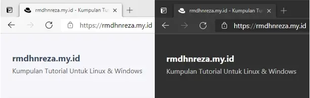
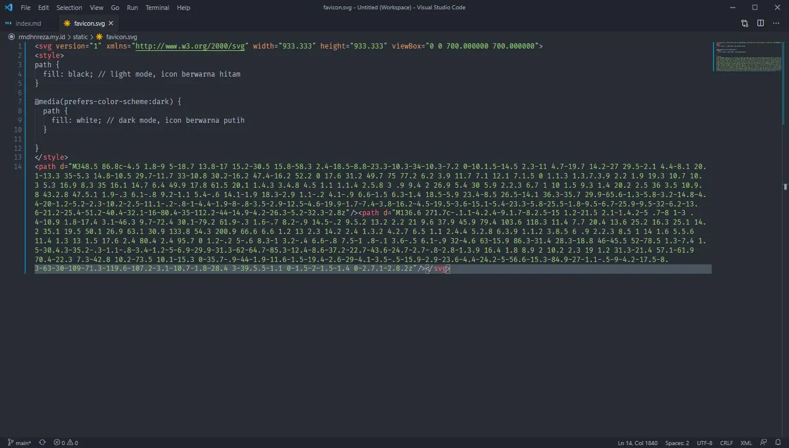

Kali ini saya akan memberikan tutorial cara membuat icon website menjadi Light Mode dan Dark Mode, seperti ini contohnya:



Disini saya akan memberikan untuk penggunakan icon berekstensi **SVG**, jadi tidak menggunakan **Javascript** atau **2 file icon**.
Jika website kalian belum menggunakan **SVG**, pastikan favicon kalian convert terlebih dahulu ke **SVG**, jika sudah kita langsung ke langkah selanjutnya.

1. Buka file **SVG** menggunakan text editor kesukaan kalian (disini saya menggunakan VScode)
2. Tambahkan baris CSS berikut sebelum **`<path>`**
```css
<style>
path {
  fill: black; // light mode, icon berwarna hitam
}

@media(prefers-color-scheme:dark) {
  path {
    fill: white; // dark mode, icon berwarna putih
  }

}
</style>
```
Jika sudah kalian **Save**



3. Edit bagian **head** pada website kalian, hapus baris favicon sebelumnya dan gantikan dengan baris berikut
```html
<link rel="icon" href="/favicon.svg" type="image/svg+xml">
```
4. Kalian Save lalu test menggunakan browser kesukaan kalian (disini saya menggunakan Microsoft Edge Chromium)

