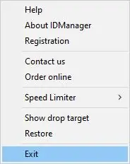
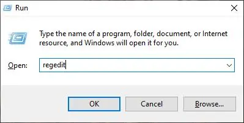
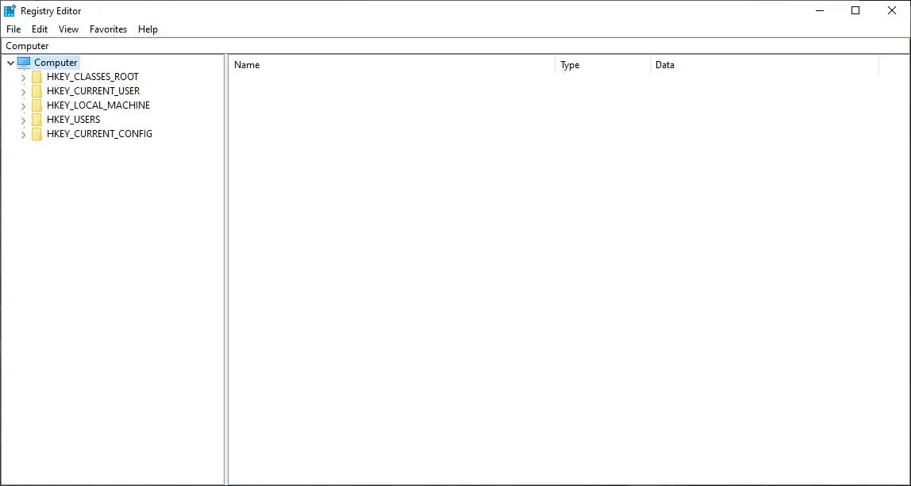
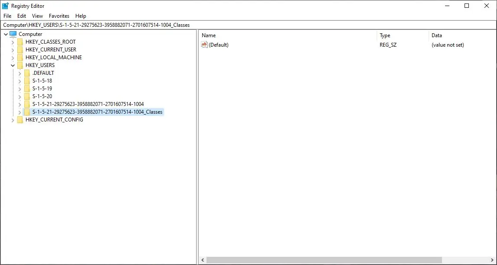
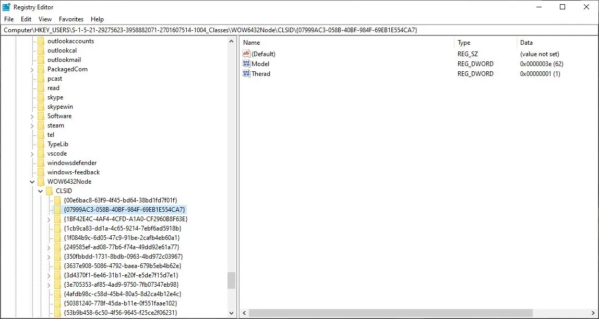
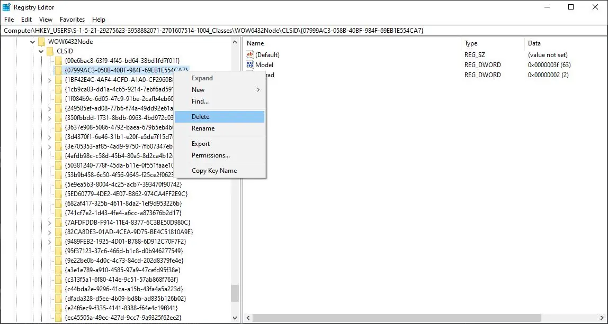

Internet Download Manager atau biasa disingkat IDM, adalah perangkat lunak yang mampu mengunduh data-data yang ada di internet dan meneruskan kembali. Program buatan New York, Amerika ini menempati posisi teratas dalam memaksimalkan kecepatan mengunduh data. Tampilan dan grafis yang sederhana membuat IDM lebih bersahabat dengan penggunanya.

IDM didukung dengan fitur meneruskan kembali, yaitu untuk mengunduh ulang berkas-berkas yang sebelumnya terputus karena masalah teknis maupun nonteknis. IDM juga memiliki fitur unduh yang cepat dengan kemampuan melakukan segmentasi berkas secara otomatis dan didukung dengan teknologi yang aman. [Sumber Wikipedia](https://id.wikipedia.org/wiki/Internet_Download_Manager)

---

Pada tutorial kali ini kita akan melakukan trial reset IDM menjadi 30 hari (seperti awal mula install), Caranya pun cukup mudah 

1. *Force Close* IDM terlebih dahulu, dengan mengklik exit di IDM pada bagian *tray icon*



2. Kalian buka **registry editor** dengan menekan shortcut **Win + R** pada keyboard lalu isikan **regedit** dan tekan **enter**, Jika muncul *Prompt UAC* kalian klik *Yes*





3. Maka akan muncul Window Registry Editor, Navigasikan ke
```
HKEY_USERS
└── S-1-5-21-563298657-3659230254-7856325069-1001_Classes
    └── WOW6432Node
        └── CLSID
            └── {07999AC3-058B-40BF-984F-69EB1E554CA7} <-- Hapus
```

 

Catatan: Pada bagian **S-1-5-21-563298657-3659230254-7856325069-1001_Classes** angka **563298657-3659230254-7856325069** pasti berbeda setiap komputer, jadi jika beda nama key registry nya tidak masalah, yang penting kalian pilih yang ada tulisan **_Classes** nya.

4. Hapus registry key **{07999AC3-058B-40BF-984F-69EB1E554CA7}** dengan cara Klik Kanan -> Delete



5. Tutup Window Registry Editor nya
6. Buka aplikasi IDM nya.
