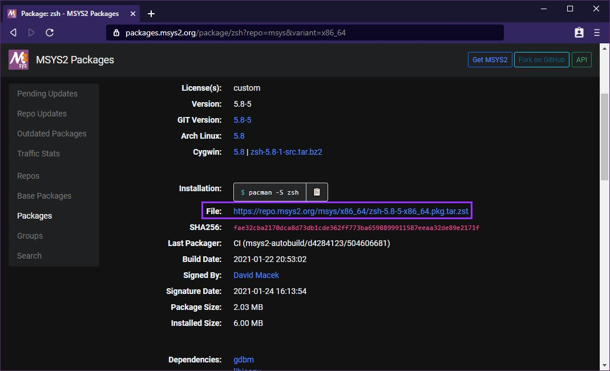
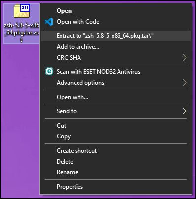
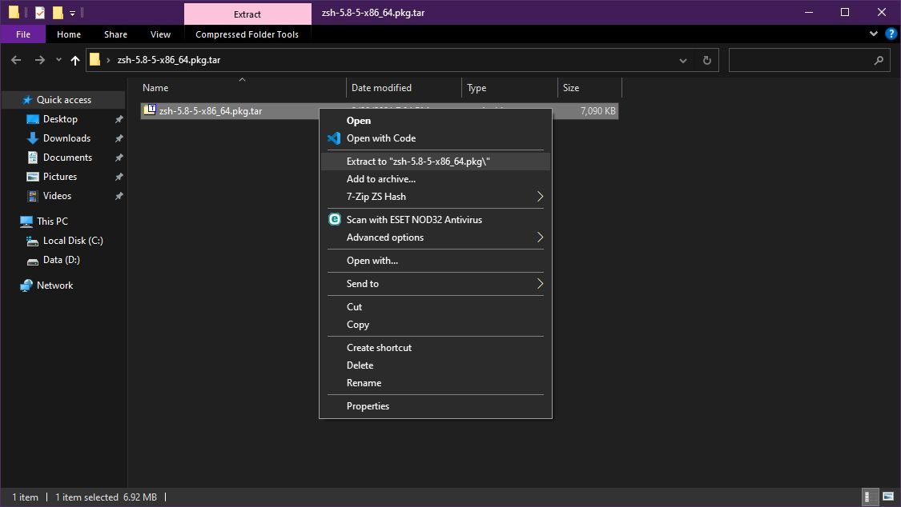
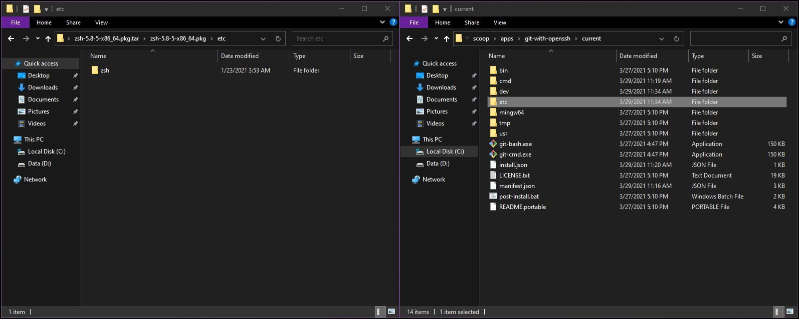
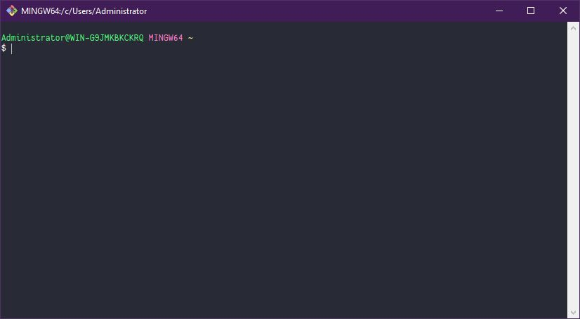
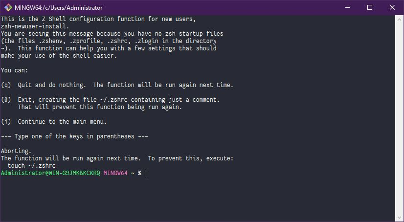
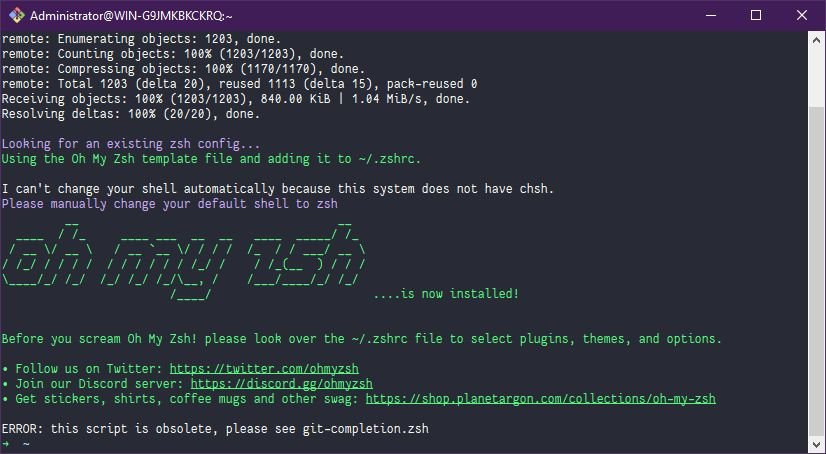
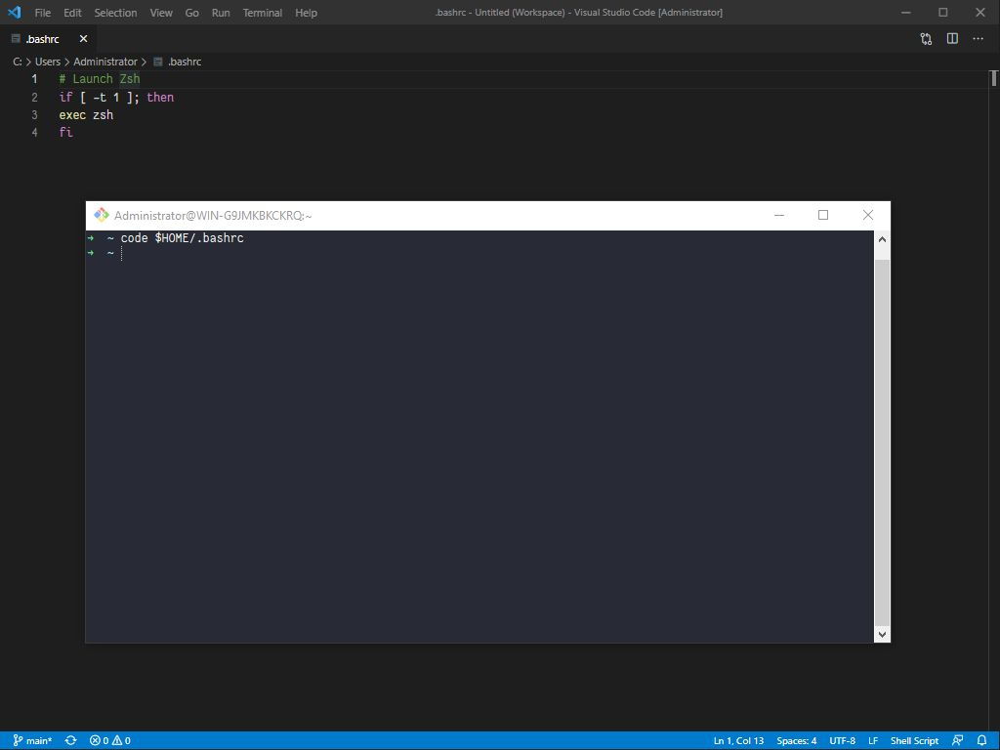

Pada tutorial kali ini saya akan share cara menginstall Framework Oh My Zsh, untuk Sistem Operasi Windows berbeda dengan Linux & Mac OS karena lumayan banyak tahapan yang harus dilakukan. Tutorial ini kita akan menggunakan **Git Bash**, jadi langsung saja ke tutorialnya.

1. Install [Git for Windows](https://git-scm.com/download/win) sesuai dengan sistem operasi kalian apakah 32/64 Bit, jika kalian menggunakan [scoop](/cara-menginstall-package-manager-scoop-di-windows-10/), kalian bisa lewati langkah ini.
2. Kalian install Zsh terlebih dahulu, kalian bisa download package nya di [packages.msys2.org/package/zsh?repo=msys&variant=x86_64](https://packages.msys2.org/package/zsh?repo=msys&variant=x86_64), dan kalian download yang filenya yang memiliki _extension_ `zst`



3. Kalian Extract file `zst` nya, untuk kalian yang tidak bisa extract file nya, coba kalian install [7-zip-zstd](https://github.com/mcmilk/7-Zip-zstd/releases), untuk kalian yang menggunakan [scoop](/cara-menginstall-package-manager-scoop-di-windows-10/) bisa mengikuti [langkah-langkah ini](https://github.com/lukesampson/scoop/issues/3990#issuecomment-631059255)
4. Extract lagi file **.tar** menggunakan **7-zip**

 

5. Kalian Copy-Paste folder **etc** dan **usr** ke folder Git (C:\Program Files\Git) untuk yang menggunakan scoop (C:\Users\%username%\scoop\apps\git\current)



6. Kalian buka **git-bash.exe** dan jalankan perintah `zsh` Enter

 

7. Selanjutnya kita install oh-my-zsh dengan perintah



```bash
sh -c "$(curl -fsSL https://raw.githubusercontent.com/robbyrussell/oh-my-zsh/master/tools/install.sh)"
```

8. Jika muncul **ERROR: this script obsolete: please see git-completion.zsh** abaikan saja, Kalian buat file `.bashrc` di home directory windows kalian (C:\Users\\%username%\\.bashrc)
9. Isikan baris berikut

```bash
# Launch Zsh
if [ -t 1 ]; then
exec zsh
fi
```



10. Jalan git-bash nya sekarang sudah load zsh otomatis.
