***White Flash*** adalah hal paling menjengkelkan pada saat kita berselancar di dunia maya, ***White Flash*** ini biasanya muncul ketika kalian membuka tab bar atau sedang memuat website yang kalian kunjungi. Disini saya akan membagikan tutorial untuk Web Browser [Firefox](https://www.mozilla.org/en-US/firefox/new/), [Chrome](https://www.google.com/chrome/) & [Microsoft Edge](https://www.microsoft.com/en-us/edge).

Pertama-tama jika kalian menggunakan Windows 10, Fitur ***Dark Mode*** nya kalian aktifkan, ***White Flash*** tidak akan muncul, tetapi jika kalian tetap menggunakan ***Light Mode*** dan ingin menghilangkan ***White Flash*** ikuti tutorial berikut.

{}
### Klik Browser yang kalian Gunakan

[](#firefox) [](#google-chrome) [](#microsoft-edge)

{}

### Firefox
1. Kalian kunjungi **about:config** & **Klik Accept the Risk and Continue**
2. Copy dan Paste baris beriku
```
ui.systemUsesDarkTheme ->> Number ->> 0 itu Light Mode & 1 Dark Mode
browser.in-content.dark-mode ->> boolean ->> Jika Dark Mode pilih **True** sedangkan Light Mode **False**
```
Jadinya Seperti ini
```
ui.systemUsesDarkTheme ->> Number ->> 1
browser.in-content.dark-mode ->> boolean ->> true
```
Jika ingin Light Mode
```
ui.systemUsesDarkTheme ->> Number ->> 0
browser.in-content.dark-mode ->> boolean ->> false
```
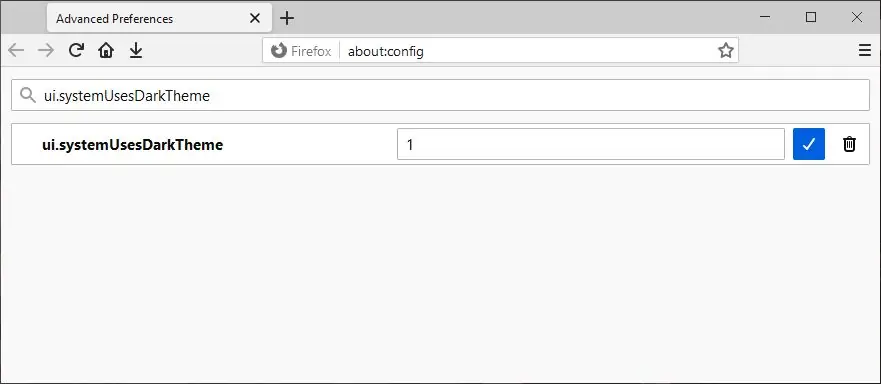 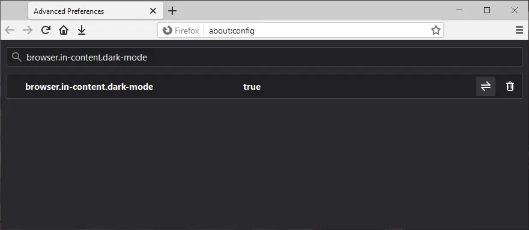

3. Install Add-ons [Dark Reader](https://addons.mozilla.org/en-US/firefox/addon/darkreader/) dan Jika sudah terinstall lanjut ke langkah 4
4. Klik icon Dark Reader nya &#8608; Dev Tools &#8608; Preview new design &#8608; Apply &#8608; Exit

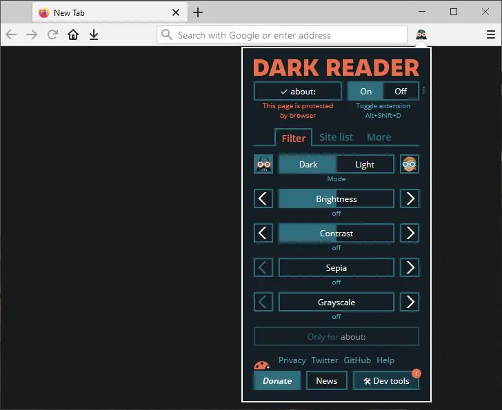 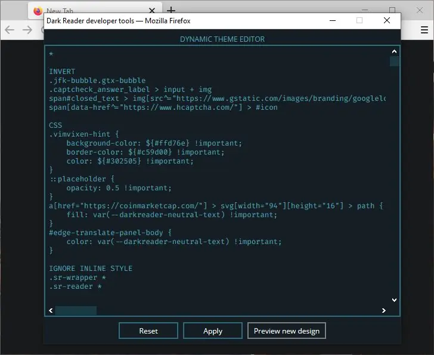

5. Klik Settings &#8608; Site List &#8608; On kan Enable on restricted pages &#8608; Back &#8608; Manage Settings &#8608; On kan Synchronize site fixes

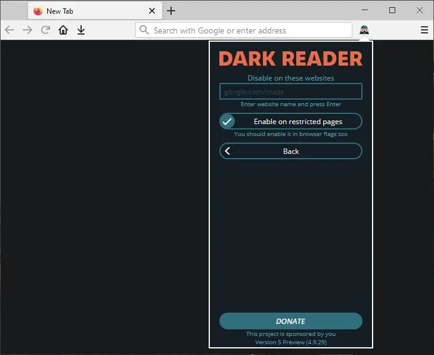 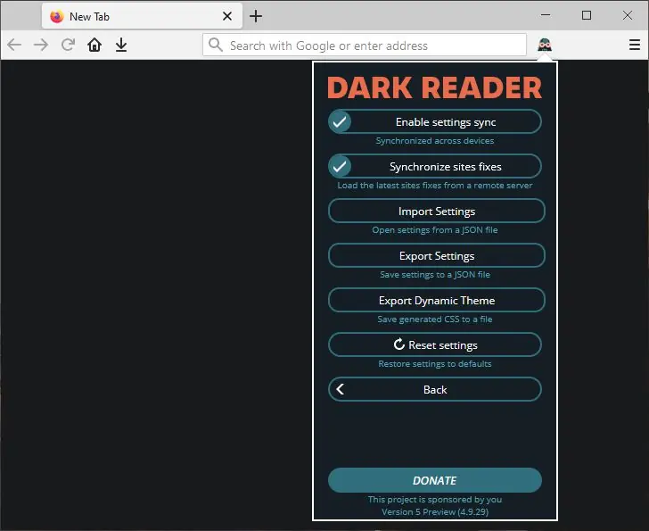

6. Selesai, White Flash tidak akan Muncul.

### Google Chrome
1. Kalian buat shortcut Google Chrome di Desktop kalian dengan cara 
```
Klik Start Menu ->> Klik Kanan pada icon Google Chrome ->> More ->> Open file location 
->> Klik Kanan pada icon Google Chrome ->> Send to ->> Desktop (create shortcut)
```
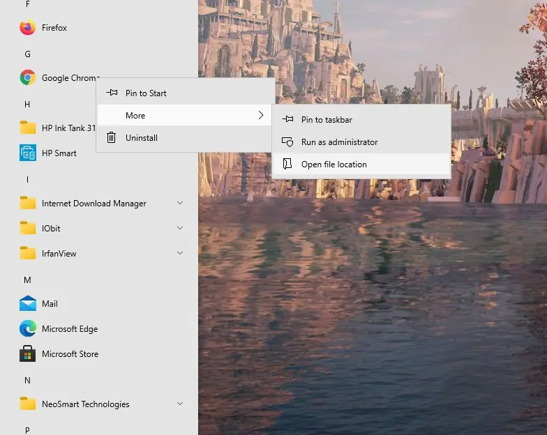 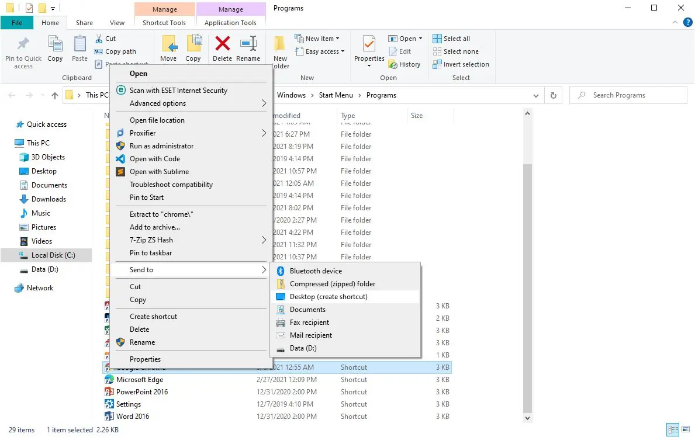 

2. Klik kanan pada shortcut Google Chrome yang baru saja dibuat, tambahkan command line **--force-dark-mode** setelah chrome.exe"
```
"C:\Program Files\Google\Chrome\Application\chrome.exe"[spasi]--force-dark-mode
Jadinya seperti ini
"C:\Program Files\Google\Chrome\Application\chrome.exe" --force-dark-mode
```

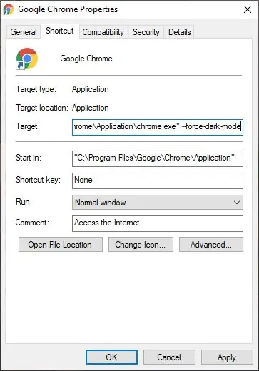 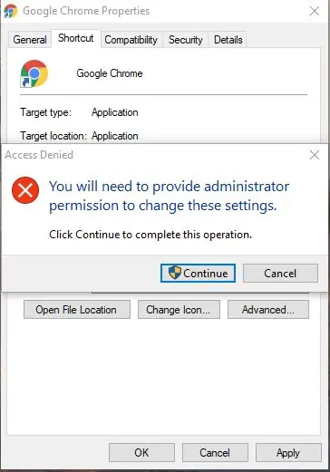

3. Buka Chrome & Install Extension [Dark Reader](https://chrome.google.com/webstore/detail/dark-reader/eimadpbcbfnmbkopoojfekhnkhdbieeh) dan Jika sudah terinstall lanjut ke langkah 4
4. Klik icon Dark Reader nya &#8608; Dev Tools &#8608; Preview New Design &#8608; Apply &#8608; Exit

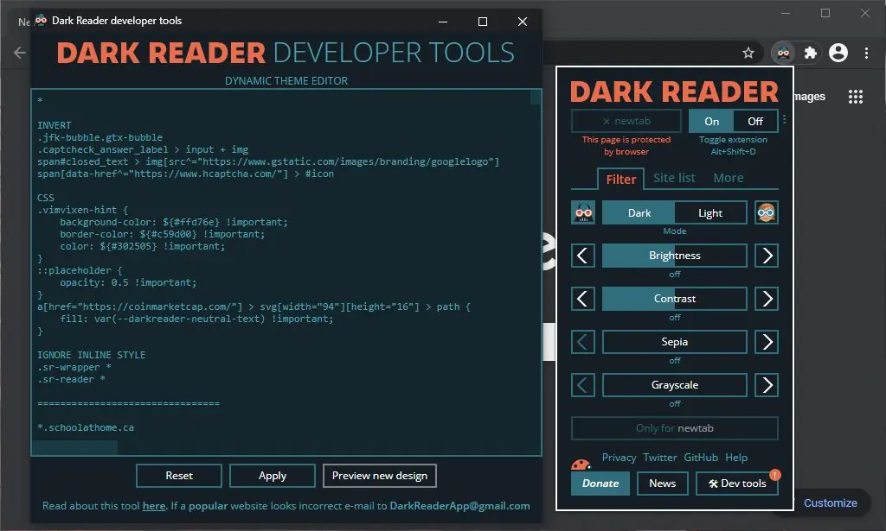

5. Klik Settings &#8608; Site List &#8608; On kan Enable on restricted pages &#8608; Back &#8608; Manage Settings &#8608; On kan Synchronize site fixes

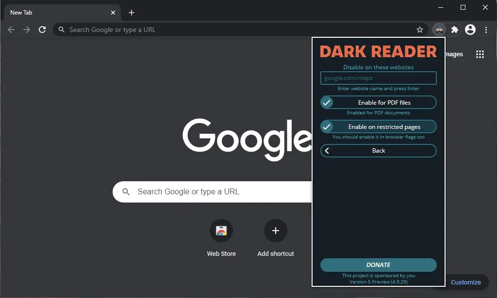 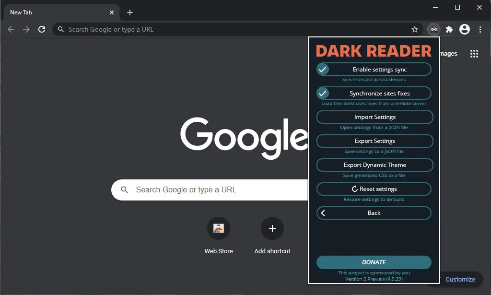

6. Selesai, White Flash tidak akan Muncul.

## Microsoft Edge
1. Kalian kunjungi **edge://settings/appearance** dan ganti **Default Theme** ke **Dark**

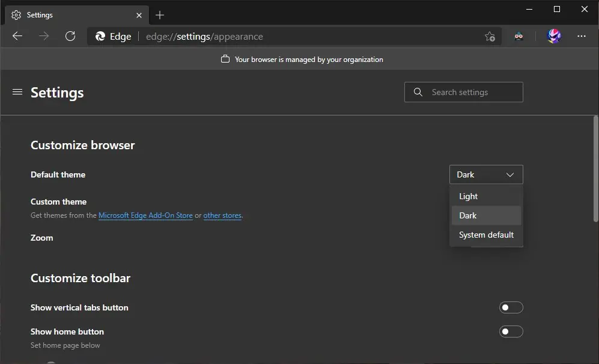

2. Install Extension [Dark Reader](https://microsoftedge.microsoft.com/addons/detail/ifoakfbpdcdoeenechcleahebpibofpc) dan Jika sudah terinstall lanjut ke langkah 3
3. Klik icon Dark Reader nya &#8608; Dev Tools &#8608; Preview New Design &#8608; Apply &#8608; Exit

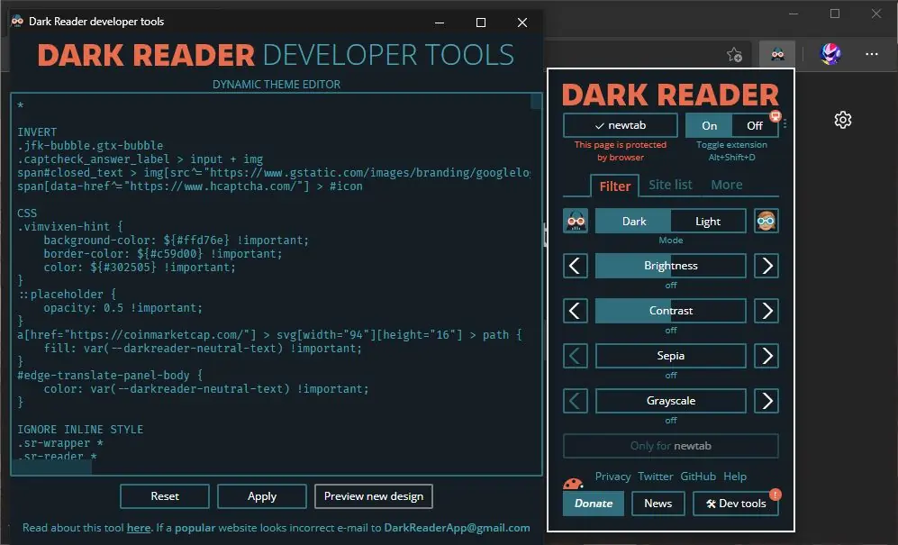

4. Klik Settings &#8608; Site List &#8608; On kan Enable on restricted pages &#8608; Back &#8608; Manage Settings &#8608; On kan Synchronize site fixes

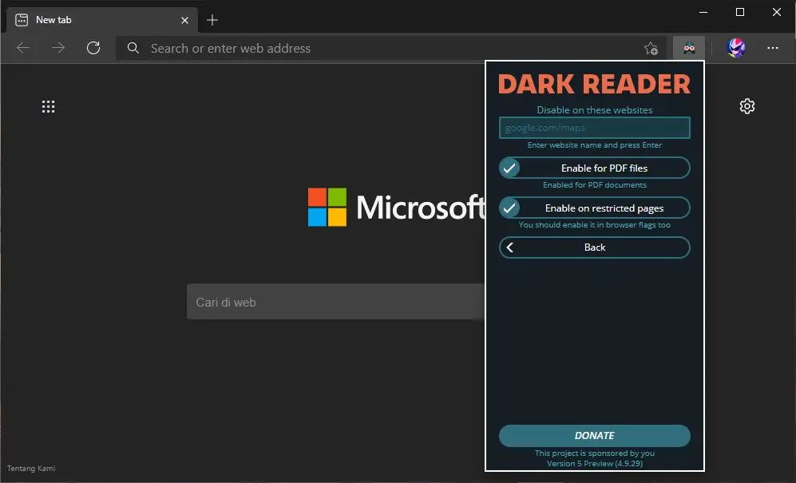 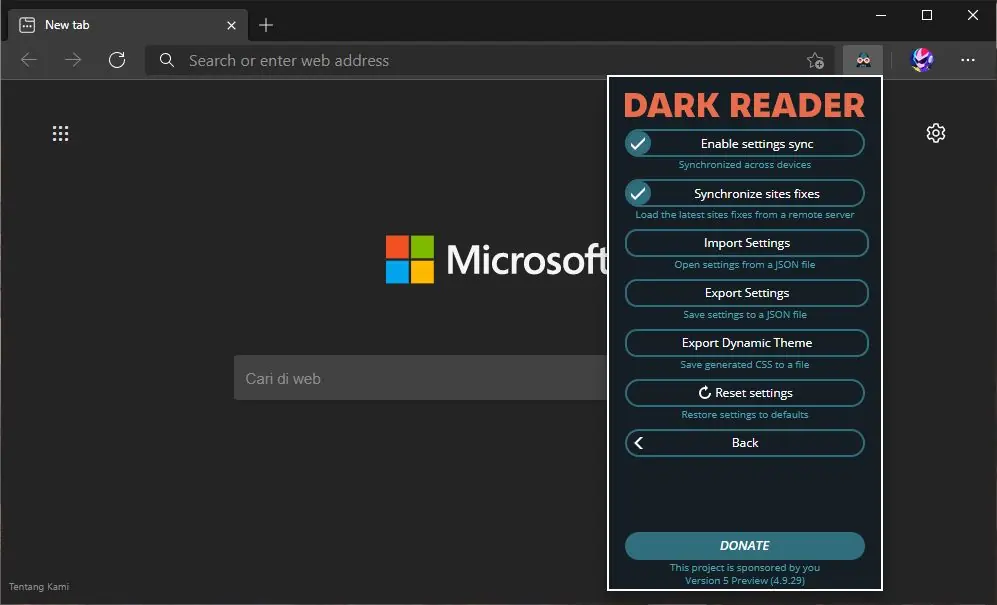

5. Selesai, White Flash tidak akan Muncul.