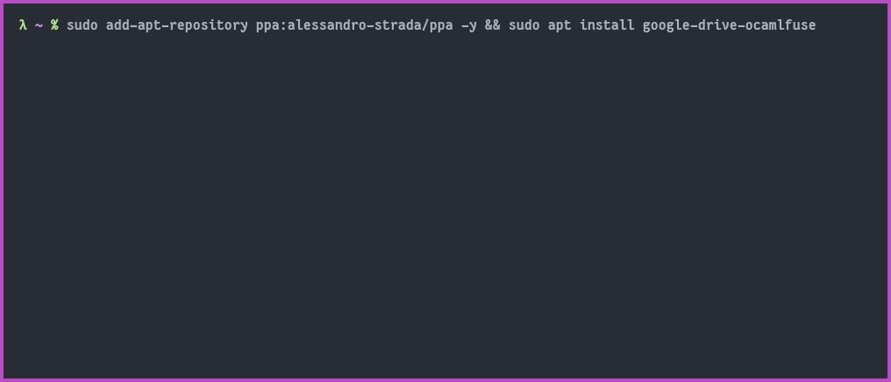
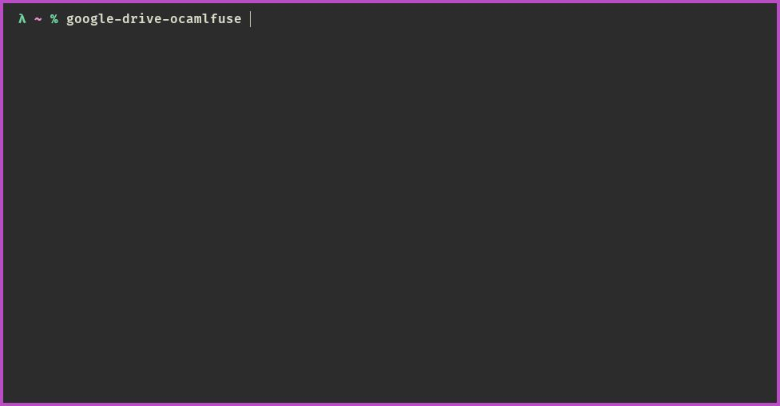
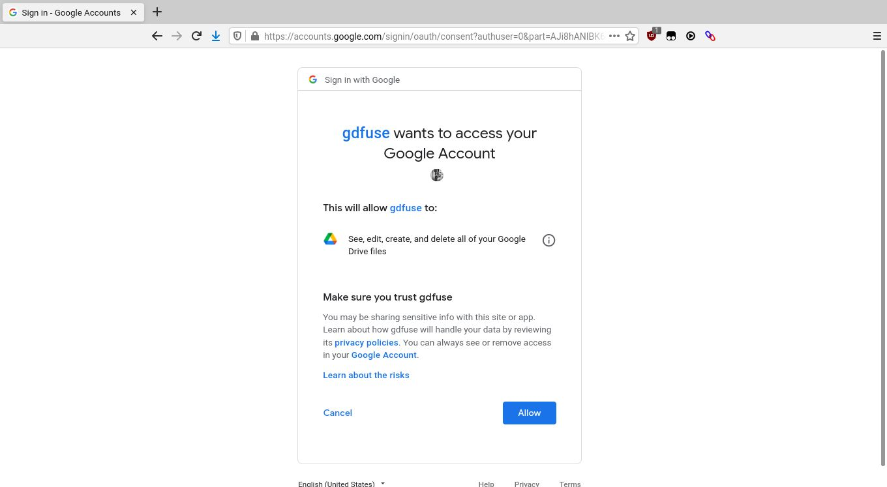
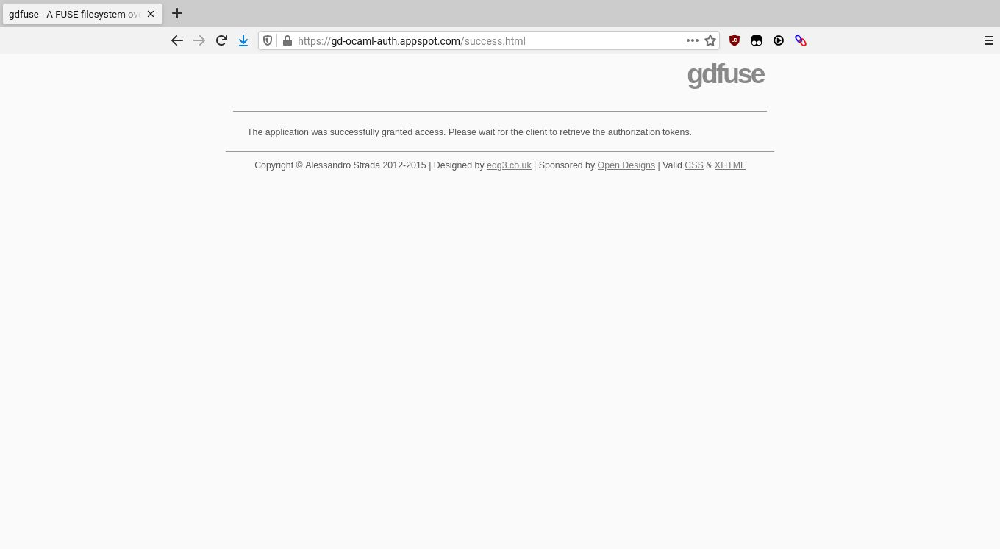
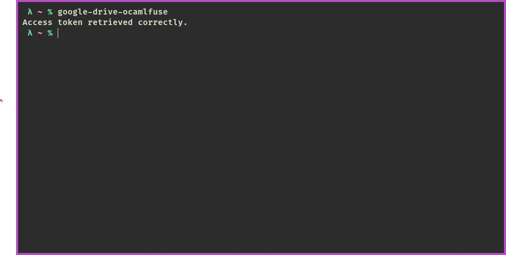
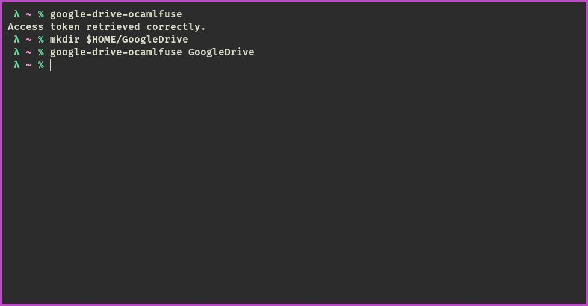
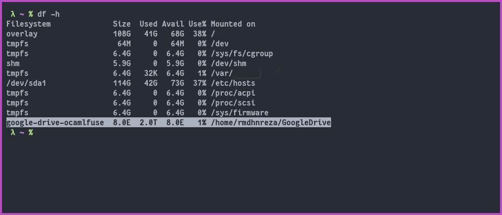
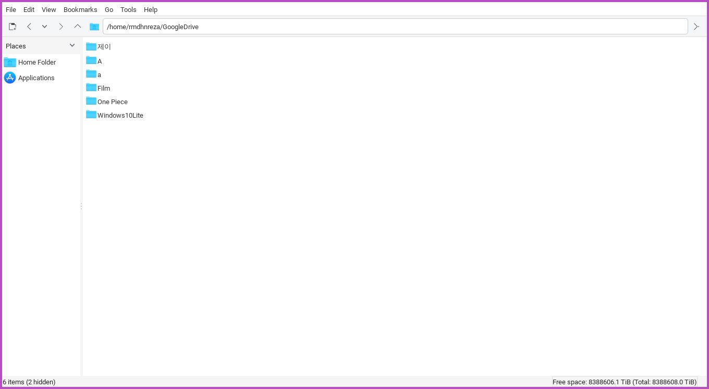
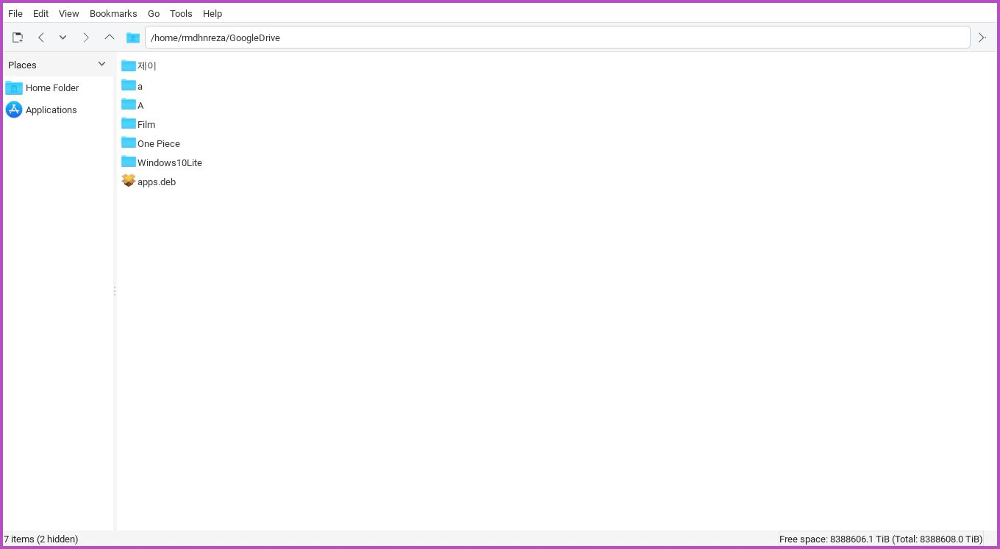
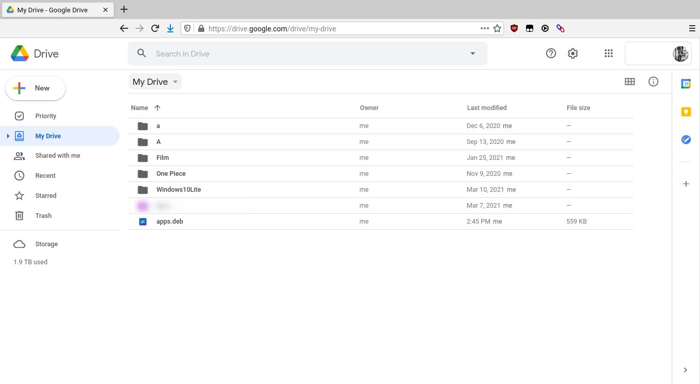

Menurut deskripsi resminya, google-drive-ocamlfuse adalah sistem file FUSE (Filesystem in Userspace) untuk Google Drive yang ditulis menggunakan bahasa pemrograman Ocaml. Dengan menggunakan *software* ini, Kalian dapat memasang Google Drive pada sistem linux kalian dan mengaksesnya seperti direktori biasa. Setiap perubahan yang dibuat akan disinkronkan secara otomatis.

Fitur Google Drive Ocamlfuse:
* Full read/write access to ordinary files and folders
* Read-only access to Google Docs, Sheets, and Slides (exported to configurable formats)
* Multiple account support
* Duplicate file handling
* Access to trash (.Trash directory)
* Unix permissions and ownership
* Symbolic links
* Read-ahead buffers when streaming
* Accessing content shared with you (requires configuration)
* Team Drive Support
* Service Account Support
* OAuth2 for Devices Support

Disini saya menggunakan Ubuntu 18.04, tapi untuk sistem operasi berbasis Linux lainnya sama saja.

1. Installasi di Sistem Operasi
   * Ubuntu kalian harus add ppa terlebih dahulu
```bash
sudo add-apt-repository ppa:alessandro-strada/ppa -y && sudo apt install google-drive-ocamlfuse
```
   * Arch Linux kalian bisa menggunakan yay
```bash
yay -S google-drive-ocamlfuse
```



2. Setelah berhasil terinstall kalian jalankan perintah berikut ini terlebih dahulu (wajib)
```bash
google-drive-ocamlfuse
```



3. Maka akan otomatis membuka browser, kalian log in menggunakan akun Google kalian



4. Tunggu beberapa saat sampai di terminal tertulis `Access token retrieved correctly.`

 

5. Buat folder di *home directory* untuk *mount* Google Drive nya, bebas dengan nama apapun, disini saya menggunakan nama **GoogleDrive**
```bash
mkdir $HOME/GoogleDrive
```
6. Kita beri tahu google-drive-ocamlfuse untuk memasang Google Drive di Folder yang telah kita buat tadi di langkah 5
```bash
google-drive-ocamlfuse $HOME/GoogleDrive
```



7. Cek jika *mount* sudah berhasil
```bash
df -h
```

 

8. Jika kalian ingin upload file ke Google Drive, kalian tinggal copy-paste saja file nya ke folder GoogleDrive nya, maka akan otomatis **sync**, disini saya copy-paste **apps.deb**

 

Untuk lebih lengkapnya tentang google-drive-ocamlfuse ini kalian bisa langsung lihat di [documentation](https://github.com/astrada/google-drive-ocamlfuse/wiki) nya yang ada di github\
google-drive-ocamlfuse juga bisa dipakai untuk Team Drive, jika kalian ingin *mount* Shared drives kalian.