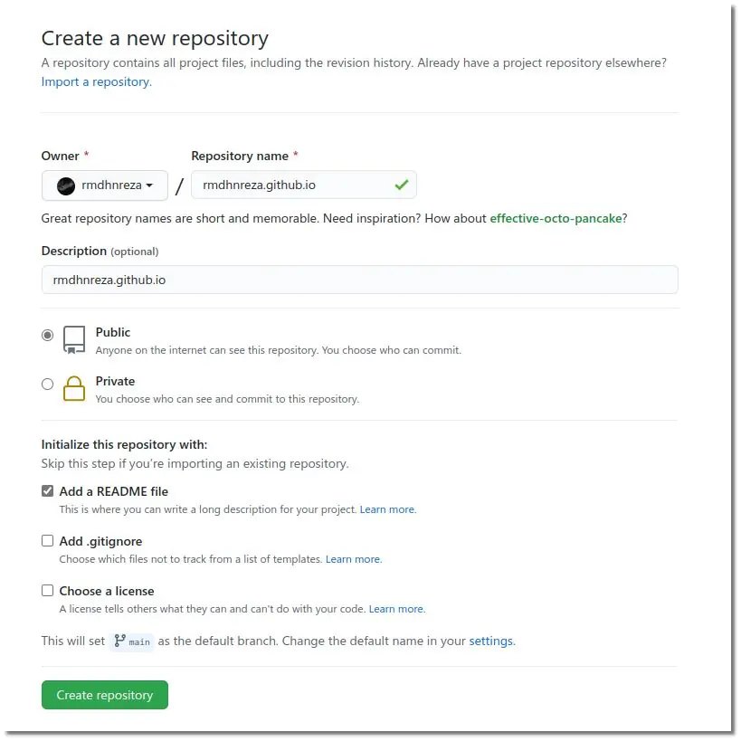
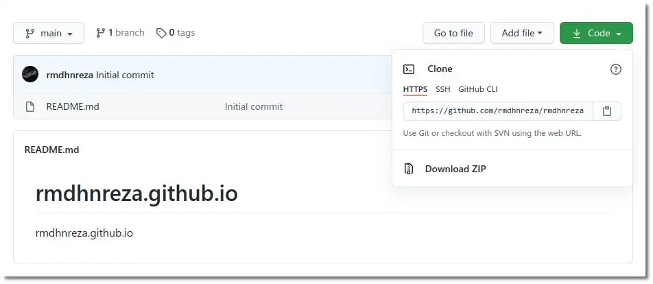
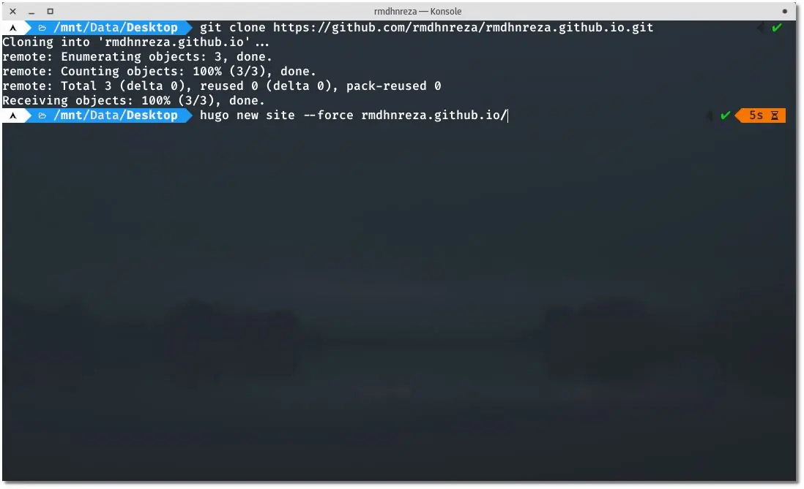
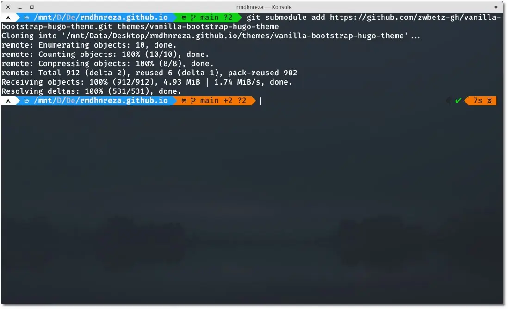
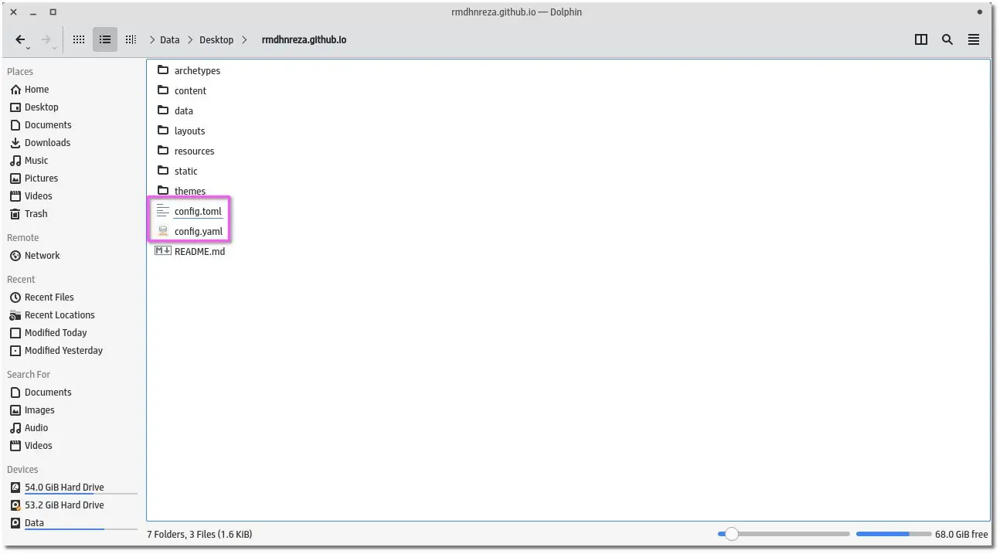
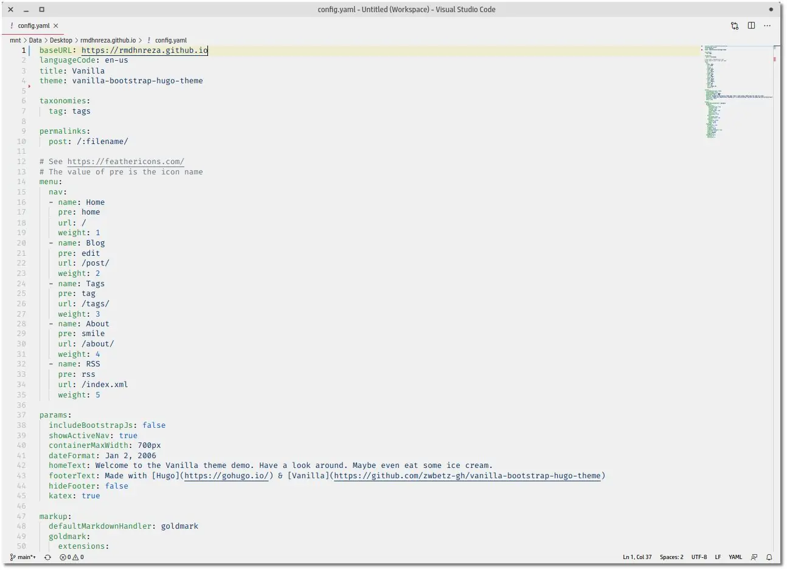
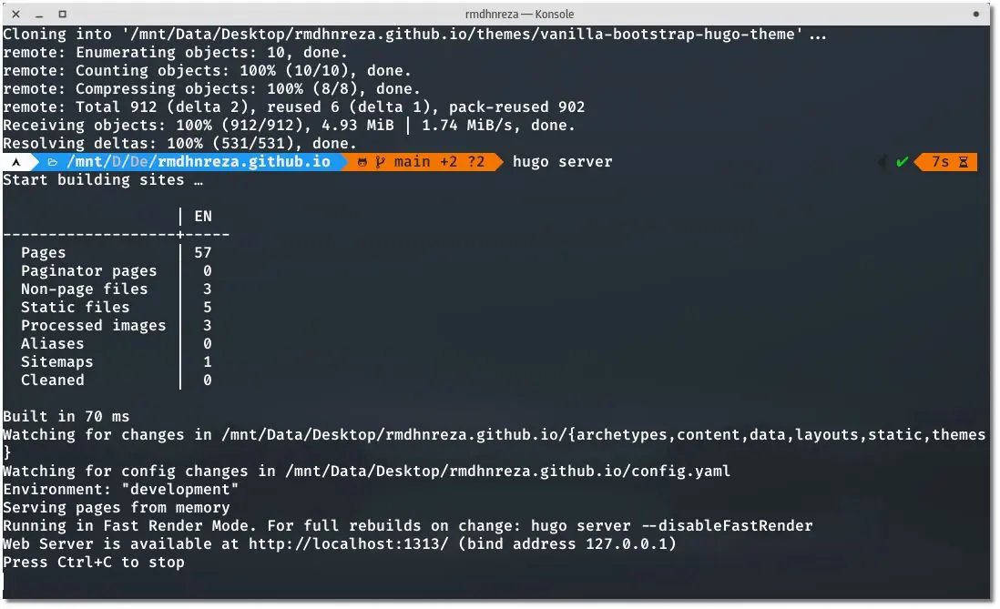
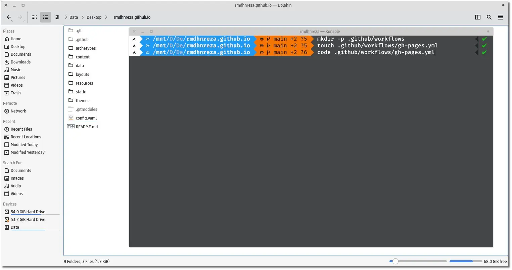
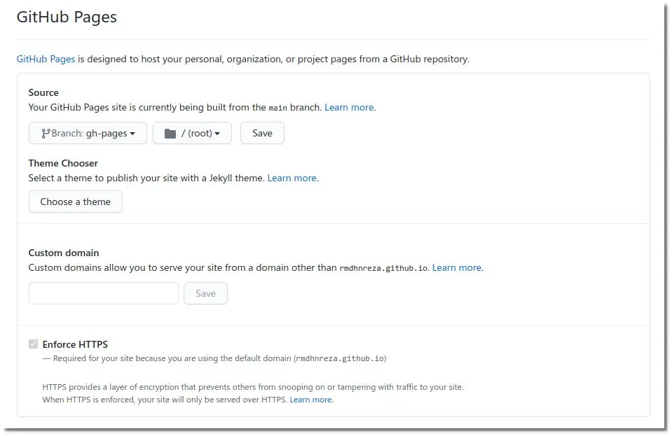
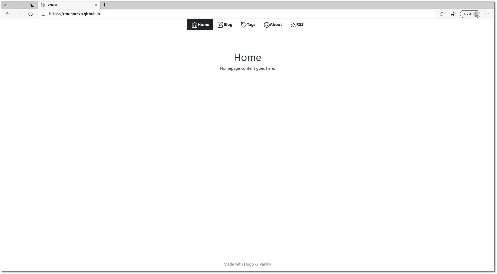

Saya asumsikan kalian sudah mempunyai akun [Github](https://github.com) dan di Sistem Operasi kalian sudah terinstall [Hugo](https://gohugo.io). Langsung saja ke Tutorialnya

1. Buat public repository dengan **username** github kalian ditambhakan **.github.io** jadinya seperti ini **rmdhnreza.github.io** dan ceklis *Add a README file*



2. Clone repository yang sudah kalian buat dengan perintah 
```
git clone https://github.com/rmdhnreza/rmdhnreza.github.io
```


3. Buat hugo website dengan perintah
```
hugo new site --force rmdhnreza.github.io
```



**Note:** argumen --force disini untuk memberi tahu hugo jika folder nya tidak kosong

4. Masuk ke folder **root direktori** hugo kalian (rmdhnreza.gitlab.io) dan tambahkan tema yang akan kalian gunakan, disini saya menggunakan tema **Notepadium**, untuk memasang tema yang kalian inginkan kalian lihat dokumentasi tema nya.
```
git submodule add https://github.com/zwbetz-gh/vanilla-bootstrap-hugo-theme.git themes/vanilla-bootstrap-hugo-theme
```



5. Copy isi folder dari exampleSite ke **root direktori** hugo website kalian, jangan lupa jika di **exampleSite** terdapat **config.yaml** maka kalian harus **hapus config.toml** di **root direktori** hugo website kalian, begitupun sebaliknya. Karena jika ada 2 config, kemungkinan besar akan error.



6. Ganti **baseURL** di **config.yml** dengan **URL Website** kalian (https://rmdhnreza.github.io)



7. Test website kalian dengan perintah `hugo server` Jika tidak ada error maka kita bisa langsung ke langkah selanjutnya



8. Buat folder **.github/workflows** di **root direktori** hugo dan buat file **gh-pages.yml** di folder nya, jadi struktur foldernya seperti ini
```
.github
└── workflows
    └── gh-pages.yml
```


9. Isikan code berikut di gh-pages.yml
```
name: github pages

on:
  push:
    branches:
      - main
  workflow_dispatch:
    inputs:
      git-ref:
        description: Git Ref (Optional)    
        required: false

jobs:
  deploy:
    runs-on: ubuntu-latest
    steps:
      - uses: actions/checkout@v2
        with:
          submodules: recursive  # Fetch the Docsy theme
          fetch-depth: 0         # Fetch all history for .GitInfo and .Lastmod

      - name: Setup Hugo
        uses: peaceiris/actions-hugo@v2
        with:
          hugo-version: '0.81.0'
          extended: true

      - run: hugo --minify 

      - name: Deploy
        uses: peaceiris/actions-gh-pages@v3
        with:
          github_token: ${{ secrets.GITHUB_TOKEN }}
```
9. Jika sudah maka bisa langsung kita push ke github dengan perintah
```
git add .
git commit -m "Hugo Github Pages"
git push origin main
```
10. Sekarang di Github kalian, masuk ke bagian **Settings** lalu scroll kebawah sampai bagian **Github Pages**, disana kalian ganti **Source Branch** nya dari **main** ke **gh-pages**, setelah itu kalian **Save**



11. Kalian coba URL https://username.github.io/ apakah website nya sudah live atau belum, jika belum, kalian masuk ke bagian **Actions** lalu klik **github pages** lalu klik **run workflow** kalian klik **run workflow** lagi

