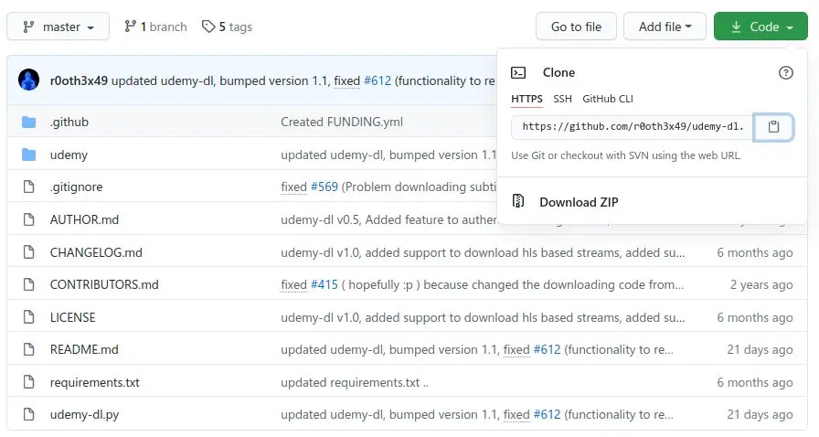
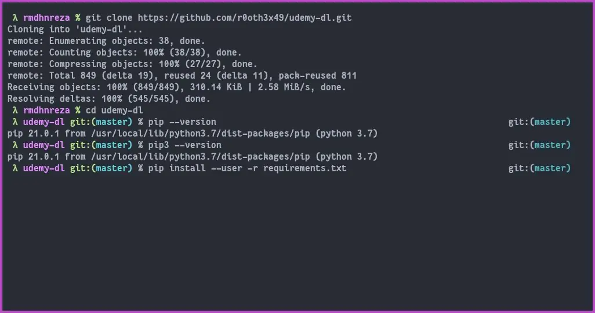
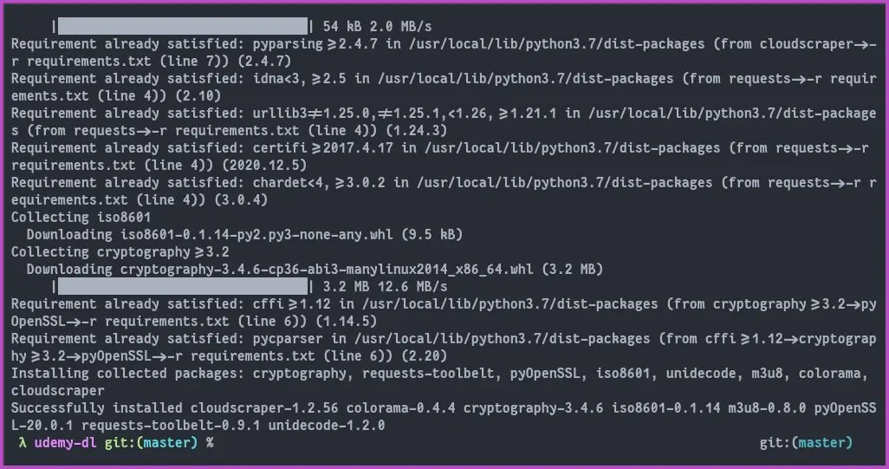
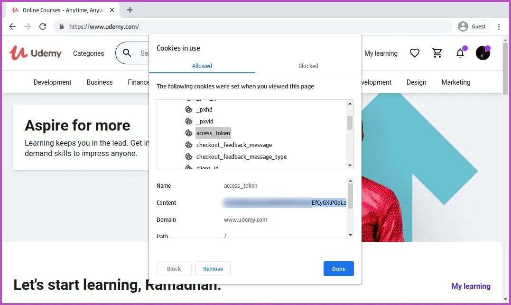
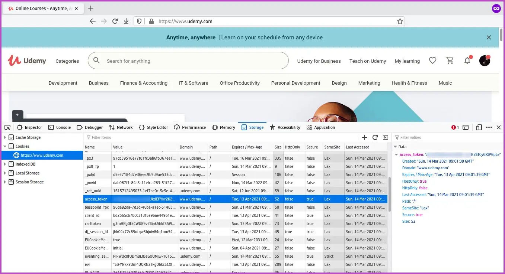
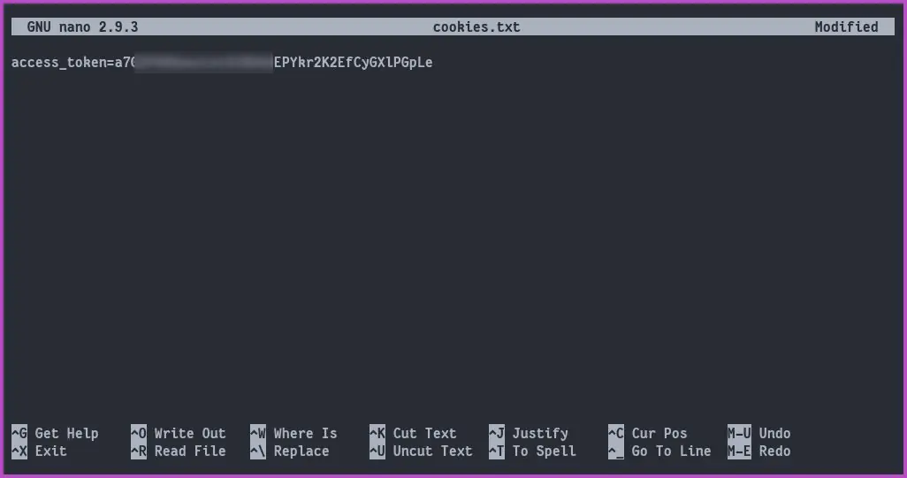
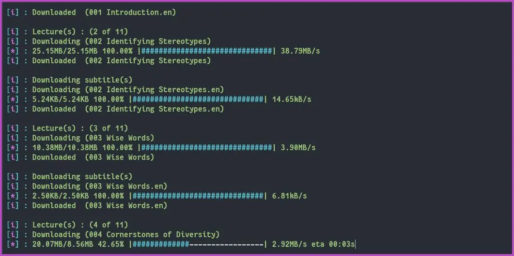
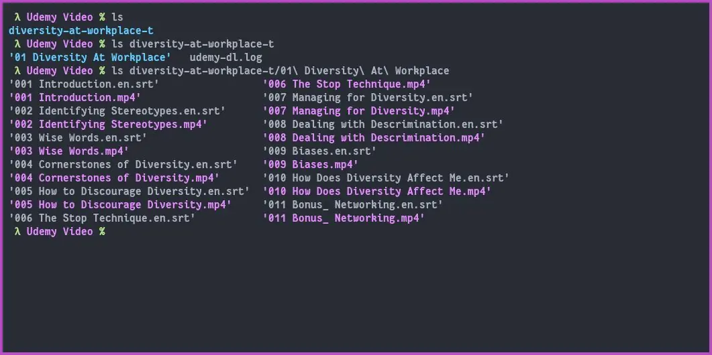

Udemy adalah pasar global untuk belajar dan mengajar secara online sehingga siswa dapat menguasai keterampilan baru dan mencapai tujuan mereka dengan belajar dari perpustakaan ekstensif dengan lebih dari 55.000 kursus yang diajarkan oleh instruktur ahli. Setiap orang dapat menjadi instruktur atau pengajar di udemy dengan mendaftar pada akun udemy.com.

## Sebelumnya kalian harus membeli terlebih dahulu kursus yang akan di download

Jika kalian sedang kursus di udemy dan malas untuk streaming, ditutorial ini kita akan mendownload video dari udemy agar bisa ditonton secara offline menggunakan video player kesukaan kalian. Langsung saja ke tutorialnya

1. Pastikan **python 3** sudah terinstall di sistem operasi kalian, untuk cek apakah **python 3** sudah terinstall atau belum kalian bisa menggunakan perintah dibawah ini untuk cek versi **python 3 nya**
```python
python3 -V
```
Untuk sistem operasi linux seharusnya python3 sudah default terinstall sedangkan untuk sistem operasi Windows kalian bisa download pythond di [situs resminya](https://www.python.org/downloads/windows/), atau install menggunakan [scoop](/cara-menginstall-package-manager-scoop-di-windows-10/) dengan perintah
```powershell
scoop install python
```
2. Clone (jika di sistem operasi kalian sudah terinstall git) atau Download & Extract repository berikut ini [github.com/r0oth3x49/udemy-dl](https://github.com/r0oth3x49/udemy-dl)
```bash
git clone https://github.com/r0oth3x49/udemy-dl.git
```
3. Kalian masuk ke folder **udemy-dl** dan install *dependencies* yang dibutuhkan dengan perintah
```python
pip3 install --user -r requirements.txt
```
  

4. Login ke [udemy.com](https://www.udemy.com/) dengan akun kalian untuk mendapatkan akses token

## Mendapatkan Akses Token di Google Chrome


1. Klik icon gembok
2. Pilih Cookies
3. Klik tanda panah pada **www.udemy.com**
4. Klik tanda panah lagi pada **Cookies**
5. Cari **access_token** dan copy **Content** nya




## Mendapatkan Akses Token di Mozilla Firefox


1. Klik kanan dan pilih **Inspect Element**
2. Masuk ke tab **storage**
3. Pilih **Cookies**
4. Cari **access_token** dan copy **Value** nya




5. Setelah kalian mendapatkan akses token nya, kalian buat file dengan nama **cookies.txt** dan isi dengan akses token kalian menggunakan format berikut lalu save
```
access_token=AKSESTOKENKALIAN
```


6. Sekarang kita akan download video nya, disini saya contohkan download kursus ini [https://www.udemy.com/course/diversity-at-workplace-t/learn/lecture/25380564](https://www.udemy.com/course/diversity-at-workplace-t/learn/lecture/25380564), maka perintahnya
```bash
python3 udemy-dl.py --cookies cookies.txt https://www.udemy.com/course/diversity-at-workplace-t/learn/lecture/25380564 --quality 720 --output /home/rmdhnreza/Udemy\ Video
```
**Note:**
   - **--cookies cookies.txt** untuk memberi tahu jika kita login menggunakan cookies
   - **--quality 720** Kualitas video yang akan kita download resolusi nya 720p
   - **--output /home/rmdhnreza/Udemy\ Video** yaitu file yang kita download akan disimpan di folder /home/rmdhnreza/Udemy\ Video, jika kalian tidak setting ini maka hasil download akan disimpan di folder udemy-dl
   - Untuk syntax lainnya kalian bisa lihat di [README.md](https://github.com/r0oth3x49/udemy-dl/blob/master/README.md)



7. Video berhasil di download

