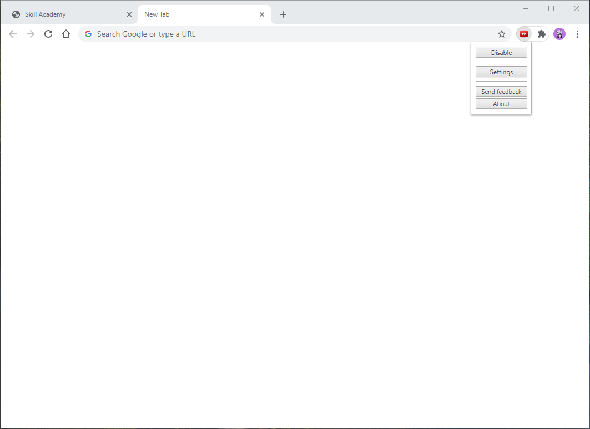
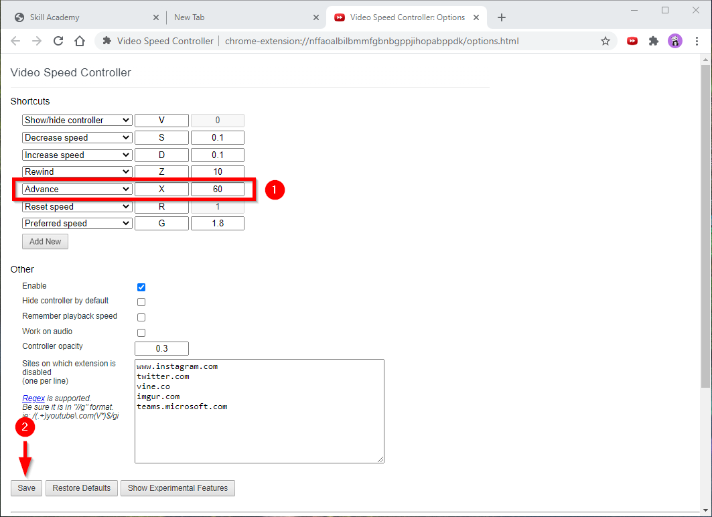

Untuk kalian yang sedang mengikuti pelatihan prakerja khususnya yang sedang mengerjakan pelatihan di Skill Akademi, pasti kalian bosan ketika menonton video nya, Untuk itu disini saya akan memberikan tutorial mempercepat Video di Skill Akademi.

Tutorial disini saya menggunakan Desktop/Laptop, untuk Mobile saya kurang tahu, Oke langsung saja ke tutorialnya.

1. Gunakan Browser Google Chrome atau Mozilla Firefox
2. Install Extension atau Addons Video Speed Controller
   * [Video Speed Controller untuk Google Chrome atau Chromium Based Browser](https://chrome.google.com/webstore/detail/video-speed-controller/nffaoalbilbmmfgbnbgppjihopabppdk)
   * [Video Speed Controller untuk Mozilla Firefox atau Gecko Based Browser](https://addons.mozilla.org/en-US/firefox/addon/videospeed/)
3. Jika Extension atau Addons nya sudah terinstall, kalian klik icon nya lalu klik Settings

4. Ubah bagian `Advance` `X` dari 10 detik bebas menjadi berapa detik untuk mempercepat video nya disini saya ubah menjadi 60 detik atau 1 menit lalu klik Save
  

5. Setelah itu kalian **Refresh** web skill akademi nya
6. Kalian play video nya, tunggu video nya sampai berjalan beberapa detik lalu tekan `X` pada keyboard kalian, maka video akan mempercepat sesuai dengan yang kalian setting tadi menjadi berapa detik.

### Video






Itu saja tutorial cara mempercepat video di Skill Akademi, jika ada pertanyaan silahkan berkomentar dibawah