Sebelumnya, ditutorial ini saya menggunakan Linux Ubuntu 18.04 dalam menggunakan perintahnya. Tapi tenang saja untuk Windows pun perintahnya sama hanya saja file rclone nya saja yang berbeda, jadi nanti kalian unduh file rclone nya sesuai dengan sistem operasi yang kalian pakai sekarang.

### Install rClone Sistem Operasi berbasis Linux
1. Untuk pengguna sistem operasi berbasis Linux, saya sarankan menggunakan perintah ini untuk menginstall nya, karena biasanya lebih up-to-date dibanding dengan versi apt (untuk Debian based)
```bash
curl https://rclone.org/install.sh | sudo bash
```
2. Kalian masukan password lalu Enter
3. Tunggu hingga proses installasi selesai

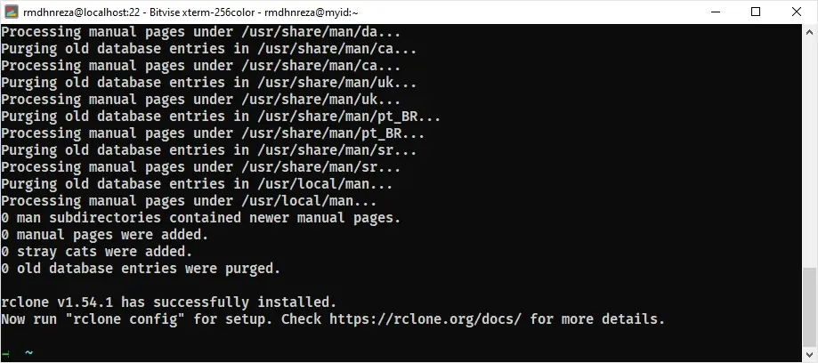

### Install rClone Sistem Operasi Windows
1. Saya sarankan kalian menginstall scoop terlebih dahulu yang bisa kalian lihat di [Cara Menginstall Package Manager Scoop Di Windows 10](/cara-menginstall-package-manager-scoop-di-windows-10/)
2. Gunakan perintah ini untuk menginstall rclone
```powershell
scoop install rclone
```


### Setup rClone
1. Kalian jalankan perintah
   * `rclone config`
   * Pilih `n`
   * Isi nama remote, disini nama remote saya yaitu **dropbox** 
   * Enter
2. Pilih Storage, karena disini kita akan menggunakan storage dropbox, maka kalian isi nama storage nya **`dropbox`** (nomor 10)

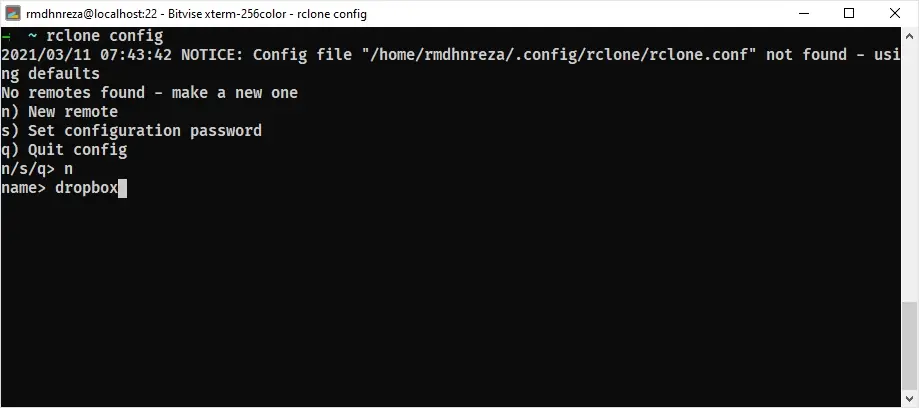

3. **OAuth Client Id & Secret**, sebetulnya bisa **dikosongkan** jika kalian tidak mau ribet, tapi disini saya menggunakan **Client ID & Secret** saya sendiri caranya


### Membuat Client ID & Secret Dropbox


1. Kalian kunjungi [Dropbox App Console](https://www.dropbox.com/developers/apps/create)
2. Create App

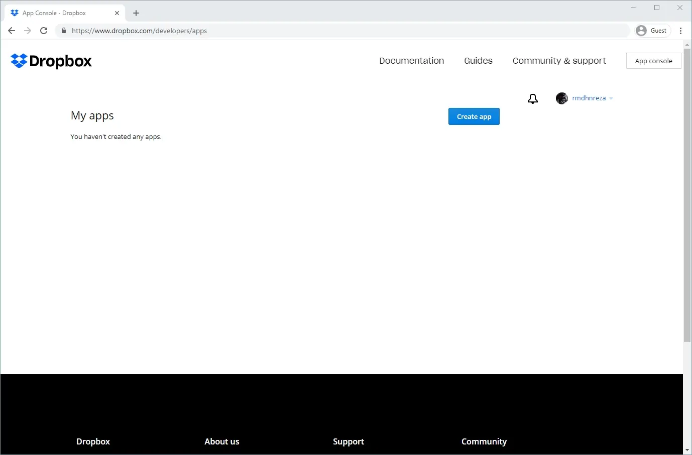

3. **Choose an API** pilih **Scoped access**
4. **Choose the Type** of access you need pilih **Full Dropbox**
5. Name your app isi Bebas asal masih bisa dipakai
6. Create App

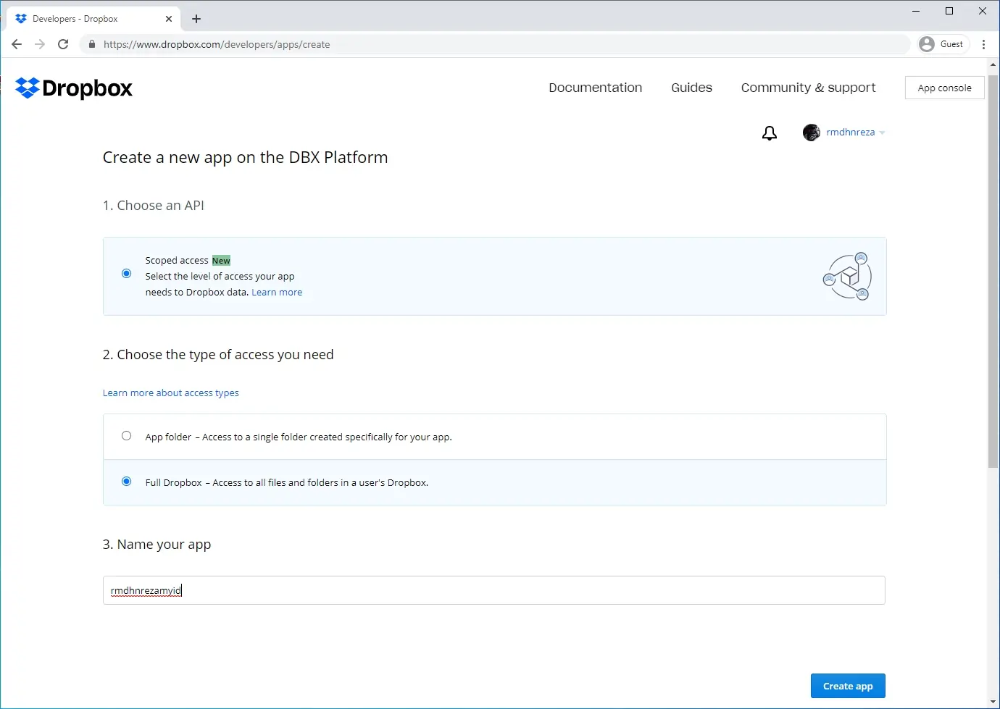

7. Dibagian Settings
   * Copy App key & App secret 
   * Isi Redirect URIs dengan **http://localhost:53682**

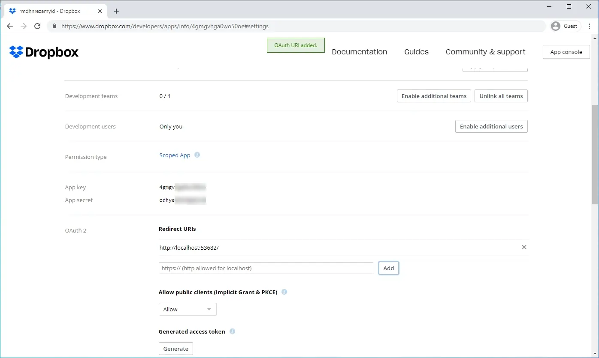

8. Masuk ke tab Permissions, Kalian ceklis semua lalu Submit

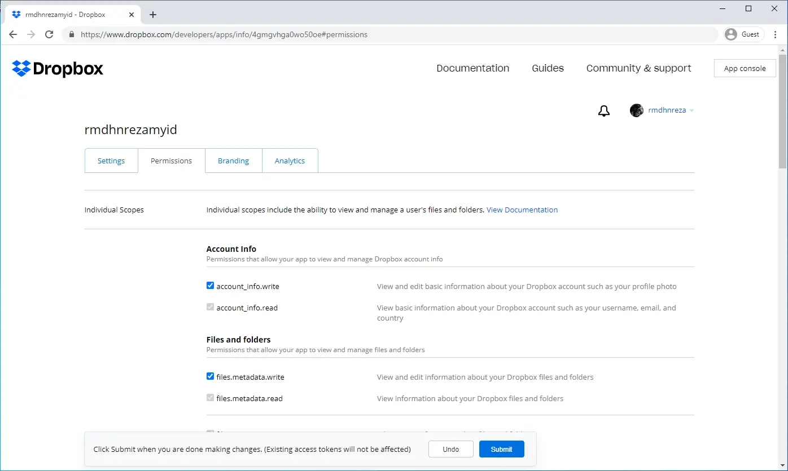



4. Isikan **client_id** dengan **App key** dan **client_secret** dengan **App secret**, sekali lagi ini hanya **optional**, kalian boleh kosongkan bagian ini

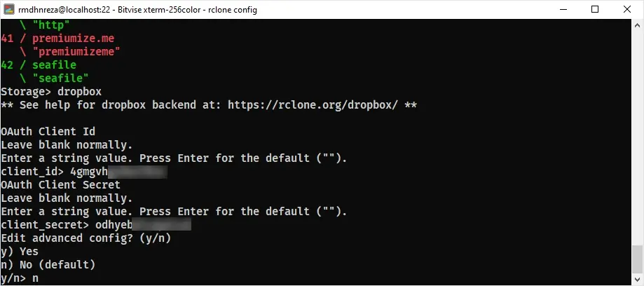

5. Edit advanced config pilih `n) No (default)`
6. Kalian copy dan eksekusi perintah yang diberikan oleh aplikasi rclone di terminal atau powershell yang baru

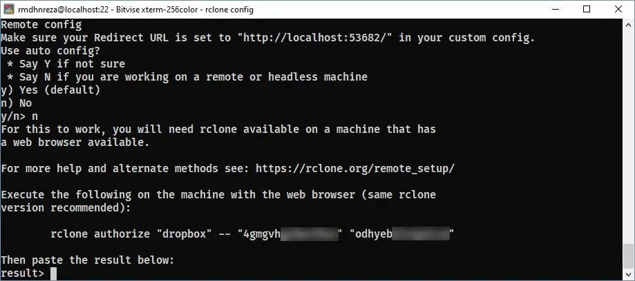 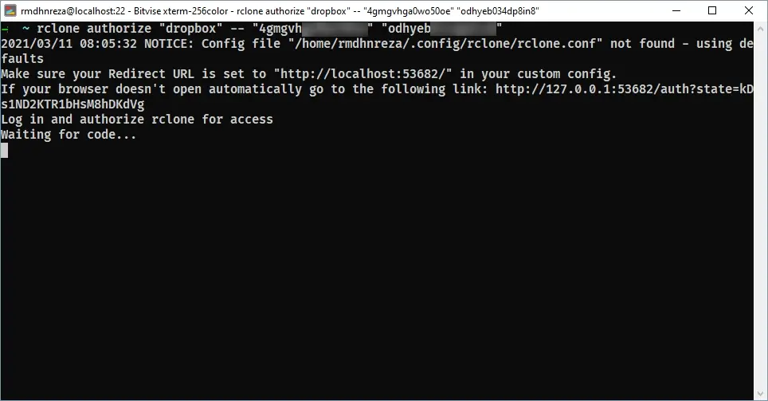

7. Nanti kalian akan diberikan link local yang harus kalian buka di browser, buka link nya di browser
   * Kalian klik Continue
   * Klik Allow
   * Copy dan Paste Access Token (Lihat yang saya blok) ke Terminal yang pertama tadi lalu klik Enter

  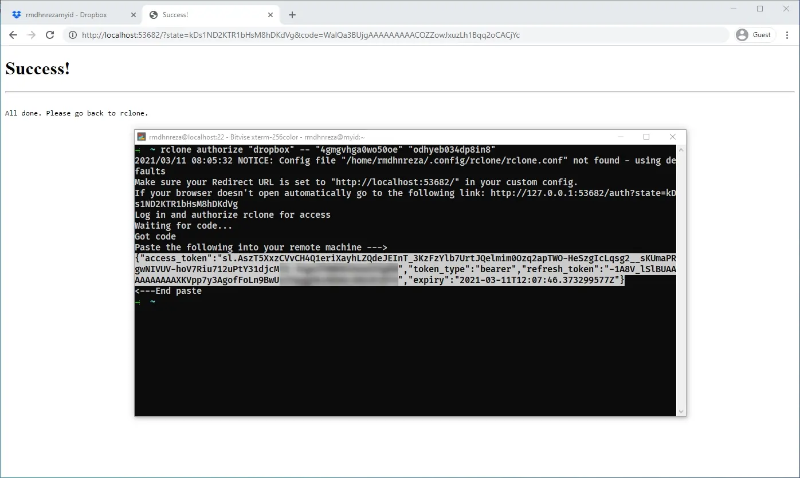

8. Jika berhasil kalian tinggal pilih `y) Yes this is Ok (default)` dan Enter

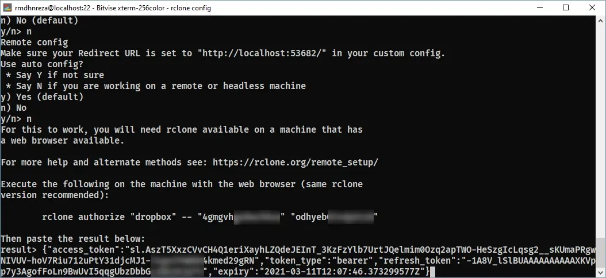

9.  Ketik `q` untuk keluar dari config rclone

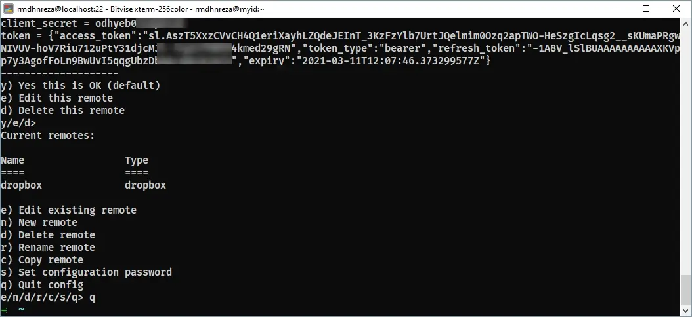

### Download & Upload file dengan rClone ke Dropbox
### Perintah rclone untuk upload
```bash
rclone copy --progress /path/file/ namaremote:path/file/di/dropbox
```
Disini saya contohkan akan upload file **Win10.ISO** yang path nya di **/home/rmdhnreza/Win10.ISO** ke **Folder WindowsISO** yang ada di **Dropbox**
Jadi, perintahnya seperti ini
```bash
rclone copy --progress /home/rmdhnreza/Win10.ISO dropbox:WindowsISO
```


### Perintah rclone untuk Download
```bash
rclone copy --progress namaremote:path/file/di/dropbox /path/file/
```
Disini saya contohkan akan download file **Win10.ISO** yang path nya di **dropbox > WindowsISO/Win10.ISO** yang ada di **Dropbox** ke **Folder Home Directory saya** 
Jadi, perintahnya seperti ini
```bash
rclone copy --progress dropbox:WindowsISO/Win10.ISO /home/rmdhnreza/Win10.ISO 
```

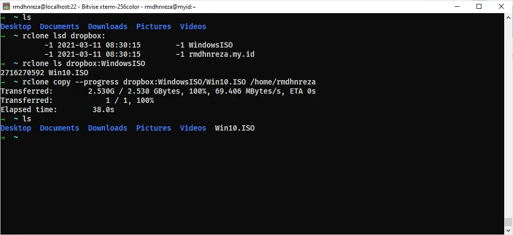

Itu tadi adalah cara mudahnya download dan upload file menggunakan rclone ke dropbox, jika kalian masih bingung dengan perintah-perintah nya kalian bisa lihat langsung di [Rclone Wiki](https://github.com/rclone/rclone/wiki) untuk lebih lengkapnya.