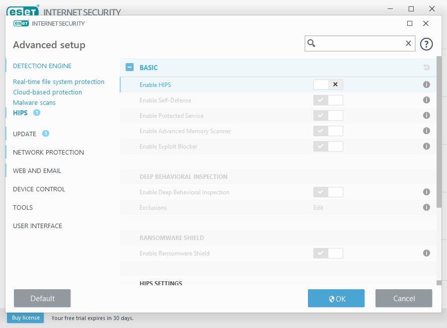
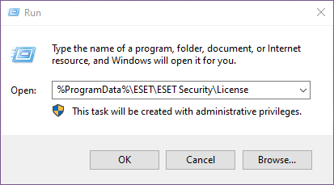
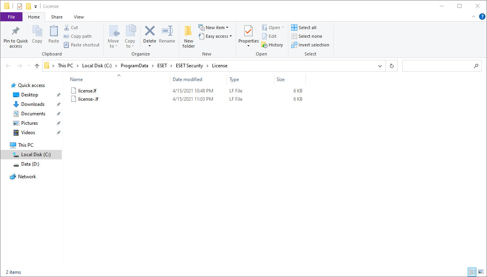
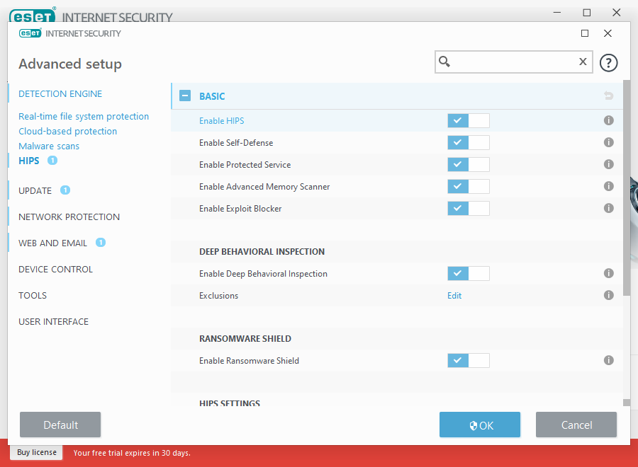
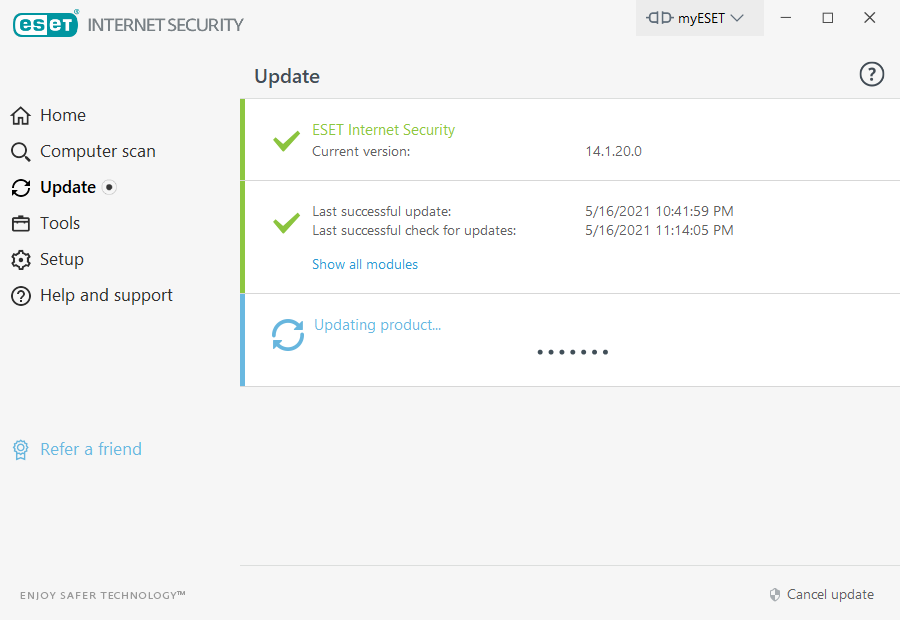
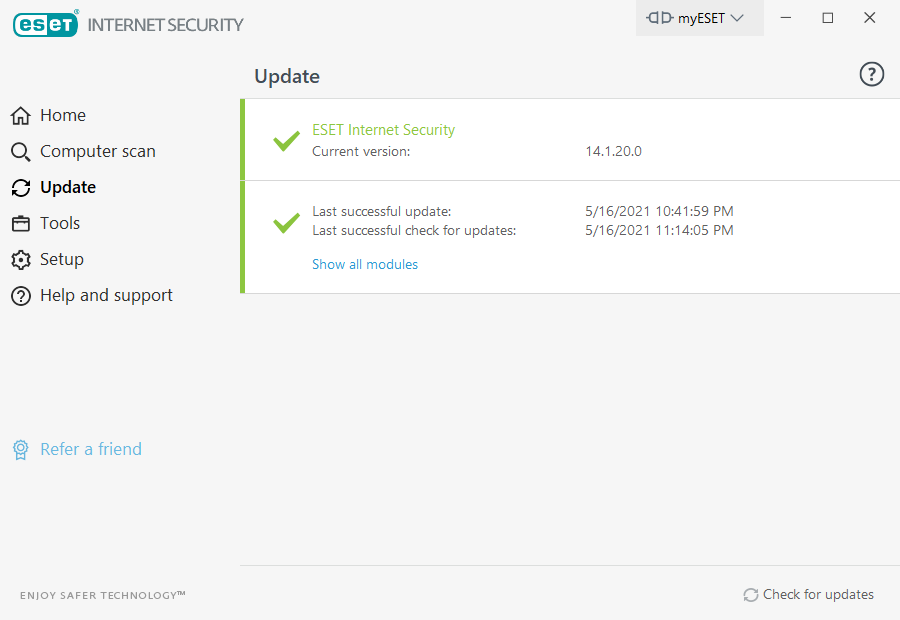
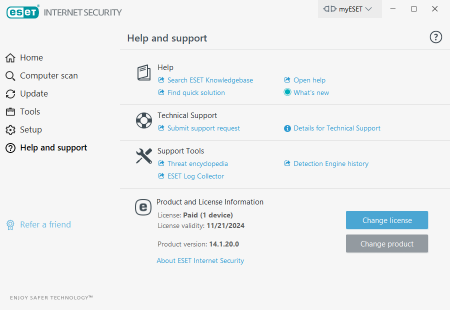
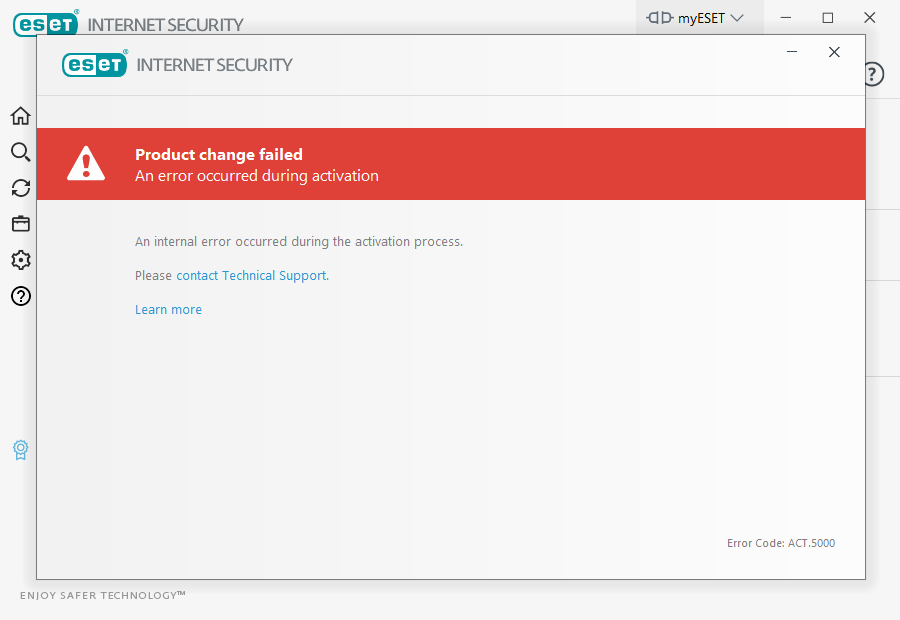

## Ngomong-ngomong

Metode ini bukan metode terbaru juga sih, karena dari ESET versi jadul sudah bisa menggunakan aktivasi seperti ini.

Sebelumnya saya sempat share **[Cara Mendapatkan License ESET Trial 30 Hari Secara Gratis 2021](/cara-mendapatkan-license-eset-trial-30-hari-secara-gratis-2021/)** dan saya coba daftar bulan Mei ini masih bisa digunakan, Jika kalian tidak mau ribet untuk aktivasi ESET silahkan kalian gunakan cara diatas, tetapi memang harus daftar 14 hari sekali, awalnya cara diatas itu 30 hari, tetapi mungkin banyak yang pakai jadi hanya 14 hari sekarang.

Cara yang akan share disini cukup ribet, kalian sampai harus restart Desktop/Laptop-nya dua kali, tetapi cara ini paling aman dari razia, karena saya sudah hampir pakai 2 bulan database ESET nya masih bisa update, walaupun kalian tidak bisa mengganti product ESET nya, misal dari NOD32 ke EIS kalian harus uninstall dulu NOD32 nya lalu install EIS dan ikuti lagi langkah aktivasi nya dari awal.

## Tutorial Aktivasi ESET

1. Download file **[license.lf](https://firebasestorage.googleapis.com/v0/b/rmdhnreza.appspot.com/o/Files%2Flicense.lf?alt=media&token=dfec78d3-c830-4aa9-ac1a-4e768a3192ab)** (Expired 11/21/2024) save filenya dimana saja bebas.

2. **Disable HIPS ESET** nya terlebih dahulu caranya masuk ke `Setup ->> Advanced Setup ->> HIPS ->> Enable HIPS ->> Off kan ->> Restart Desktop/Laptop.`
   - **Note: Jangan browsingan, buka crack, dll. Soalnya bahaya juga kalo HIPS nya lagi di Disable.**

3. Tekan shortcut **Win + R** untuk buka Run, masukan `%ProgramData%\ESET\ESET Security\License`

4. Nanti ada 1 file **license.lf**. Kalian boleh hapus, rename, atau timpa dengan **license.lf** yang udah di download tadi di langkah nomor 1
   - **Note: Jika tidak bisa dihapus, rename atau ditimpa, berarti belum di disable HIPS nya, Ulangi lagi langkah 2!**

5. **Enable lagi HIPS**-nya masuk ke `Setup ->> Advanced Setup ->> HIPS ->> Enable HIPS ->> On kan ->> Restart Desktop/Laptop.`

6. Update Database ESET nya.

 

Udah dicoba dari awal ESET mulai gencar-gencarnya razia license dan masih bisa update Database ESET nya sampai sekarang, sayangnya gk bisa ganti product (misalnya dari NOD ke EIS, pasti muncul error) kalo mau ganti product uninstall dulu ESET nya via safe mode pake ESET Uninstaller. Cara ini sudah saya coba di NOD32 dan EIS, bisa dua-dua nya.

 
