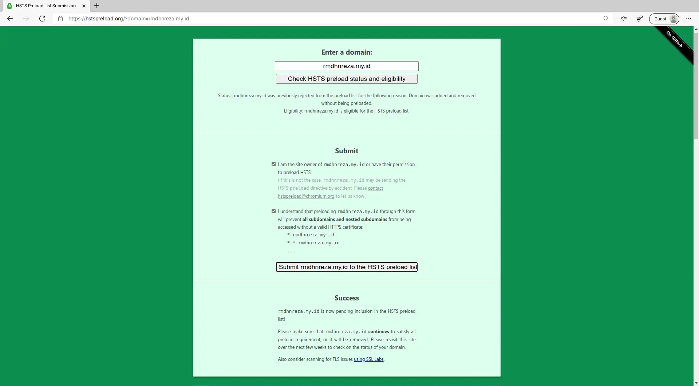

## Apa itu HSTS

HSTS (HTTP Strict Transport Security) adalah sebuah metode dimana website memaksa browser untuk menggunakan koneksi HTTPS (Hypertext Transfer Protocol Secure) ketika melakukan pertukaran data. 

HTTPS adalah protokol komunikasi antar jaringan yang memiliki keamanan lebih baik dari versi HTTP berkat adanya proteksi dari Secure Socket Layer (SSL). 

Dengan metode HSTS ini, website akan jauh lebih aman. Sebab,  hanya akan melayani permintaan dari koneksi HTTPS dan menolak koneksi HTTP yang rentan serangan hacker. [Sumber: Niagahoster](https://www.niagahoster.co.id/blog/hsts-adalah/)

## Wordpress
* Untuk wordpress yang menggunakan **Apache** kalian bisa merubah configurasinya via **.htaccess** dengan menambahkan baris berikut
```apache
<IfModule mod_headers.c>
Header set Strict-Transport-Security “max-age=31536000; includeSubDomains; preload”
</IfModule>
```
* Untuk yang menggunakan **Nginx**, edit config **Nginx** nya dan tambahkan baris berikut
```ngix
add_header Strict-Transport-Security max-age=31536000
```

## Firebase Hosting
Untuk yang menggunakan firebase hosting (seperti blog saya ini) kalian cukup menambahkan beberapa baris berikut di file **firebase.json** pada bagian attribut **headers** nya.
```json
{
    "key": "strict-transport-security",
    "value": "max-age=31536000; includeSubDomains; preload"
}
```

Jadinya seperti ini, jika **firebase.json** nya masih default.

```json
{
  "hosting": {
    "public": "public",
    "ignore": [
      "firebase.json",
      "**/.*",
      "**/node_modules/**"
    ],
    "headers": [{
      "source": "/**",
      "headers": [{
        "key": "strict-transport-security",
        "value": "max-age=31536000; includeSubDomains; preload"
      }]
    }]
  }
}
```

## Netlify Hosting
Untuk yang menggunakan hosting netlify, kalian bisa menambahkan baris berikut di **netlify.toml**
```toml
[[headers]]
  for = "/*"
  [headers.values]
  Strict-Transport-Security = "max-age=63072000; includeSubDomains; preload"
```

## Github Pages
Sayangnya sampai artikel ini dibuat, **Github Pages masih tidak support HSTS**

## Mendaftarkan Domain ke hstspreload.org

1. Kalian kunjungi [hstspreload.org](https://hstspreload.org)


2. Masukan domain kalian yang akan di daftarkan ke HSTS preload list


3. Klik **Check HSTS preload status and eligibility**


4. Jika tidak ada error, maka akan muncul tampilan seperti ini dan kalian ceklis dua-dua nya


5. Klik **Submit rmdhnreza.my.id to the HSTS preload list**, maka nanti akan muncul **Success**



7. Proses ini membutuhkan waktu sampai berminggu-minggu, jadi kalian bisa cek setiap hari untuk melihat apakah domain kalian sudah terdaftar di HSTS preload list atau belum

