## Pertama-tama
Saya disini menggunakan VPS menggunakan Sistem Operasi Ubuntu 18.04, tapi harusnya ini juga bisa digunakan di Sistem Operasi Ubuntu yang lebih baru. Tutorial ini menggunakan Desktop Environment (DE) i3WM, bukan Gnome ataupun KDE, jadi jika kalian misalnya belum familiar dengan DE i3WM saya sarankan jangan mengikuti tutorial ini.

## Tutorial Install VNC

1. Kalian login ke VPS kalian

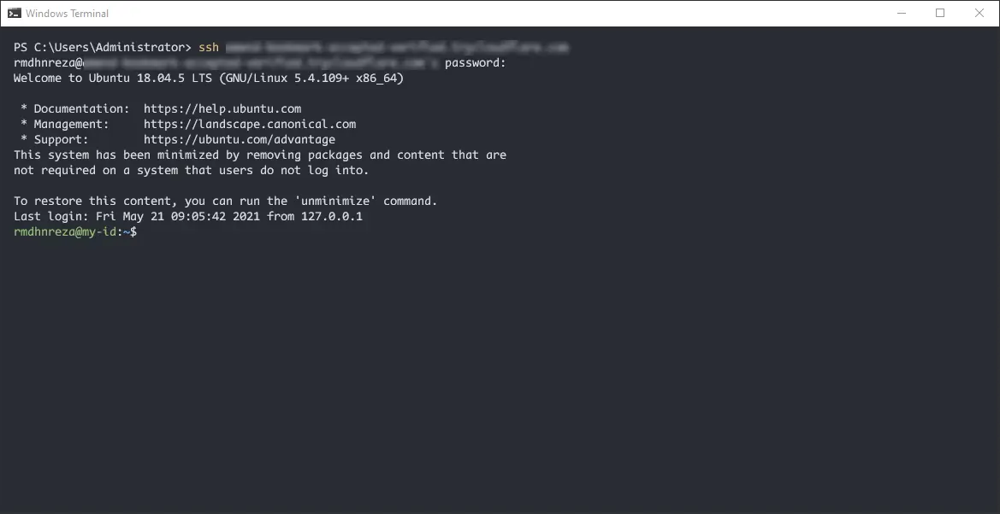

2. Jalankan perintah berikut untuk menginstall **vncserver** nya, disini saya juga menginstall aplikasi lain supaya bisa langsung dipakai pada saat kalian sudah selesai menginstall **vncserver** nya
```bash
sudo apt install dialog xorg xinit dbus-x11 x11-xserver-utils i3 pcmanfm xarchiver hsetroot xsel fonts-mplus fonts-firacode xsettingsd lxappearance tigervnc-standalone-server tigervnc-common tigervnc-xorg-extension tigervnc-viewer apache2 iputils-ping zsh nano netbase fonts-roboto fonts-nanum ttf-ancient-fonts fonts-wqy-zenhei imwheel zenity firefox apt-transport-https dconf-cli uuid-runtime clipit renameutils rar unrar libpci3 libpci-dev mediainfo gtk2-engines-murrine gtk2-engines-pixbuf libglib2.0-dev libxml2-utils konsole fonts-fantasque-sans gnupg aria2 breeze-gtk-theme breeze-icon-theme breeze-cursor-theme -y
```

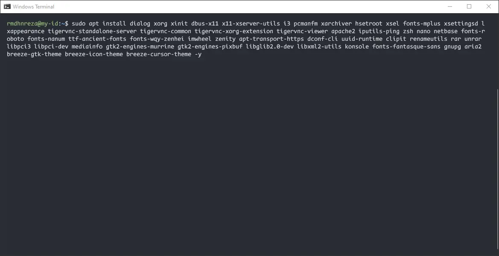

3. Tunggu proses download dan installasi hingga selesai, untuk VPS tidak lebih dari 2 menit harus nya

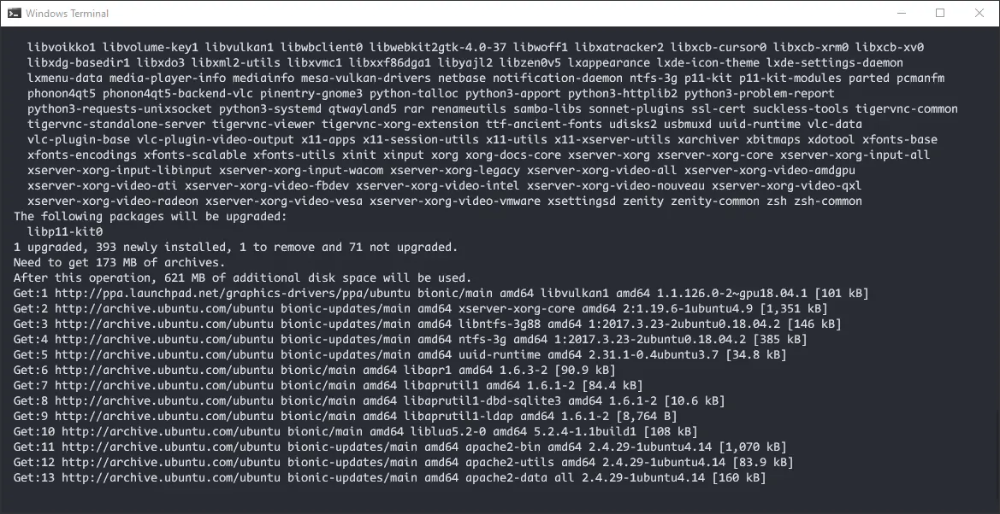 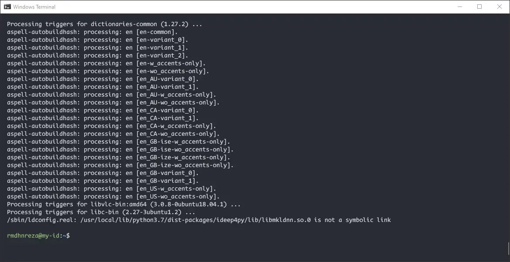 

4. Jalankan perintah  `vncserver`
5. Nanti kalian disuruh untuk memasukan password, password ini untuk login ke **VNC** nya dan minimal 6 karakter
6. *Would you like to enter a view-only password (y/n)*  Kalian bisa pilih **Y** atau **N** bebas

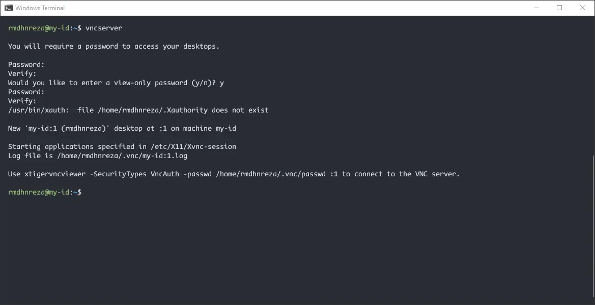

7. Jalankan perintah `vncserver -kill :1` *kill* proses *VNC*
8. Masukan perintah dibawah untuk start i3WM nya
```bash
cat > .vnc/xstartup <<EOL
#!/bin/sh
xrdb $HOME/.Xresources
dbus-launch --exit-with-session i3 &
exec i3
EOL
```
9. Kalian juga bisa set resolusi & DPI dengan memasukan perintah
```bash
cat > .vnc/config <<EOL 
geometry=1366x768
dpi=96
EOL
chmod u+x ~/.vnc/xstartup
``` 
10. Kalian jalankan lagi perintah `vncserver && pkill -9 vncconfig` untuk menjalankan **VNC** nya
  * **Note:** Jika kalian tidak *kill* proses **vncconfig** nya, biasanya background nya menjadi warna abu-abu, jadi saya sarankan kalian *kill* proses **vncconfig** nya, lalu jalankan manual pada saat sudah login ke **VNC** nya

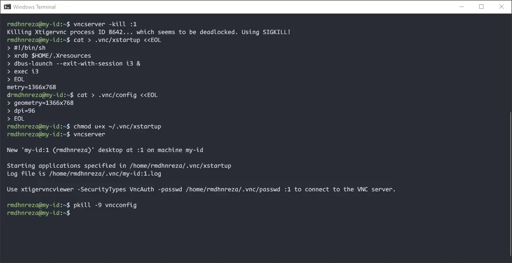

11. Kalian tinggal login ke VNC nya menggunakan **VNC Viewer**, disini saya menggunakan **TIgerVNC** kalian juga boleh menggunakan **VNC Viewer** yang lain.
12. Masukan IP VPS nya dengan port 5901 jadinya `IPVPS:5901` lalu masukan password yang tadi kalian buat di langkah nomor 5

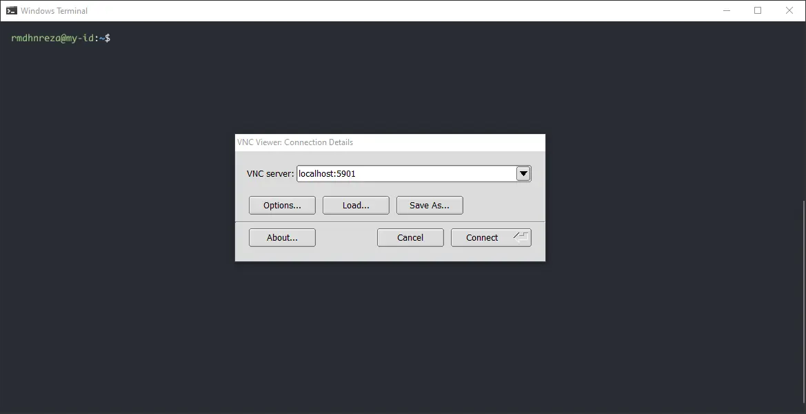 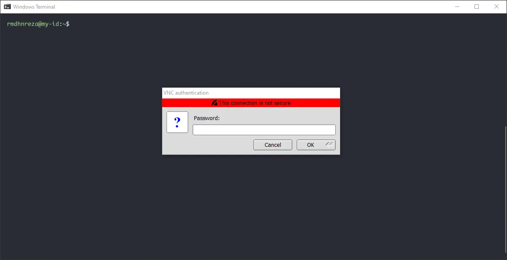

13. Awal tampilan i3WM seperti ini kalian tinggal `<Enter>` dan pilih `<Alt>`, Jika pilih `<Win>` takutnya nanti bentrok dengan tombol Windows di Desktop kalian

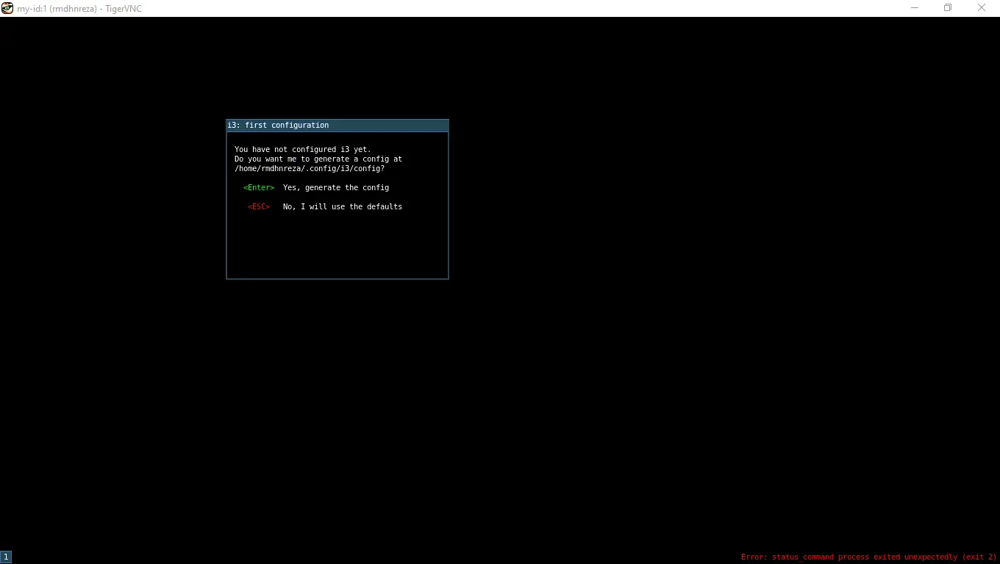 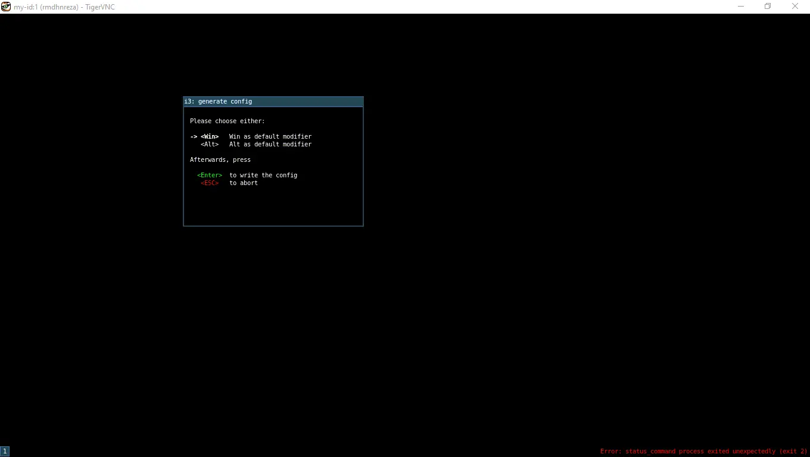

14. Tekan shorcut `Alt + D` untuk membuka d-menu
15. Menjalankan browser Firefox

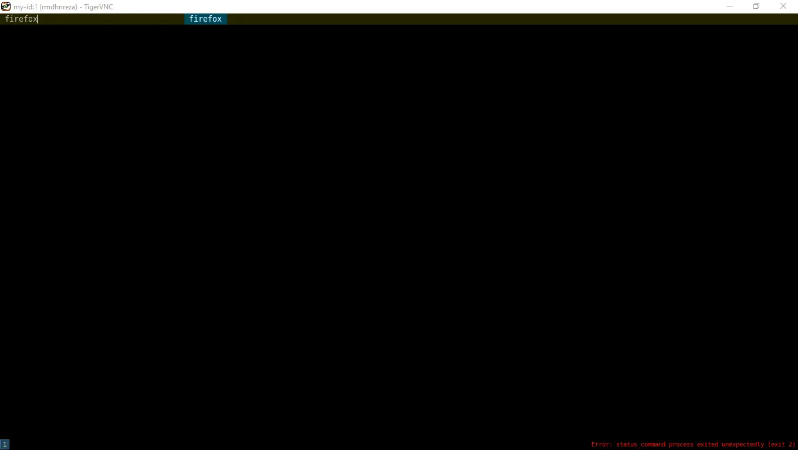 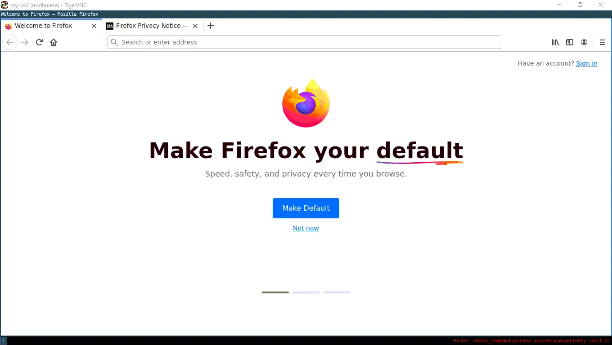  

Itulah tutorial cara menginstall VNC dengan Desktop Environment i3WM di VPS Ubuntu