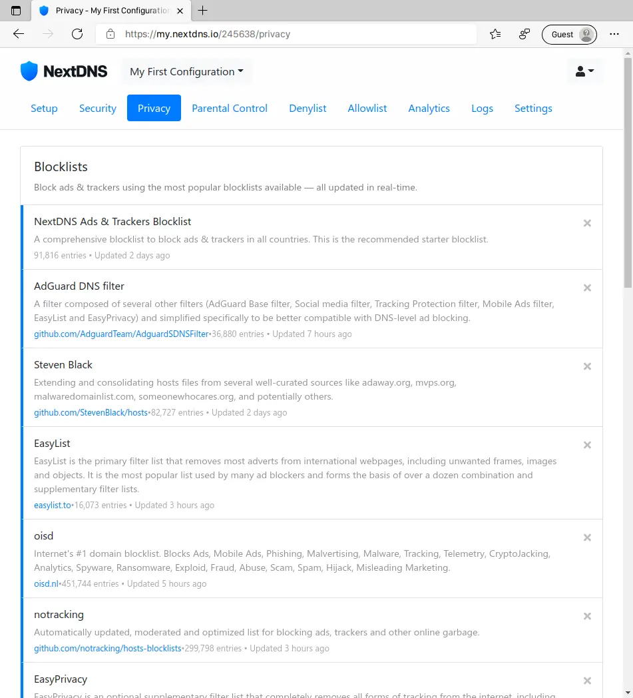

## NextDNS The new firewall for the modern Internet.
NextDNS melindungi Anda dari semua jenis ancaman keamanan (*malware*), memblokir iklan dan pelacak di situs web dan aplikasi (*ads & trackers*), serta menyediakan Internet yang aman dan terawasi untuk anak-anak (*Family Protection*) — di semua perangkat dan di semua jaringan.

## Settings NextDNS di
- [Android](#settings-nextdns-di-android)
- [Linux](#settings-nextdns-di-linux)
- [Windows](#settings-nextdns-di-windows)


## Mendaftar dan Setting NextDNS
1. Kalian kunjungi halaman [NextDNS.io](https://my.nextdns.io/signup)
2. Daftar Menggunakan alamat E-Mail


3. Setelah mendaftar maka akan muncul tampilan seperti ini, **dan kalian ingat-ingat ID Next DNS kalian, karena ini akan dipakai saat nanti dipasang ke perangkat kalian.** Tapi sebelum memulai pemasangan NextDNS ke perangkat kalian, lebih baik kalian setting-setting dulu NextDNS nya.


 

  * **Tab Security**
    * Pada bagian ini kalian bisa enable Google Safesearch, Block Domain yang baru saja didaftarkan, dll.






  * **Tab Privacy**
    * Pada bagian blocklist, kalian klik **ADD A BLOCKLIST**, dan kalian add filters yang kalian butuhkan, disini saya menambahkan filter
      * ABPindo
      * AdAway
      * AdGuard DNS filter
      * EasyList
      * EasyPrivacy
      * Energized Ultimate
      * NextDNS Ads & Trackers Blocklist (Default)
      * notracking
      * oisd
      * Steven Black
    * Pada Native Tracking Protection saya tambahkan semuanya
    * Block Disguised Third-Party Trackers - On
    * Allow Affiliate & Tracking Links - Off





  * **Tab Parental Control**
    * Jika kalian ingin block situs porno, judi, social media, dll. Ada pada bagian ini, silahkan tinggal add saja filter nya sesuai yang kalian butuhkan





  * **Tab Denylist**
    * Di Tab ini jika kalian ingin block domain manual





  * **Tab Allowlist**
    * Di Tab ini jika kalian ingin membuka situs yang terblock





  * **Tab Analitycs**
    * Di Tab ini berisi informasi total query yang masuk, **Untuk NextDNS Free itu dibatasi 300,000 query per bulan.**





  * **Tab Logs**
    * Berisi domain yang di akses di perangkat yang dipasang NextDNS





  * **Tab Settings**
    * Untuk settings untuk config NextDNS, seperti nama, block page, dll.





## Settings NextDNS di Android
* **Android 9 Keatas**
  - Untuk Android 9 keatas kalian bisa menggunakan **Private DNS**
    1. Masuk ke Settings → Network & internet → Advanced → Private DNS. (Atau Search Private DNS)
    2. Pilih pada Private DNS provider hostname option.
    3. Masukan ID.dns.nextdns.io
* **Android 8 Kebawah**
  - Untuk Android 8 kebawah kalian bisa menggunakan aplikasi official NextDNS bisa di undu di playstore
    1. Install app [NextDNS](https://play.google.com/store/apps/details?id=io.nextdns.NextDNS)
    2. Buka aplikasi nya
    3. Masuk ke bagian Settings (icon gear)
    4. On kan `Use Custom Configuration`
    5. Masukan ID NextDNS nya.

## Settings NextDNS di Linux
* Untuk Linux disini saya menggunakan **DNSCrypt-Proxy**, tapi jika kalian ingin menggunakan aplikasi official NextDNS nya kalian bisa lihat di [Github Wiki](https://github.com/nextdns/nextdns/wiki)
  1. Edit file **dnscrypt-proxy.toml** menggunakan editor kesukaan kalian, lokasi config berada di `/etc/dnscrypt-proxy/dnscrypt-proxy.toml`
  2. Edit bagian `server_names` ubah menjadi `server_names = ['NextDNS-ID']`, jika sebelumnya sudah kalian settings cukup tambahkan saja tanda `#` (jadi tidak perlu dihapus)
  3. Pada bagian `[Static]` tambahkan
```toml
[static]
  [static.'NextDNS-ID']
  stamp = 'sdns://AgEAAAAAAAAACjQ1LjkwLjI4LjAADmRucy5uZXh0ZG5zLmlvBy9lZjZlZDE'
```
  4. Save & Restart NextDNS nya
  5. Ubah DNS ke `127.0.0.1` di `/etc/resolv.conf`

## Settings NextDNS di Windows
1. Download installer [NextDNS](https://nextdns.io/download/windows/stable)
2. Setelah terinstall, klik kanan pada icon NextDNS di system tray, lalu buka Settings, set ID nya menggunakan ID NextDNS kalian
3. Klik kanan pada icon NextDNS di system tray, lalu klik Enable
4. Ubah DNS ke `127.0.0.1` di Network Adapter IPv4