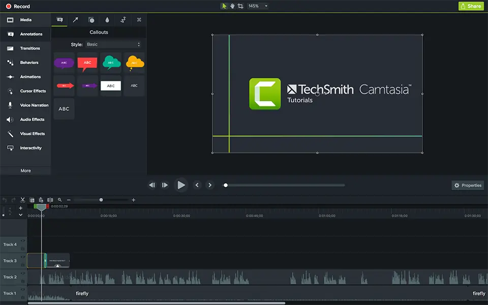
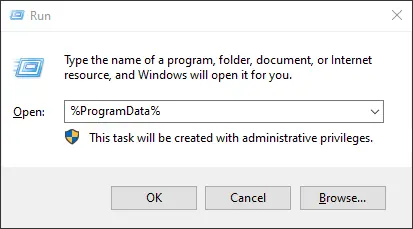

Camtasia 2021 Full Terbaru bagi kalian yang mencari software Camtasia 2021 terbaru full, kali ini akan saya share versi terbarunya, software ini sudah dalam versi Camtasia 2021.0.0 Build 30170 memiliki fungsi sebagai desktop recorder video sekaligus editing video dengan menghasilkan berbagai jenis format video. software ini sudah terkenal, untuk kalian yang ingin segera update ke versi baru silahkan download Camtasia 2021 Terbaru filenya di bawah.

Internet dipenuhi dengan tutorial dan semua jenis video di mana pengupload merekam beberapa aktivitas di desktop mereka, dan mungkin menjadi pertanyaan software apa yang mereka digunakan untuk membuat tutorial rekam tersebut. Solusi software yang powerfull yang dapat melakukan hal seperti itu salah satunya disebut Camtasia 2021 Terbaru ini.



## Langkah Install

1. Download, kemudian Extract, Wajib !!
2. Lalu install sampai dengan selesai
3. Kemudian buka folder **Crack**, lalu buka folder **CrackDir**, copy isinya dan paste ke

`C:\Program Files\TechSmith\Camtasia 2021`

4. Replace yang asli
5. Selanjutnya buka folder “Reg“, copy folder “TechSmith” dan paste ke

**C:\ProgramData**

Untuk gampang membuka folder **ProgramData** nya, kalian bisa tekan shortcur **Win + R** untuk membuka dialog Run, lalu ketikan `%ProgramData%`

6. Selanjutnya jalankan 
    * CamRecorder.exe
    * Klik kanan dan pilih Properties
    * Masuk ke Compatibility tab
    * Pilih **Change settings for all users**
    * Ceklis **Run this program as Administrator**
    * Klik OK dan save setting.