<svg xmlns="http://www.w3.org/2000/svg" class="icon icon-tabler icon-tabler-brand-google-drive" width="200" height="200" viewBox="0 0 24 24" stroke-width="1.5" stroke="CurrentColor" fill="none" stroke-linecap="round" stroke-linejoin="round" style="display: block;margin: auto;">
    <path stroke="none" d="M0 0h24v24H0z" fill="none"></path>
    <path d="M12 10l-6 10l-3 -5l6 -10z"></path>
    <path d="M9 15h12l-3 5h-12"></path>
    <path d="M15 15l-6 -10h6l6 10z"></path>
</svg>

In this tutorial, I will share How to Download a File in Google Drive using Command Line Interface, using this script you can download a file without file size limitation, maybe you can use **[gdown](https://github.com/wkentaro/gdown)** but **[gdown](https://github.com/wkentaro/gdown)** sometimes still error if you **[download a big file](https://github.com/wkentaro/gdown/issues/26)** from Google Drive

## Before Download a Big File, Create OAuth Authentication First
This script also same if you don't configure first, can't download a big file from Google Drive, so you must create **OAuth Credentials** first

1. Login to **[Google Developer Console](https://console.developers.google.com/)** and Create Project first 
    * Note: If you don't have project Click on **Select Project** → **New Project**


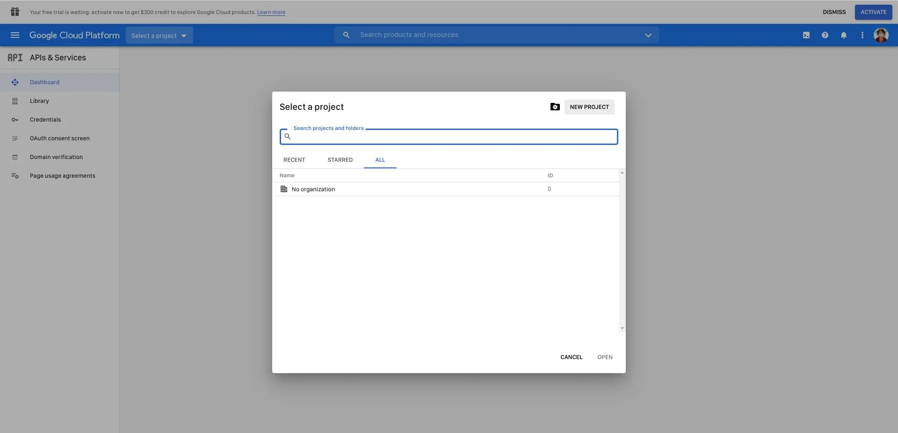 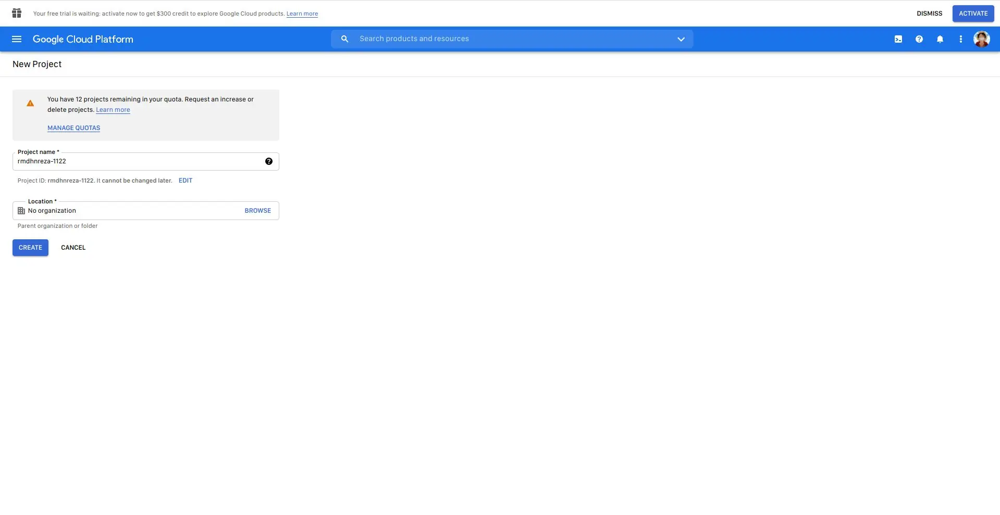


2. Click Hamburger menu on the left → **Select API & Services** → **Select Library**


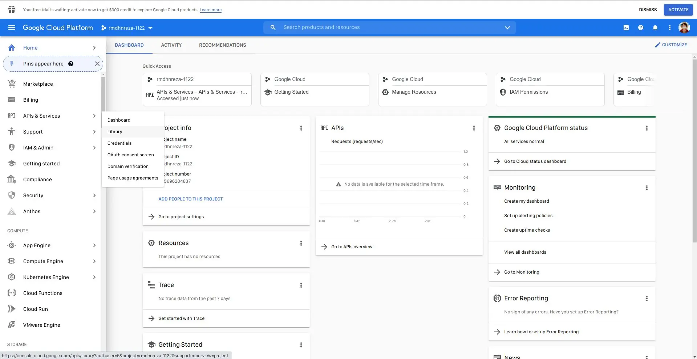


3. Search for **Google Drive API** and **Enable Google Drive API**


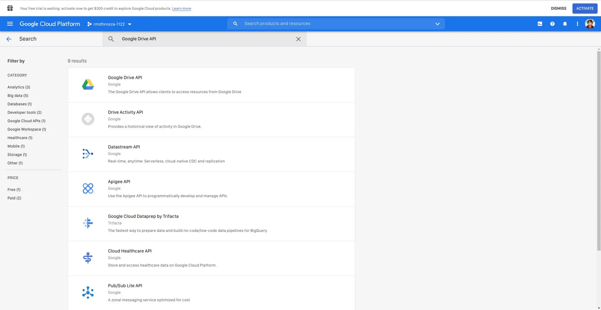 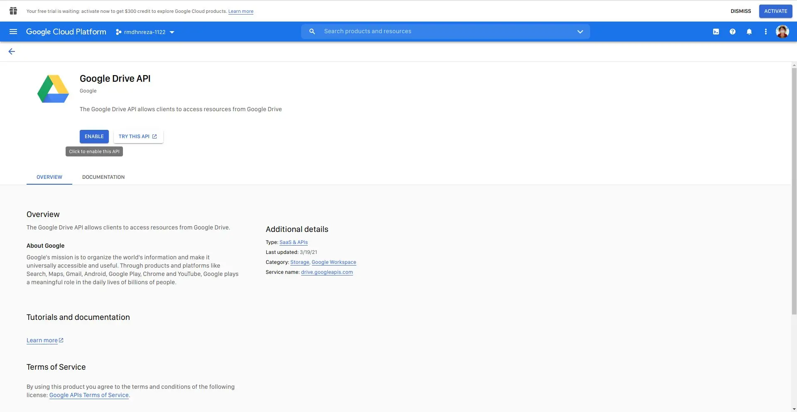 


4. Click Credentials on left pane and Click **+ CREATE CREDENTIALS** and select **OAuth Client ID**


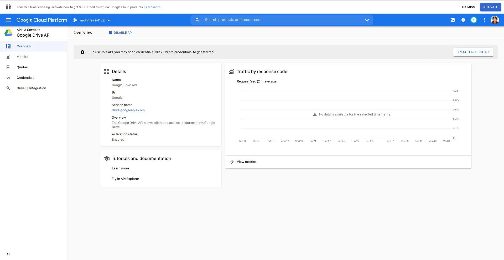 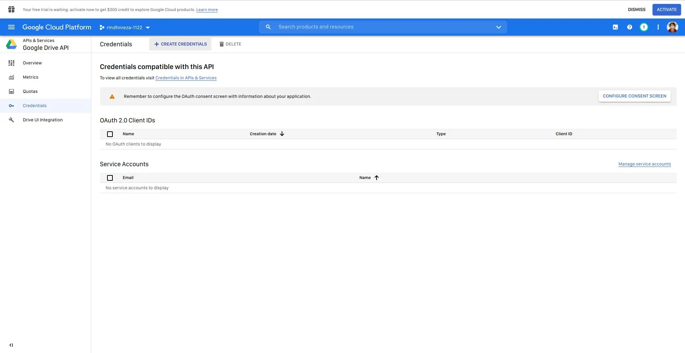 


**Note:** If you face this error, click on **CONFIGURE CONSENT SCREEN**


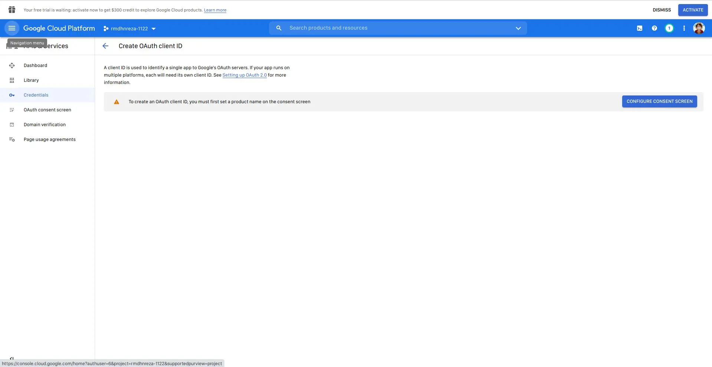 


  * Select **External** and click **CREATE**


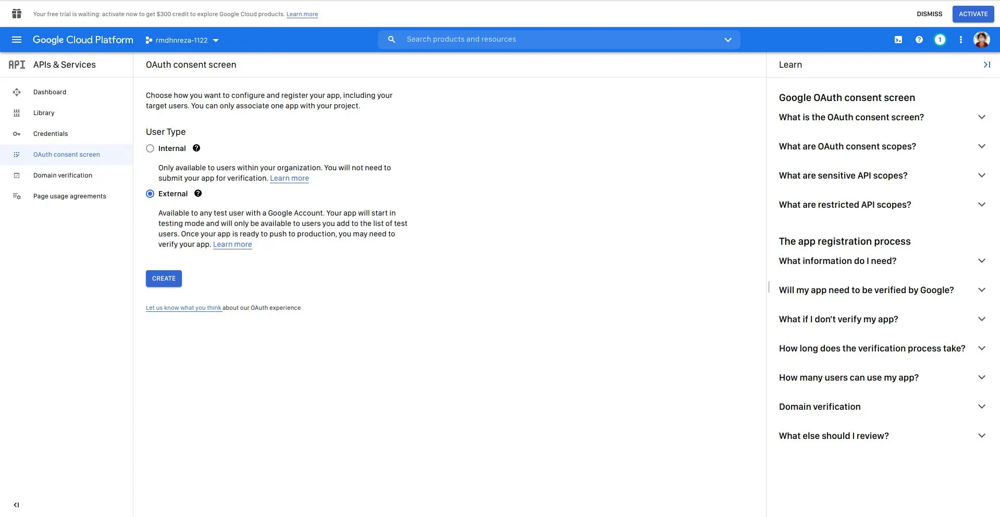 


  * Just fill in the section
    * App name *
    * User support email
    * Email addresses
  * Click **SAVE AND CONTINUE** until **Step 4** and **Click Publish** in the **Production** section
  * Back to Create Credentials
5. After select **OAuth Client ID**
    * Application type select **Desktop app**
    * Name fill whatever you want
    * Click **CREATE**
6. If success, you will get Client ID and Client Secret, **Save it**.


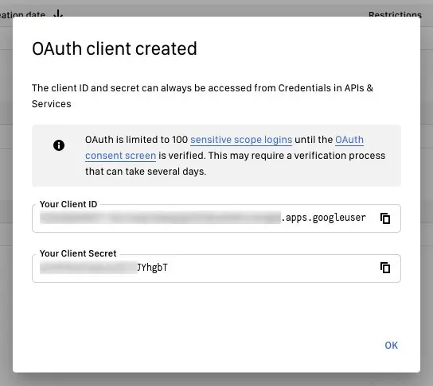 


## Download a File From Google Drive
1. This script you can find it in **[Official GitHub Repository](https://github.com/Akianonymus/gdrive-downloader/)**
2. To install this script, just execute command
```ruby
curl -Ls --compressed https://drivedl.cf | sh -s
```
alternatively, you can use the original github url instead of https://drivedl.cf
```ruby
curl -Ls --compressed  https://github.com/Akianonymus/gdrive-downloader/raw/master/install.sh | sh -s
```
3. This script installed at `${HOME}/.gdrive-downloader/`
4. To Download a File from Google Drive (Especially big file) use command
```ruby
gdl -o driveID
```


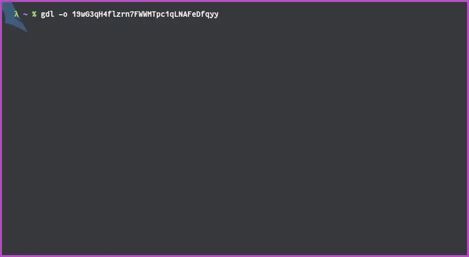 



5. And you will be asked to put (Only one time), and this config file saved in `${HOME}/.gdl.conf`
    * Client ID → Fill in the client ID with the one you created earlier
    * Client Secret → Fill in the client Secret with the one you created earlier
    * Refresh Token → Just blank and hit enter
    * And the link will appear, click on that link to get **authorization code**

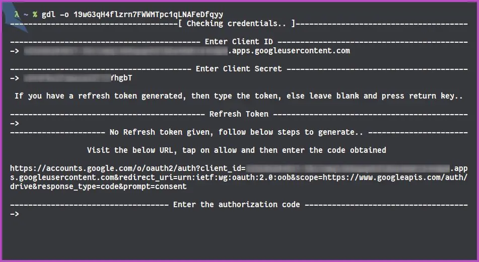

      * Login with your Google Account

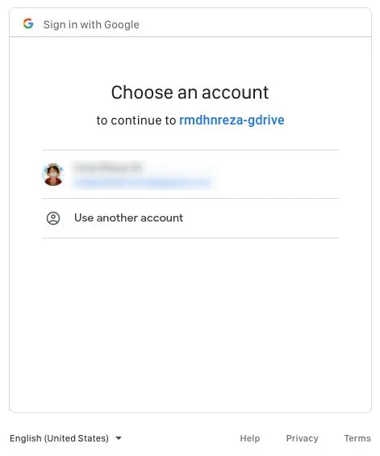

      * **In this case** Warning like this is normal, because app we create earlier is not verified by Google, so just click **show advanced** and click Go to **yourappname (unsafe)**

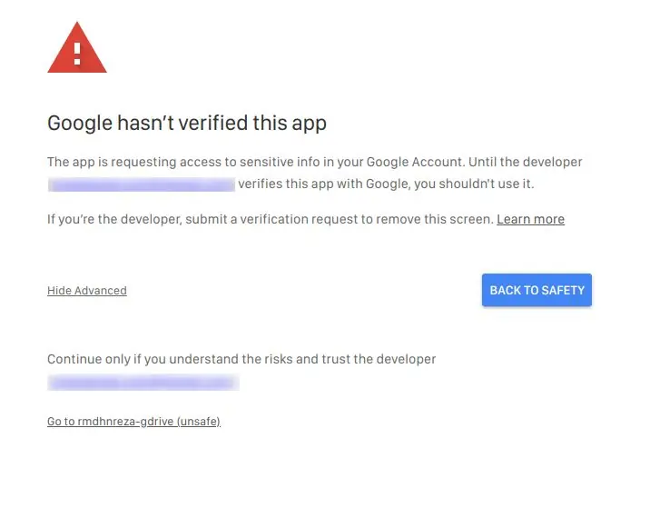

      * Click Allow

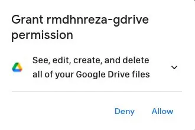

      * Click Allow Again

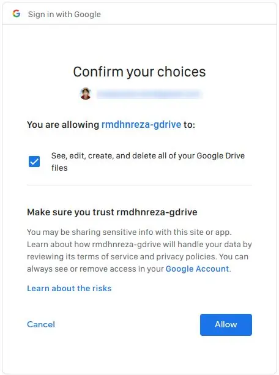

      * And you get **authorization code** copy and paste to terminal console

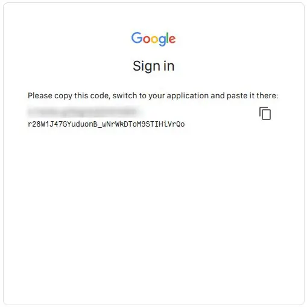

6. And file will be downloaded immediately


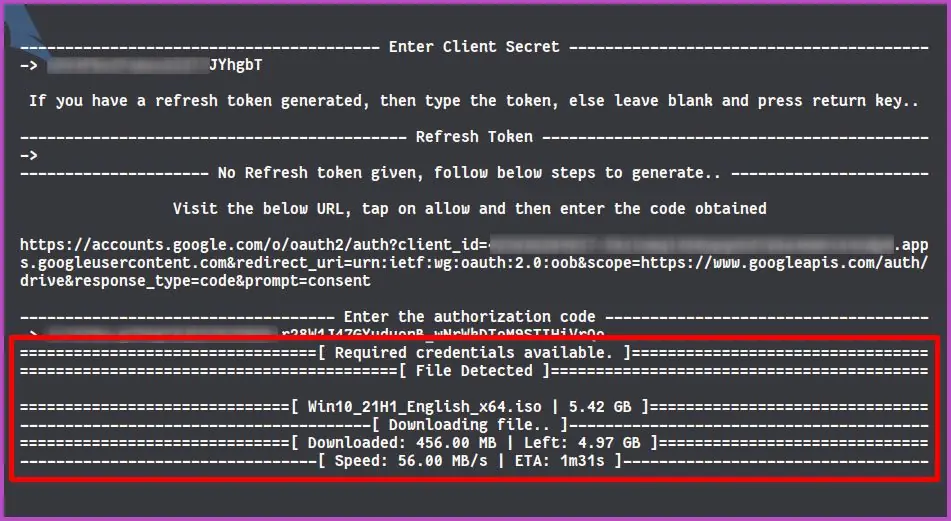


If you want to download a big file again, just use command `gdl -o driveID`  and will not be asked to enter the auth code.

For Documentation, you can see in [GitHub Repository](https://github.com/Akianonymus/gdrive-downloader/)

Special Thanks to: **[Akianonymus](https://github.com/Akianonymus)** for making a great script!