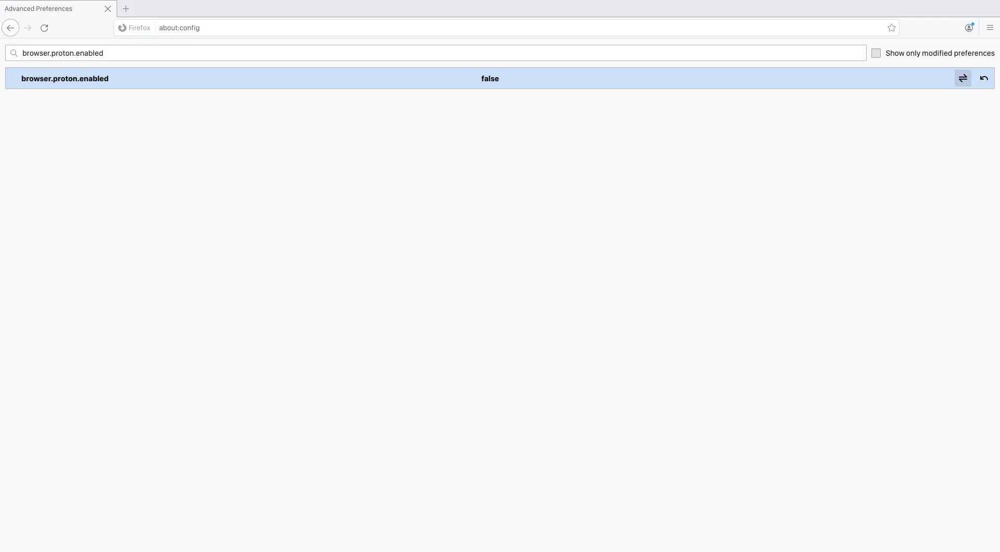
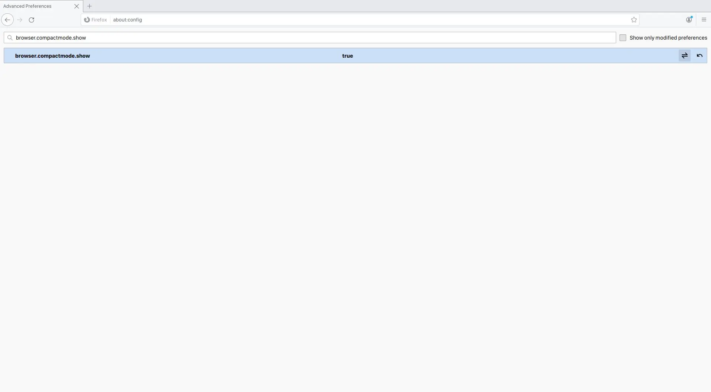
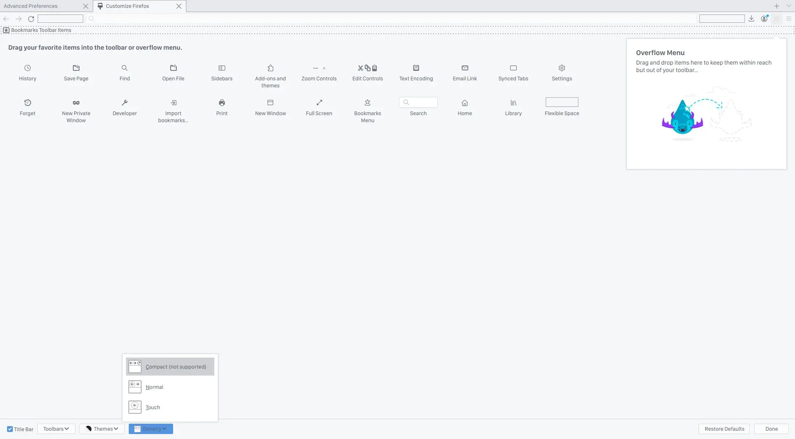
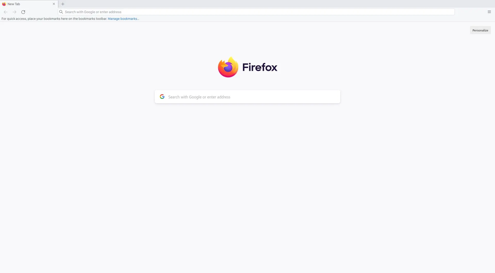

<svg xmlns="http://www.w3.org/2000/svg" class="icon icon-tabler icon-tabler-brand-firefox" width="200" height="200" viewBox="0 0 24 24" stroke-width="1.5" stroke="CurrentColor" fill="none" stroke-linecap="round" stroke-linejoin="round" style="display: block;margin: auto;">
    <path stroke="none" d="M0 0h24v24H0z" fill="none" />
    <path d="M4.028 7.82a9 9 0 1 0 12.823 -3.4c-1.636 -1.02 -3.064 -1.02 -4.851 -1.02h-1.647" />
    <path d="M4.914 9.485c-1.756 -1.569 -.805 -5.38 .109 -6.17c.086 .896 .585 1.208 1.111 1.685c.88 -.275 1.313 -.282 1.867 0c.82 -.91 1.694 -2.354 2.628 -2.093c-1.082 1.741 -.07 3.733 1.371 4.173c-.17 .975 -1.484 1.913 -2.76 2.686c-1.296 .938 -.722 1.85 0 2.234c.949 .506 3.611 -.995 4.545 .354c-1.698 .102 -1.536 3.107 -3.983 2.727c2.523 .957 4.345 .462 5.458 -.34c1.965 -1.52 2.879 -3.542 2.879 -5.557c-.014 -1.398 .194 -2.695 -1.26 -4.75" />
</svg>

Firefox 89.0 is the latest stable version of the Firefox web browser. Released on June 1, 2021, it ships with major interface changes, a new custom theme, and more. The focus of the release is the interface redesign that is affecting major interface elements such as the main toolbar, address bar, menus, prompts that the browser displays, and tabs.

Some users maybe hate proton tabs because it's looking like floating button instead of tabs, but you can revert to old tabs with only change value in **about:config**

## Revert Old Tabs via about:config
1. Open **about:config** 
2. Click Accept the Risk and Continue
3. Search `browser.proton.enabled` and set value to `false`





4. To make more compact search `browser.compactmode.show` and set value to `true`





5. Click on the hamburger menu → More Tools → Customize Toolbar... → Density → Compact (not supported)





**Sadly, `browser.proton.enabled` will be removed in Firefox 90 Stable.**

---

## Revert Old Tabs with userChrome.css
1. Open **about:config**
2. Search `toolkit.legacyUserProfileCustomizations.stylesheets` and set value to `true`
3. Open **about:support** and Click on **Open Directory**
4. Create a new folder named `chrome`
5. Create a new text file inside the chrome folder named `userChrome.css` **(extensions must be CSS not TXT)**
6. Copy and Paste this CSS code to `userChrome.css` and Save it
```css
@media (-moz-proton) {
    .tab-background {
        border-radius: var(--user-tab-rounding) var(--user-tab-rounding) 0 0 !important;
        margin-block: 1px 0 !important
    }

    .tabbrowser-tab[usercontextid]>.tab-stack>.tab-background>.tab-context-line {
        margin: 0 max(calc(var(--user-tab-rounding) - 3px), 0) !important
    }
}

@media (-moz-proton) {
    .tabbrowser-tab:not([selected=true]):not([multiselected=true]):not([beforeselected-visible="true"]) .tab-background {
        border-right: 1px solid rgba(0, 0, 0, .20) !important;
    }

    [brighttext="true"] .tabbrowser-tab:not([selected=true]):not([multiselected=true]):not([beforeselected-visible="true"]) .tab-background {
        border-right: 1px solid var(--lwt-selected-tab-background-color, rgba(255, 255, 255, .20)) !important;
    }

    .tabbrowser-tab:not([selected=true]):not([multiselected=true]) .tab-background {
        border-radius: 0 !important;
    }

    .tabbrowser-tab {
        padding-left: 0 !important;
        padding-right: 0 !important;
    }
}

.tabbrowser-tab:not([pinned]):not([selected]) .tab-close-button {
    display: none !important
}

.tabbrowser-tab:not([pinned]):not([selected]):hover .tab-close-button {
    display: -moz-box !important
}

.tabbrowser-tab[pending] {
    opacity: .66
}

#nav-bar {
    border: none !important;
    box-shadow: none !important;
    margin-bottom: -1px !important
}

.tabbrowser-tab::after,
.tabbrowser-tab::before {
    margin-top: 9px !important;
    margin-bottom: 9px !important
}
```
7. Restart Firefox
8. The UI look like this





To disable `userChrome.css` just set value `toolkit.legacyUserProfileCustomizations.stylesheets` to `false`