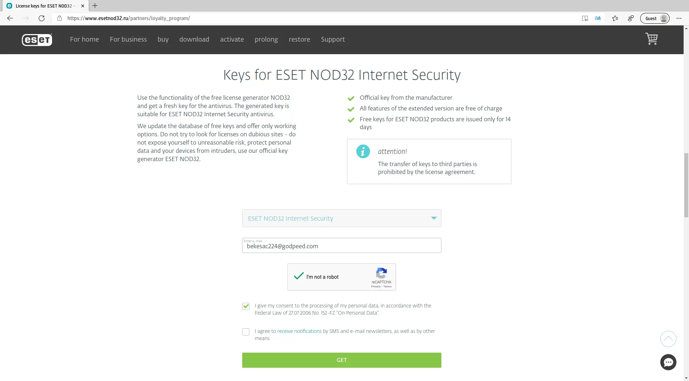
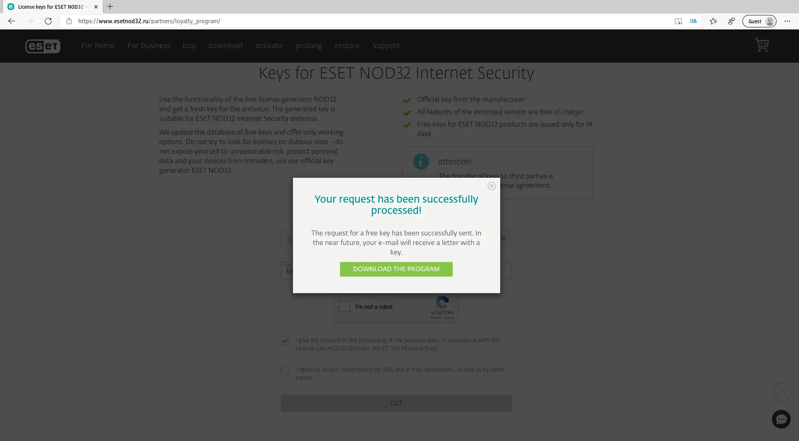
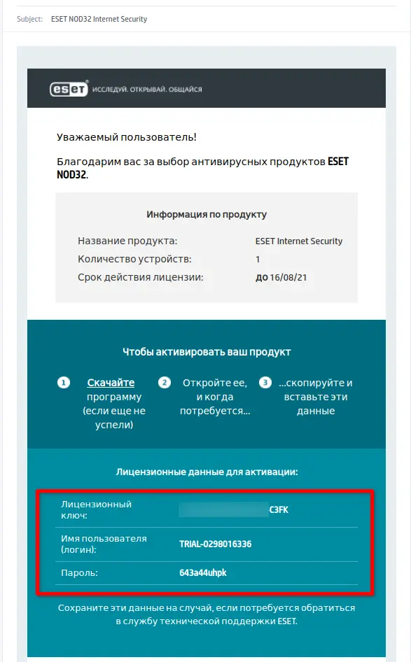
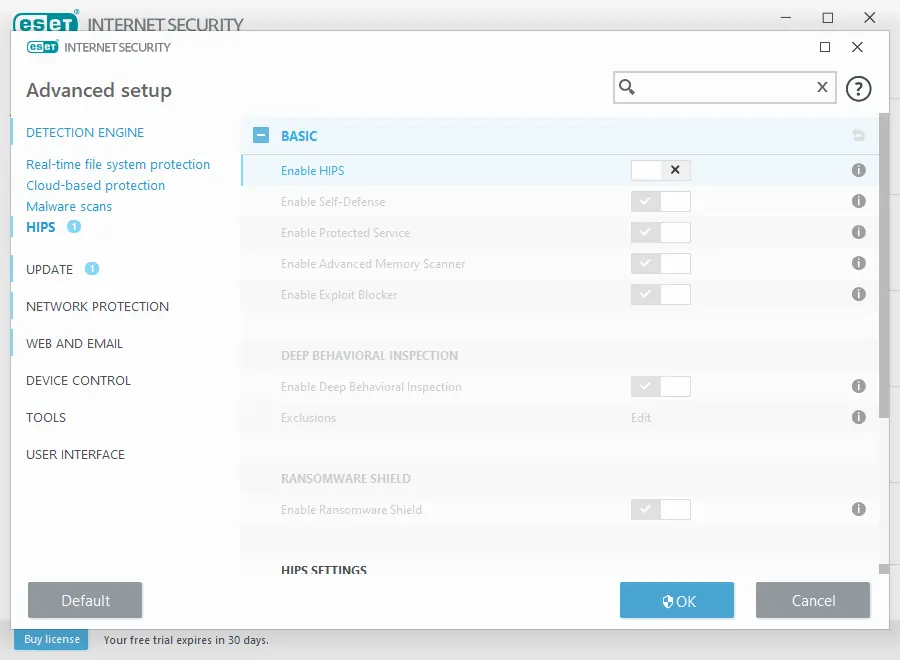
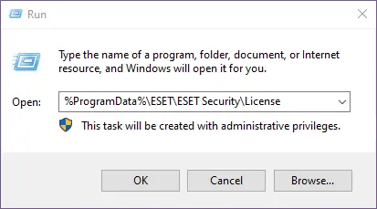
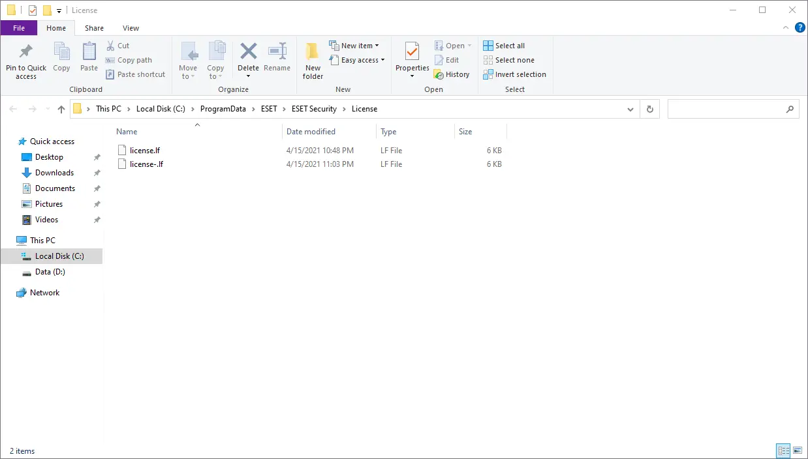
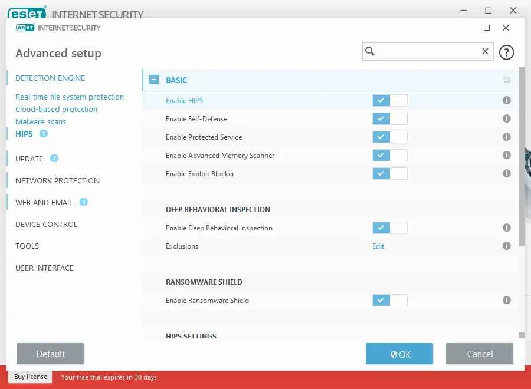

---
title: "ESET 14 Activation New Method Work July 2021"
date: 2021-07-16T17:30:13+07:00
description: "ESET 14 Activation New Method Work July 2021, License until 2024"
categories: ["Windows", "Tutorial"]
tags: ["Windows", "Tutorial"]
keywords:
  [
    "ESET",
    "ESET 14",
    "License ESET Free",
    "License ESET 2021",
    "License ESET 2021 Crack",
    "Activation ESET 2021",
    "Metode Aktivasi ESET 2021",
    "Activation ESET 2021",
    "New Method Activation ESET 2021",
    "License ESET 14 Free",
    "License ESET 14 2021",
    "License ESET 14 2021 Crack",
    "Activation ESET 14 2021",
    "Metode Aktivasi ESET 14 2021",
    "Activation ESET 14 2021",
    "New Method Activation ESET 14 2021",
  ]
image: eset-logo.svg
---

From ESET version 13, ESET is very strict with pirated License users. 
Here I will provide several methods for activating ESET 14, but it should work on previous versions too (Version 12, 13).

## First Method 14 Days Trial
1. Open this [loyalty program](https://www.esetnod32.ru/partners/loyalty_program/) page
2. Use temporary e-mail such as 
   - [temp-mail.org](https://temp-mail.org/en/)
   - [10minutemail.com](https://10minutemail.com) | [10minutemail.net](https://10minutemail.net)
   - etc.\
for receive ESET keys

3. Click on **Получить** / **Get** / **Receive**
4. Check e-mail, and you will get license, unfortunately this License only work for 14 Days

 

## Second Method Until 2024
This method requires restarting Desktop/Laptop twice (Disable HIPS and Enable HIPS), and disable ESET main features (HIPS) when applying License.\
**So I Highly recommended when HIPS disabled, you don’t open crack software, browsing, etc. Until HIPS Enabled again.**

1. Download [license.lf](https://firebasestorage.googleapis.com/v0/b/rmdhnreza.appspot.com/o/Files%2Flicense.lf?alt=media&token=dfec78d3-c830-4aa9-ac1a-4e768a3192ab) and Save it for example in Desktop
2. Disable HIPS\
    `Setup ->> Advanced Setup ->> HIPS ->> Enable HIPS ->> Switch to Left (Off) ->> Restart Desktop/Laptop.`

3. Open run dialog windows with shortcut `Win + R` and put\
    `%ProgramData%\ESET\ESET Security\License`

4. Delete or rename license.lf inside License folder
5. Copy and paste license.lf which you have downloaded in step 1 to License folder

6. Enable HIPS\
  `Setup ->> Advanced Setup ->> HIPS ->> Enable HIPS ->> Switch to Right (On) ->> Restart Desktop/Laptop.`

7. After boot up, try to update ESET database virus

**Note: Using this method, You can’t change ESET Product**, for example you want to change ESET NOD32 to ESET Internet Security it will not work, so if you want to change ESET Product

-   Uninstall older ESET with ESET Uninstaller
-   Install ESET (NOD32 or EIS)
-   For activation, just follow again step 1 - 7